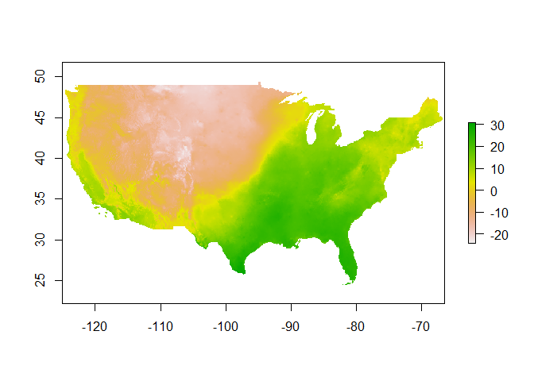
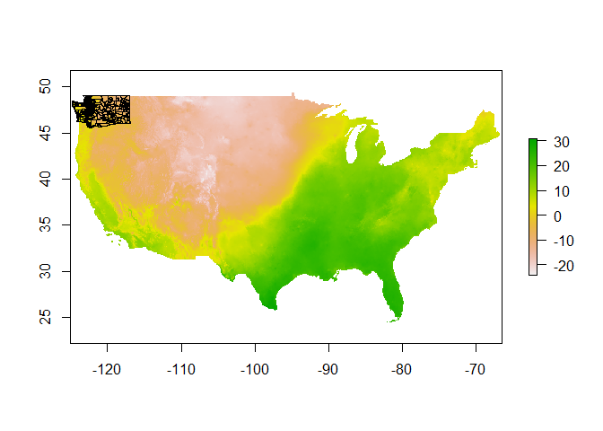
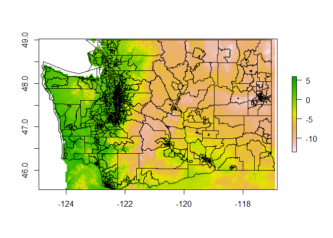

## **How to get a year of daily census tract level temperature data in 122 lines of R code.**

### **Introduction**

<br />

For a recent project, I was interested in temperature-level data at the
census tract level. I came across [the PRISM Climate
Group](https://prism.oregonstate.edu/) at Oregon State. I needed data in
tabular format, but their data are in raster format. I wrote a simple
yet powerful R script that downloads a year’s worth of daily temperature
data and converts them to CSV files with tract-level weather data for
the state of Washington. This article will walk through how to:

<br />

1.  Download multiple .zip files
2.  Unzip multiple .zip files
3.  Use parallel processing in R
4.  Convert raster data into CSV

<br />

And, at the end, I will provide a link to an R script on GitHub that you
can use to make your own!

<br />

### **Getting set up**

<br />

First, I encourage you to click on that link above and read a bit about
[the PRISM Climate Group](https://prism.oregonstate.edu/), perhaps even
their [citizen science
program](https://prism.oregonstate.edu/participate/). Eventually, you
might find your way to their [FTP
site](https://ftp.prism.oregonstate.edu/daily/). That is what we are
interested in today. Before we download the data though, let’s get our R
session set up properly:

<br />

``` r
# Load libraries
library(jsonlite)
library(rvest)
library(raster)
library(rgdal)
library(sp)
library(tidyverse)
library(parallel)

# Set year
year <- 2011

# Set up parallel runs (save 2 cores)
nc <- detectCores() - 2
cl <- makeCluster(nc)

# Load configuration settings (using hidden environmental variable)
# TO USE: make a .JSON file a variable called dirPRISM where all this data
#         will be stored
cfig_file <- paste0(Sys.getenv('myrconfig'), 'extractPRISM.json')
config <- jsonlite::read_json(cfig_file)

# Path to where all BIL files will download (make if necessary)
bil_dir <- paste0(config$dirPRISM, 'TMAX/BIL/')
dir.create(bil_dir, recursive = TRUE)

# Create a download directory for year TMAX data (make if necessary)
download_dir <- paste0(bil_dir, year, '/')
dir.create(download_dir)

# Where our final CSV files will go
csv_dir <- paste0(config$dirPRISM, 'TMAX/CSV/', year, '/')
dir.create(csv_dir, recursive = TRUE)

tract10_fn <- paste0(config$tract10dir, "tract10.shp")
```

<br />

Let’s walk through all of that. First, we load rvest, the tidyverse, and
other libraries we will be using. Then, we set the year of data we want.
The very last step of this exercise is fairly power hungry, so we set up
parallel processing. In this example, we are saving two cores. I also
wanted to specify some directories for all of my downloads and final
files. I use a JSON config file to keep the code organized and portable.
A config file is a good place to store variables that would need to
change to run your code on another system. I also stored the path to my
config files in an environmental variable, mostly for privacy reasons.
My config file looks like this:

<br />

``` json
{
  "dirPRISM": "C:/YOUR/FILE/PATH/HERE/",
  "tract10dir":  "Z:/NONE/OF/YOUR/BUSINESS/"
}
```

<br />

Those two directories are the main directory where you want all the
PRISM data (raw and transformed) as well as the directory for your
census tract data file (more on that in a minute). From there, the
script names and creates the sub-directories needed to run the script.

<br />

### **Download data**

<br />

Next, we download a
[bil](https://www.loc.gov/preservation/digital/formats/fdd/fdd000283.shtml)
file. A bil is a type of
[raster](https://www.bu.edu/tech/support/research/training-consulting/online-tutorials/imagefiles/image101/#:~:text=A%20raster%20image%20file%20is,pixel%20should%20be%20displayed%20in.)
file. In overly simple terms, a raster file is a combination of an image
that is color-coded by some variable and a metadata file that explains
the values associated with each color. The data are stored as one raster
per day of the year and measure (maximum temperature, minimum
temperature, etc.). The below chunk of code will download all bil files
for a given year at once, so allow a few minutes for it to complete. If
downloads fail, the script is designed to re-try any files that it may
have missed on the second run. The code:

<br />

``` r
# DOWNLOAD FILES ----------------------------------------------------------
# List all of the PRISM files on an FTP site
listPRISMFiles <- function(var, year){
  var <- tolower(var)
  lnk <- glue::glue("https://ftp.prism.oregonstate.edu/daily/{var}/{year}")
  ftp_txt <- read_html(lnk)
  ftp_files <- html_attr(html_nodes(ftp_txt, 'a'), 'href')
  ftp_files <- ftp_files[grepl('PRISM', ftp_files)]
  return(list(lnk = lnk, files = ftp_files))
}

# Get TMAX files for year
files <- listPRISMFiles(var = 'tmax', year = year)

# Check for already downloaded files (we don't want to download twice)
already_downloaded <- list.files(download_dir, pattern = '.zip')
files$files <- files$files[!(files$files %in% already_downloaded)]

# Download all of the files specified
dlPRISMDaily <- function(baselnk, file, outdir){
  fn <- paste0(baselnk, '/', file)
  download.file(fn, destfile = paste0(outdir, file))
}
dlPRISMDaily(baselnk = files$lnk, file = files$files, outdir = download_dir)
```

<br />

We start by writing a function, `listPRISMfiles`. We are interested in
the PRISM varaible TMAX, or max temperature. We also provide the year.
These are used to populate the correct path to the resource on the FTP
website. The function will then search for all links on the page, and
pull the reference. It will keep any references that contain the string
‘PRISM’, because that is a common pattern among the .bil files. The
function will return the base name of the hyperlink for all of the files
and a list of files available at the base link. After we write the
function, we run it and store it’s results in the ‘files’ variable.
These are the files we might want to download. To avoid re-downloading
old data, a second step removes any files names already in our downloads
folder. If there are no new files, the script will throw a soft warning
about a non-zero exit status.

<br />

### **Download some data!**

<br />

Next, we unzip the new data. We start by finding files with the .zip
pattern in our download folder. Similar to above, we also remove any
files that have previously been unzipped before we start. A quick helper
function is used to make the output directory name the same as the
zipped folder (minus the .zip).

``` r
# UNZIP FILES -------------------------------------------------------------
# Identify all of the .zip files in the directory we just created
unzip_fns <- list.files(download_dir, pattern = ".zip")

# Identify already-unzipped versions of these files, remove from list
already_unzipped <- basename(list.dirs(download_dir))
unzip_fns <- unzip_fns[!(gsub('.zip', '', unzip_fns) %in% already_unzipped)]

# Unzip the files that need it
lapply(unzip_fns, function(x) 
  unzip(paste0(download_dir, x), 
        exdir = paste0(download_dir, '/', gsub(".zip", '', x))))
```

<br />

### **Explore the data!**

<br />

Okay, we have some data! Now, let’s read it in and take a peek.

<br />

``` r
# Identify the first .bil file
myBilFile <- list.files(download_dir, pattern = '.bil$', recursive = TRUE)[1]
myRast <- raster::raster(paste0(download_dir, myBilFile)[[1]])
plot(myRast)
```

<!-- -->

<br />

Voila! A color-coded heat map of max US temperatures on 1/1/2011. As
mentioned, our desired format is tabular data with maximum temperature
by the census tract level. To accomplish this, we will add a shape file
that includes census tract boundaries. Then, we can use a function to
extract the average maximum temperature value across that entire
geography, and report that as the maximum temperature for the area. Our
shapefile comes from the [Washington Office of Financial Management’s
(OFM)](https://ofm.wa.gov/washington-data-research/population-demographics/gis-data/census-geographic-files)
shape files for Washington State. Download those files, unzip them, and
point to them with the ‘tract10dir’ variable in your configuration file.
Next, we look at the shape file and raster image on the same plot. This
requires them to be in the same projection:

<br />

``` r
# Read in shapefile, convert to new CRS
waCensus10 <- readOGR(tract10_fn)
```

    ## Warning in OGRSpatialRef(dsn, layer, morphFromESRI = morphFromESRI, dumpSRS = dumpSRS, : Discarded datum NAD83_High_Accuracy_Reference_Network
    ## in Proj4 definition: +proj=lcc +lat_0=45.3333333333333 +lon_0=-120.5 +lat_1=45.8333333333333 +lat_2=47.3333333333333 +x_0=500000 +y_0=0
    ## +ellps=GRS80 +units=us-ft +no_defs

    ## OGR data source with driver: ESRI Shapefile 
    ## Source: "D:\PRISM\tract10\tract10.shp", layer: "tract10"
    ## with 1458 features
    ## It has 34 fields
    ## Integer64 fields read as strings:  ALANDM AWATERM

``` r
shp_reproj <- sp::spTransform(waCensus10, crs(myRast))

# Plot raster and overlay shapefile
plot(myRast)
plot(shp_reproj, bg = 'transparent', add = TRUE)
```

<!-- -->

<br />

The scale appears to be correct, but there is one problem: the area
covered by the raster (background image) is much larger than our census
tract borders. Having extra raster data would slow down a future step in
our process, so we will use the crop function to take a Washington-sized
slice of the raster file.

<br />

``` r
# Subset the raster image to speed things up
myRast2 <- crop(myRast, shp_reproj)
plot(myRast2)
plot(shp_reproj, bg = 'transparent', add = TRUE)
```

<!-- -->

<br />

### **Extract the data **

<br />

Now, we use our correctly projected shape file and our cropped raster
file to extract the average maximum temperature over each census tract
for the day. We are working with 1/1/2011 in this example.

<br />

``` r
# Get mean temp across each boundary
myExtract <- raster::extract(myRast2, shp_reproj, fun = mean)

# Put in dataframe format, add date and tract identifiers
myOutputData <- data.frame('GEOID10' = shp_reproj@data$GEOID10, 
                           date = as.Date('2011-01-01'), 
                           TMAX = myExtract)

# Take a peek at the data
head(myOutputData)
```

    ##       GEOID10       date      TMAX
    ## 1 53001950100 2011-01-01 -7.456779
    ## 2 53001950200 2011-01-01 -6.259750
    ## 3 53001950300 2011-01-01 -5.479644
    ## 4 53001950400 2011-01-01 -5.475000
    ## 5 53001950500 2011-01-01 -5.326000
    ## 6 53003960100 2011-01-01 -5.268149

<br />

And there you go! A single raster file, turned into a data frame.
But….we have 365 raster files. Thankfully, we are all set up to do
parallel processing. Let’s turn our shape file re-project -\> crop
raster -\> extract data process into a function. It will take some more
work up front, because we need to programmatically figure out the date
instead of hard-coding it. However, it is possible: each file contains
the date as an 8 digit string. I also want to save each result to file.
For now, it will be useful to have a CSV file for each raster image. It
will help us stay organized and quickly identify which files have
already been converted in case we spread the work out over multiple
script runs.

<br />

``` r
# Convert raster to CSV ---------------------------------------------------
# Only do 10 files for demonstration purposes. 
n_ras_to_csv <- 10

# Identify all files ending with .bil (no zip)
prismBils <- list.files(download_dir, pattern = '.bil$', 
                        recursive = TRUE)

outunzip_fns <- basename(dirname(prismBils))
excludes <- which(file.exists(paste0(csv_dir, outunzip_fns, '.csv')))

# If CSVs already exist, we don't need to run this script on them again
if(!identical(excludes, integer(0))){
  prismBils <- prismBils[-excludes]
  outunzip_fns <- outunzip_fns[-excludes]
}

# Date column to add to each entry
dates <- as.Date(
  sub(".*([0-9.]{8}).*", "\\1", basename(prismBils)), 
  format = "%Y%m%d")

# Read in CT shapefile file and a single BIL. Reproject shapefile.
waCensus10 <- readOGR(tract10_fn)
```

    ## Warning in OGRSpatialRef(dsn, layer, morphFromESRI = morphFromESRI, dumpSRS = dumpSRS, : Discarded datum NAD83_High_Accuracy_Reference_Network
    ## in Proj4 definition: +proj=lcc +lat_0=45.3333333333333 +lon_0=-120.5 +lat_1=45.8333333333333 +lat_2=47.3333333333333 +x_0=500000 +y_0=0
    ## +ellps=GRS80 +units=us-ft +no_defs

    ## OGR data source with driver: ESRI Shapefile 
    ## Source: "D:\PRISM\tract10\tract10.shp", layer: "tract10"
    ## with 1458 features
    ## It has 34 fields
    ## Integer64 fields read as strings:  ALANDM AWATERM

``` r
myBilFile <- list.files(download_dir, pattern = '.bil$', recursive = TRUE)[1]
myRast <- raster::raster(paste0(download_dir, myBilFile)[[1]])
waCensus10_transform <- spTransform(waCensus10, crs(myRast))

# Function to make a single PRISM csv file
makePRISMcsv <- function(prismBil, outdir, outfn, shp, varname, funx, date){
  prismRast <- raster::raster(prismBil)
  prismRast_crop <- raster::crop(prismRast, shp)
  extr <- raster::extract(prismRast_crop, shp, fun = funx)
  out <- data.frame(shp@data$GEOID10, date, extr)
  colnames(out) <- c('GEOID10', 'DATE', varname)
  dir.create(outdir)
  data.table::fwrite(out, paste0(outdir, outfn, '.csv'))
  return(out)
}

# Run script in parallel, stop when finished.
addArgs <- list(funx = mean, varname = 'TMAX', shp = waCensus10_transform,
                outdir = csv_dir)
parallel::clusterMap(cl = cl,
                     fun = makePRISMcsv,
                     prismBil = paste0(download_dir, prismBils)[1:n_ras_to_csv],
                     outfn = outunzip_fns[1:n_ras_to_csv],
                     date = dates[1:n_ras_to_csv],
                     MoreArgs = addArgs)
```

    ## $`D:/PRISM/TMAX/BIL/2011/PRISM_tmax_stable_4kmD2_20110121_bil/PRISM_tmax_stable_4kmD2_20110121_bil.bil`
    ##         GEOID10       DATE      TMAX
    ## 1   53001950100 2011-01-21  1.686708
    ## 2   53001950200 2011-01-21  2.760489
    ## 3   53001950300 2011-01-21  3.439578
    ## 4   53001950400 2011-01-21  3.581000
    ## 5   53001950500 2011-01-21  3.602333
    ## 6   53003960100 2011-01-21  2.815904
    ## 7   53003960200 2011-01-21  3.601333
    ## 8   53003960300 2011-01-21  3.194000
    ## 9   53003960400 2011-01-21  3.142500
    ## 10  53003960500 2011-01-21  3.194000
    ## 11  53003960600 2011-01-21  3.067500
    ## 12  53005010100 2011-01-21  7.329250
    ## 13  53005010201 2011-01-21  7.319000
    ## 14  53005010202 2011-01-21  7.364000
    ## 15  53005010300 2011-01-21  7.638000
    ## 16  53005010400 2011-01-21  7.554000
    ## 17  53005010500 2011-01-21  7.554000
    ## 18  53005010600 2011-01-21  7.803000
    ## 19  53005010701 2011-01-21  6.926500
    ## 20  53005010703 2011-01-21  7.241000
    ## 21  53005010705 2011-01-21  7.132750
    ## 22  53005010707 2011-01-21  7.023667
    ## 23  53005010708 2011-01-21  7.357500
    ## 24  53005010803 2011-01-21  7.128000
    ## 25  53005010805 2011-01-21  8.038000
    ## 26  53005010807 2011-01-21  6.401000
    ## 27  53005010809 2011-01-21  8.334500
    ## 28  53005010810 2011-01-21  8.539000
    ## 29  53005010811 2011-01-21  7.495000
    ## 30  53005010813 2011-01-21  8.347000
    ## 31  53005010814 2011-01-21  6.803167
    ## 32  53005010901 2011-01-21  8.355667
    ## 33  53005010902 2011-01-21  8.395500
    ## 34  53005011001 2011-01-21  8.462600
    ## 35  53005011002 2011-01-21  8.444000
    ## 36  53005011100 2011-01-21  8.414000
    ## 37  53005011200 2011-01-21  8.708000
    ## 38  53005011300 2011-01-21  8.972000
    ## 39  53005011401 2011-01-21  9.094500
    ## 40  53005011402 2011-01-21  8.887000
    ## 41  53005011501 2011-01-21  8.938000
    ## 42  53005011503 2011-01-21  7.040600
    ## 43  53005011504 2011-01-21  8.401000
    ## 44  53005011600 2011-01-21  6.937559
    ## 45  53005011700 2011-01-21  6.629500
    ## 46  53005011800 2011-01-21  6.031327
    ## 47  53005011900 2011-01-21  6.372600
    ## 48  53005012000 2011-01-21  5.977831
    ## 49  53007960100 2011-01-21  2.018268
    ## 50  53007960200 2011-01-21  2.128746
    ## 51  53007960300 2011-01-21  4.238343
    ## 52  53007960400 2011-01-21  4.372417
    ## 53  53007960500 2011-01-21  4.958424
    ## 54  53007960600 2011-01-21  6.195400
    ## 55  53007960700 2011-01-21  6.408000
    ## 56  53007960801 2011-01-21  6.820000
    ## 57  53007960802 2011-01-21  7.885250
    ## 58  53007961000 2011-01-21  7.957000
    ## 59  53007961100 2011-01-21  7.140000
    ## 60  53007961200 2011-01-21  6.372800
    ## 61  53007961301 2011-01-21  6.125000
    ## 62  53007961302 2011-01-21  6.643333
    ## 63  53009000200 2011-01-21  6.437926
    ## 64  53009000300 2011-01-21  6.844500
    ## 65  53009000400 2011-01-21  6.407986
    ## 66  53009000600 2011-01-21  4.979818
    ## 67  53009000700 2011-01-21  5.265000
    ## 68  53009000800 2011-01-21  5.451000
    ## 69  53009000900 2011-01-21  5.549500
    ## 70  53009001000 2011-01-21  5.549500
    ## 71  53009001100 2011-01-21  4.992167
    ## 72  53009001200 2011-01-21  5.140250
    ## 73  53009001300 2011-01-21  5.333600
    ## 74  53009001400 2011-01-21  4.870000
    ## 75  53009001500 2011-01-21  4.119700
    ## 76  53009001600 2011-01-21  5.682000
    ## 77  53009001700 2011-01-21  5.581500
    ## 78  53009001800 2011-01-21  5.106143
    ## 79  53009001900 2011-01-21  5.639250
    ## 80  53009002000 2011-01-21  5.526000
    ## 81  53009002100 2011-01-21  5.556500
    ## 82  53009002300 2011-01-21  5.036417
    ## 83  53009940000 2011-01-21  6.811857
    ## 84  53009990100 2011-01-21        NA
    ## 85  53011040101 2011-01-21  4.608370
    ## 86  53011040102 2011-01-21  4.422500
    ## 87  53011040201 2011-01-21  4.405500
    ## 88  53011040202 2011-01-21  4.239800
    ## 89  53011040203 2011-01-21  4.348500
    ## 90  53011040301 2011-01-21  4.317500
    ## 91  53011040302 2011-01-21  4.300500
    ## 92  53011040403 2011-01-21  4.350000
    ## 93  53011040407 2011-01-21  4.098250
    ## 94  53011040408 2011-01-21  4.261500
    ## 95  53011040409 2011-01-21  4.389000
    ## 96  53011040411 2011-01-21  4.460500
    ## 97  53011040412 2011-01-21  4.403000
    ## 98  53011040413 2011-01-21  4.217500
    ## 99  53011040414 2011-01-21  4.267000
    ## 100 53011040415 2011-01-21  4.080000
    ## 101 53011040416 2011-01-21  4.008000
    ## 102 53011040504 2011-01-21  4.552800
    ## 103 53011040505 2011-01-21  4.076333
    ## 104 53011040507 2011-01-21  4.400500
    ## 105 53011040508 2011-01-21  4.394000
    ## 106 53011040509 2011-01-21  4.387500
    ## 107 53011040510 2011-01-21  4.285667
    ## 108 53011040511 2011-01-21  4.969000
    ## 109 53011040603 2011-01-21  4.439750
    ## 110 53011040604 2011-01-21  4.440000
    ## 111 53011040605 2011-01-21  4.268500
    ## 112 53011040608 2011-01-21  4.477000
    ## 113 53011040609 2011-01-21  4.411667
    ## 114 53011040610 2011-01-21  4.388500
    ## 115 53011040703 2011-01-21  4.514250
    ## 116 53011040706 2011-01-21  4.600500
    ## 117 53011040707 2011-01-21  4.600500
    ## 118 53011040709 2011-01-21  4.450000
    ## 119 53011040710 2011-01-21  4.417500
    ## 120 53011040711 2011-01-21  4.519500
    ## 121 53011040712 2011-01-21  4.509000
    ## 122 53011040803 2011-01-21  4.460500
    ## 123 53011040805 2011-01-21  4.441000
    ## 124 53011040806 2011-01-21  4.509000
    ## 125 53011040808 2011-01-21  4.470500
    ## 126 53011040809 2011-01-21  4.463250
    ## 127 53011040810 2011-01-21  4.466000
    ## 128 53011040904 2011-01-21  4.480000
    ## 129 53011040905 2011-01-21  4.357000
    ## 130 53011040907 2011-01-21  4.502000
    ## 131 53011040908 2011-01-21  4.491000
    ## 132 53011040909 2011-01-21  4.491000
    ## 133 53011040910 2011-01-21  4.302000
    ## 134 53011041003 2011-01-21  4.586500
    ## 135 53011041005 2011-01-21  4.550000
    ## 136 53011041007 2011-01-21  4.586500
    ## 137 53011041008 2011-01-21  4.538750
    ## 138 53011041009 2011-01-21  4.494500
    ## 139 53011041010 2011-01-21  4.509000
    ## 140 53011041011 2011-01-21  4.466000
    ## 141 53011041104 2011-01-21  4.589500
    ## 142 53011041105 2011-01-21  4.423000
    ## 143 53011041107 2011-01-21  4.568000
    ## 144 53011041108 2011-01-21  4.568000
    ## 145 53011041110 2011-01-21  4.646500
    ## 146 53011041111 2011-01-21  4.616750
    ## 147 53011041112 2011-01-21  4.495500
    ## 148 53011041201 2011-01-21  4.663750
    ## 149 53011041203 2011-01-21  4.681333
    ## 150 53011041205 2011-01-21  4.606000
    ## 151 53011041206 2011-01-21  4.550000
    ## 152 53011041309 2011-01-21  4.616000
    ## 153 53011041310 2011-01-21  4.583000
    ## 154 53011041312 2011-01-21  4.611000
    ## 155 53011041313 2011-01-21  4.569750
    ## 156 53011041317 2011-01-21  4.550000
    ## 157 53011041318 2011-01-21  4.494000
    ## 158 53011041319 2011-01-21  4.485000
    ## 159 53011041320 2011-01-21  4.485000
    ## 160 53011041321 2011-01-21  4.476000
    ## 161 53011041322 2011-01-21  4.494000
    ## 162 53011041323 2011-01-21  4.485000
    ## 163 53011041325 2011-01-21  4.498500
    ## 164 53011041326 2011-01-21  4.600500
    ## 165 53011041327 2011-01-21  4.590000
    ## 166 53011041328 2011-01-21  4.487500
    ## 167 53011041329 2011-01-21  4.476500
    ## 168 53011041330 2011-01-21  4.552500
    ## 169 53011041331 2011-01-21  4.552500
    ## 170 53011041332 2011-01-21  4.542750
    ## 171 53011041333 2011-01-21  4.600500
    ## 172 53011041400 2011-01-21  4.379000
    ## 173 53011041500 2011-01-21  4.381000
    ## 174 53011041600 2011-01-21  4.646500
    ## 175 53011041700 2011-01-21  4.800000
    ## 176 53011041800 2011-01-21  4.727250
    ## 177 53011041900 2011-01-21  4.808000
    ## 178 53011042000 2011-01-21  4.509000
    ## 179 53011042100 2011-01-21  4.793000
    ## 180 53011042300 2011-01-21  5.107000
    ## 181 53011042400 2011-01-21  4.999500
    ## 182 53011042500 2011-01-21  5.107000
    ## 183 53011042600 2011-01-21  5.107000
    ## 184 53011042700 2011-01-21  4.870000
    ## 185 53011042800 2011-01-21  4.870000
    ## 186 53011042900 2011-01-21  4.738000
    ## 187 53011043000 2011-01-21  4.606000
    ## 188 53011043100 2011-01-21  4.764333
    ## 189 53013960200 2011-01-21  4.829344
    ## 190 53015000300 2011-01-21  4.914000
    ## 191 53015000400 2011-01-21  5.436250
    ## 192 53015000501 2011-01-21  5.485000
    ## 193 53015000502 2011-01-21  5.485000
    ## 194 53015000601 2011-01-21  5.441000
    ## 195 53015000602 2011-01-21  5.436250
    ## 196 53015000702 2011-01-21  5.366500
    ## 197 53015000703 2011-01-21  5.277000
    ## 198 53015000704 2011-01-21  5.336000
    ## 199 53015000800 2011-01-21  5.397000
    ## 200 53015000900 2011-01-21  5.784000
    ## 201 53015001000 2011-01-21  5.431500
    ## 202 53015001100 2011-01-21  5.079000
    ## 203 53015001200 2011-01-21  4.566000
    ## 204 53015001300 2011-01-21  5.175750
    ## 205 53015001501 2011-01-21  4.297533
    ## 206 53015001502 2011-01-21  4.645833
    ## 207 53015001600 2011-01-21  4.644833
    ## 208 53015001700 2011-01-21  4.366889
    ## 209 53015001800 2011-01-21  4.349215
    ## 210 53015001900 2011-01-21  3.997714
    ## 211 53015002001 2011-01-21  3.915944
    ## 212 53015002002 2011-01-21  4.898625
    ## 213 53015002100 2011-01-21  5.449333
    ## 214 53017950100 2011-01-21  2.905752
    ## 215 53017950200 2011-01-21  4.158339
    ## 216 53017950300 2011-01-21  6.707923
    ## 217 53017950400 2011-01-21  7.082600
    ## 218 53017950500 2011-01-21  8.094000
    ## 219 53017950600 2011-01-21  6.595333
    ## 220 53017950700 2011-01-21  7.360000
    ## 221 53017950800 2011-01-21  7.135750
    ## 222 53019940000 2011-01-21 -0.150652
    ## 223 53019970100 2011-01-21 -1.958699
    ## 224 53019970200 2011-01-21 -1.974766
    ## 225 53021020100 2011-01-21  8.296667
    ## 226 53021020200 2011-01-21  8.727750
    ## 227 53021020300 2011-01-21  8.387000
    ## 228 53021020400 2011-01-21  8.858667
    ## 229 53021020501 2011-01-21  8.276000
    ## 230 53021020502 2011-01-21  8.274000
    ## 231 53021020601 2011-01-21  5.472425
    ## 232 53021020603 2011-01-21  7.958333
    ## 233 53021020605 2011-01-21  7.799750
    ## 234 53021020606 2011-01-21  7.807667
    ## 235 53021020700 2011-01-21  5.453418
    ## 236 53021020800 2011-01-21  4.078757
    ## 237 53021980100 2011-01-21  7.895250
    ## 238 53023970300 2011-01-21  4.996279
    ## 239 53025010100 2011-01-21  2.149117
    ## 240 53025010200 2011-01-21  2.592893
    ## 241 53025010300 2011-01-21  3.667455
    ## 242 53025010400 2011-01-21  3.646571
    ## 243 53025010500 2011-01-21  5.441286
    ## 244 53025010600 2011-01-21  5.896250
    ## 245 53025010700 2011-01-21  4.995919
    ## 246 53025010800 2011-01-21  3.139000
    ## 247 53025010901 2011-01-21  3.194000
    ## 248 53025010902 2011-01-21  3.403500
    ## 249 53025011000 2011-01-21  3.134667
    ## 250 53025011100 2011-01-21  3.703500
    ## 251 53025011200 2011-01-21  4.338943
    ## 252 53025011300 2011-01-21  3.077087
    ## 253 53025011401 2011-01-21  5.100364
    ## 254 53025011402 2011-01-21  5.215722
    ## 255 53027000200 2011-01-21  8.470926
    ## 256 53027000300 2011-01-21  5.676854
    ## 257 53027000400 2011-01-21  5.454881
    ## 258 53027000500 2011-01-21  8.095111
    ## 259 53027000600 2011-01-21  6.045250
    ## 260 53027000700 2011-01-21  6.484667
    ## 261 53027000800 2011-01-21  8.189125
    ## 262 53027000900 2011-01-21  8.620500
    ## 263 53027001000 2011-01-21  8.122250
    ## 264 53027001100 2011-01-21  7.986334
    ## 265 53027001200 2011-01-21  8.620500
    ## 266 53027001300 2011-01-21  7.716500
    ## 267 53027001400 2011-01-21  7.806500
    ## 268 53027001500 2011-01-21  8.329400
    ## 269 53027001600 2011-01-21  8.244240
    ## 270 53027940000 2011-01-21  6.888571
    ## 271 53027990000 2011-01-21        NA
    ## 272 53029970100 2011-01-21  5.667333
    ## 273 53029970200 2011-01-21  5.903000
    ## 274 53029970300 2011-01-21  5.604000
    ## 275 53029970400 2011-01-21  5.773000
    ## 276 53029970500 2011-01-21  5.733000
    ## 277 53029970601 2011-01-21  5.694000
    ## 278 53029970602 2011-01-21  5.694000
    ## 279 53029970700 2011-01-21  5.724000
    ## 280 53029970800 2011-01-21  5.744500
    ## 281 53029970900 2011-01-21  5.754000
    ## 282 53029971000 2011-01-21  5.811750
    ## 283 53029971100 2011-01-21  5.822000
    ## 284 53029971300 2011-01-21  5.827250
    ## 285 53029971400 2011-01-21  5.642667
    ## 286 53029971500 2011-01-21  5.174667
    ## 287 53029971600 2011-01-21  5.576000
    ## 288 53029971700 2011-01-21  5.554250
    ## 289 53029971800 2011-01-21  5.863500
    ## 290 53029971900 2011-01-21  5.719333
    ## 291 53029972000 2011-01-21  5.899000
    ## 292 53029972100 2011-01-21  6.159000
    ## 293 53029992201 2011-01-21        NA
    ## 294 53031950202 2011-01-21  5.927571
    ## 295 53031950300 2011-01-21  6.003278
    ## 296 53031950400 2011-01-21  6.045555
    ## 297 53031950500 2011-01-21        NA
    ## 298 53031950601 2011-01-21  6.063000
    ## 299 53031950602 2011-01-21  5.975000
    ## 300 53031950702 2011-01-21  5.188057
    ## 301 53031990000 2011-01-21        NA
    ## 302 53033000100 2011-01-21  6.393000
    ## 303 53033000200 2011-01-21  6.432500
    ## 304 53033000300 2011-01-21  6.468000
    ## 305 53033000401 2011-01-21  6.530250
    ## 306 53033000402 2011-01-21  6.528000
    ## 307 53033000500 2011-01-21  6.592500
    ## 308 53033000600 2011-01-21  6.429000
    ## 309 53033000700 2011-01-21  6.429000
    ## 310 53033000800 2011-01-21  6.431000
    ## 311 53033000900 2011-01-21  6.435000
    ## 312 53033001000 2011-01-21  6.431000
    ## 313 53033001100 2011-01-21  6.431000
    ## 314 53033001200 2011-01-21  6.427000
    ## 315 53033001300 2011-01-21  6.427000
    ## 316 53033001400 2011-01-21  6.528000
    ## 317 53033001500 2011-01-21  6.683500
    ## 318 53033001600 2011-01-21  6.629000
    ## 319 53033001701 2011-01-21  6.528000
    ## 320 53033001702 2011-01-21  6.629000
    ## 321 53033001800 2011-01-21  6.427000
    ## 322 53033001900 2011-01-21  6.427000
    ## 323 53033002000 2011-01-21  6.429000
    ## 324 53033002100 2011-01-21  6.431000
    ## 325 53033002200 2011-01-21  6.583000
    ## 326 53033002400 2011-01-21  6.550500
    ## 327 53033002500 2011-01-21  6.550500
    ## 328 53033002600 2011-01-21  6.552750
    ## 329 53033002700 2011-01-21  6.555000
    ## 330 53033002800 2011-01-21  6.685750
    ## 331 53033002900 2011-01-21  6.816500
    ## 332 53033003000 2011-01-21  6.816500
    ## 333 53033003100 2011-01-21  6.855250
    ##  [ reached 'max' / getOption("max.print") -- omitted 1125 rows ]
    ## 
    ## $`D:/PRISM/TMAX/BIL/2011/PRISM_tmax_stable_4kmD2_20110122_bil/PRISM_tmax_stable_4kmD2_20110122_bil.bil`
    ##         GEOID10       DATE       TMAX
    ## 1   53001950100 2011-01-22  3.8523097
    ## 2   53001950200 2011-01-22  5.0821794
    ## 3   53001950300 2011-01-22  5.9377111
    ## 4   53001950400 2011-01-22  6.0770001
    ## 5   53001950500 2011-01-22  6.1903334
    ## 6   53003960100 2011-01-22  6.6202873
    ## 7   53003960200 2011-01-22  9.2343750
    ## 8   53003960300 2011-01-22 12.4359999
    ## 9   53003960400 2011-01-22 12.2814999
    ## 10  53003960500 2011-01-22 12.4359999
    ## 11  53003960600 2011-01-22 11.7314999
    ## 12  53005010100 2011-01-22  9.9292500
    ## 13  53005010201 2011-01-22  9.9056667
    ## 14  53005010202 2011-01-22  9.9530001
    ## 15  53005010300 2011-01-22 10.2093334
    ## 16  53005010400 2011-01-22 10.1400003
    ## 17  53005010500 2011-01-22 10.1400003
    ## 18  53005010600 2011-01-22 10.3602502
    ## 19  53005010701 2011-01-22  9.7360001
    ## 20  53005010703 2011-01-22  9.9583337
    ## 21  53005010705 2011-01-22  9.8087499
    ## 22  53005010707 2011-01-22  9.7246666
    ## 23  53005010708 2011-01-22  9.9874997
    ## 24  53005010803 2011-01-22  9.7930002
    ## 25  53005010805 2011-01-22 10.5605001
    ## 26  53005010807 2011-01-22  9.3146666
    ## 27  53005010809 2011-01-22 10.8185000
    ## 28  53005010810 2011-01-22 10.9630003
    ## 29  53005010811 2011-01-22 10.0619998
    ## 30  53005010813 2011-01-22 10.8079996
    ## 31  53005010814 2011-01-22  9.5438333
    ## 32  53005010901 2011-01-22 10.8483334
    ## 33  53005010902 2011-01-22 10.8680000
    ## 34  53005011001 2011-01-22 10.9620001
    ## 35  53005011002 2011-01-22 10.9280005
    ## 36  53005011100 2011-01-22 10.9175003
    ## 37  53005011200 2011-01-22 11.1450005
    ## 38  53005011300 2011-01-22 11.3620005
    ## 39  53005011401 2011-01-22 11.4530001
    ## 40  53005011402 2011-01-22 11.2465003
    ## 41  53005011501 2011-01-22 11.1279999
    ## 42  53005011503 2011-01-22  9.6024000
    ## 43  53005011504 2011-01-22 10.8690004
    ## 44  53005011600 2011-01-22 10.1017928
    ## 45  53005011700 2011-01-22  9.5455003
    ## 46  53005011800 2011-01-22  8.5873454
    ## 47  53005011900 2011-01-22  8.4490000
    ## 48  53005012000 2011-01-22  9.2752338
    ## 49  53007960100 2011-01-22  2.7457682
    ## 50  53007960200 2011-01-22  3.1572370
    ## 51  53007960300 2011-01-22  5.5532857
    ## 52  53007960400 2011-01-22  5.7720834
    ## 53  53007960500 2011-01-22  5.3829661
    ## 54  53007960600 2011-01-22  7.6969999
    ## 55  53007960700 2011-01-22  7.1289001
    ## 56  53007960801 2011-01-22  8.6260004
    ## 57  53007960802 2011-01-22  9.8345001
    ## 58  53007961000 2011-01-22  9.9454999
    ## 59  53007961100 2011-01-22  8.8811998
    ## 60  53007961200 2011-01-22  6.8674500
    ## 61  53007961301 2011-01-22  5.6739998
    ## 62  53007961302 2011-01-22  7.7873333
    ## 63  53009000200 2011-01-22  8.5739706
    ## 64  53009000300 2011-01-22  8.7630000
    ## 65  53009000400 2011-01-22  8.4204864
    ## 66  53009000600 2011-01-22  7.7243030
    ## 67  53009000700 2011-01-22  9.7240000
    ## 68  53009000800 2011-01-22  9.5059996
    ## 69  53009000900 2011-01-22  9.3924999
    ## 70  53009001000 2011-01-22  9.3924999
    ## 71  53009001100 2011-01-22  9.1303333
    ## 72  53009001200 2011-01-22  9.6067502
    ## 73  53009001300 2011-01-22  9.4820002
    ## 74  53009001400 2011-01-22  9.2488750
    ## 75  53009001500 2011-01-22  6.4393500
    ## 76  53009001600 2011-01-22  9.2089996
    ## 77  53009001700 2011-01-22  9.2919998
    ## 78  53009001800 2011-01-22  8.1032143
    ## 79  53009001900 2011-01-22  9.2407498
    ## 80  53009002000 2011-01-22  9.3900003
    ## 81  53009002100 2011-01-22  9.3525000
    ## 82  53009002300 2011-01-22  8.2099583
    ## 83  53009940000 2011-01-22  8.3548571
    ## 84  53009990100 2011-01-22         NA
    ## 85  53011040101 2011-01-22  5.8149630
    ## 86  53011040102 2011-01-22  6.5490000
    ## 87  53011040201 2011-01-22  7.5732499
    ## 88  53011040202 2011-01-22  7.0002000
    ## 89  53011040203 2011-01-22  7.4085001
    ## 90  53011040301 2011-01-22  7.6224999
    ## 91  53011040302 2011-01-22  7.5947500
    ## 92  53011040403 2011-01-22  7.7800002
    ## 93  53011040407 2011-01-22  7.3720000
    ## 94  53011040408 2011-01-22  7.7320001
    ## 95  53011040409 2011-01-22  7.8979998
    ## 96  53011040411 2011-01-22  8.0225000
    ## 97  53011040412 2011-01-22  7.9252499
    ## 98  53011040413 2011-01-22  7.6287500
    ## 99  53011040414 2011-01-22  7.6869998
    ## 100 53011040415 2011-01-22  7.3639998
    ## 101 53011040416 2011-01-22  7.0390000
    ## 102 53011040504 2011-01-22  5.8852000
    ## 103 53011040505 2011-01-22  7.1259999
    ## 104 53011040507 2011-01-22  7.6075001
    ## 105 53011040508 2011-01-22  8.6250000
    ## 106 53011040509 2011-01-22  8.7674999
    ## 107 53011040510 2011-01-22  7.2990001
    ## 108 53011040511 2011-01-22  6.4399999
    ## 109 53011040603 2011-01-22  7.2030001
    ## 110 53011040604 2011-01-22  8.2360001
    ## 111 53011040605 2011-01-22  8.0649998
    ## 112 53011040608 2011-01-22  8.4379997
    ## 113 53011040609 2011-01-22  8.5156663
    ## 114 53011040610 2011-01-22  8.4437497
    ## 115 53011040703 2011-01-22  8.1910000
    ## 116 53011040706 2011-01-22  8.3985000
    ## 117 53011040707 2011-01-22  8.3985000
    ## 118 53011040709 2011-01-22  8.0500002
    ## 119 53011040710 2011-01-22  8.0565000
    ## 120 53011040711 2011-01-22  8.2189999
    ## 121 53011040712 2011-01-22  8.2275000
    ## 122 53011040803 2011-01-22  8.0225000
    ## 123 53011040805 2011-01-22  8.0120001
    ## 124 53011040806 2011-01-22  8.1630001
    ## 125 53011040808 2011-01-22  8.0977502
    ## 126 53011040809 2011-01-22  8.0492501
    ## 127 53011040810 2011-01-22  8.0760002
    ## 128 53011040904 2011-01-22  8.0330000
    ## 129 53011040905 2011-01-22  7.7570000
    ## 130 53011040907 2011-01-22  7.9720001
    ## 131 53011040908 2011-01-22  8.0025001
    ## 132 53011040909 2011-01-22  8.0025001
    ## 133 53011040910 2011-01-22  7.7579999
    ## 134 53011041003 2011-01-22  8.1440001
    ## 135 53011041005 2011-01-22  7.9607501
    ## 136 53011041007 2011-01-22  8.1440001
    ## 137 53011041008 2011-01-22  8.0732501
    ## 138 53011041009 2011-01-22  8.0660000
    ## 139 53011041010 2011-01-22  8.0990000
    ## 140 53011041011 2011-01-22  8.0760002
    ## 141 53011041104 2011-01-22  8.3249998
    ## 142 53011041105 2011-01-22  8.0530005
    ## 143 53011041107 2011-01-22  8.2760000
    ## 144 53011041108 2011-01-22  8.2760000
    ## 145 53011041110 2011-01-22  8.2755003
    ## 146 53011041111 2011-01-22  8.2972503
    ## 147 53011041112 2011-01-22  8.1645002
    ## 148 53011041201 2011-01-22  8.4630003
    ## 149 53011041203 2011-01-22  8.3786669
    ## 150 53011041205 2011-01-22  8.3620005
    ## 151 53011041206 2011-01-22  8.3240004
    ## 152 53011041309 2011-01-22  8.4465003
    ## 153 53011041310 2011-01-22  8.4630001
    ## 154 53011041312 2011-01-22  8.3739996
    ## 155 53011041313 2011-01-22  8.3245001
    ## 156 53011041317 2011-01-22  8.3240004
    ## 157 53011041318 2011-01-22  8.2860003
    ## 158 53011041319 2011-01-22  8.3125000
    ## 159 53011041320 2011-01-22  8.3125000
    ## 160 53011041321 2011-01-22  8.3389997
    ## 161 53011041322 2011-01-22  8.2860003
    ## 162 53011041323 2011-01-22  8.3125000
    ## 163 53011041325 2011-01-22  8.5229998
    ## 164 53011041326 2011-01-22  8.3985000
    ## 165 53011041327 2011-01-22  8.4230003
    ## 166 53011041328 2011-01-22  8.4557498
    ## 167 53011041329 2011-01-22  8.3884997
    ## 168 53011041330 2011-01-22  8.3299999
    ## 169 53011041331 2011-01-22  8.3299999
    ## 170 53011041332 2011-01-22  8.3555000
    ## 171 53011041333 2011-01-22  8.3985000
    ## 172 53011041400 2011-01-22  8.5544996
    ## 173 53011041500 2011-01-22  8.9099998
    ## 174 53011041600 2011-01-22  8.2755003
    ## 175 53011041700 2011-01-22  8.3793335
    ## 176 53011041800 2011-01-22  8.3092501
    ## 177 53011041900 2011-01-22  8.3429999
    ## 178 53011042000 2011-01-22  8.0990000
    ## 179 53011042100 2011-01-22  8.3232501
    ## 180 53011042300 2011-01-22  8.5869999
    ## 181 53011042400 2011-01-22  8.5025001
    ## 182 53011042500 2011-01-22  8.5869999
    ## 183 53011042600 2011-01-22  8.5869999
    ## 184 53011042700 2011-01-22  8.4980001
    ## 185 53011042800 2011-01-22  8.4980001
    ## 186 53011042900 2011-01-22  8.4300003
    ## 187 53011043000 2011-01-22  8.3620005
    ## 188 53011043100 2011-01-22  8.4856669
    ## 189 53013960200 2011-01-22  6.6596623
    ## 190 53015000300 2011-01-22  7.6300001
    ## 191 53015000400 2011-01-22  7.8697499
    ## 192 53015000501 2011-01-22  7.8800001
    ## 193 53015000502 2011-01-22  7.8800001
    ## 194 53015000601 2011-01-22  7.8785000
    ## 195 53015000602 2011-01-22  7.8697499
    ## 196 53015000702 2011-01-22  7.8144999
    ## 197 53015000703 2011-01-22  7.6689999
    ## 198 53015000704 2011-01-22  7.7519999
    ## 199 53015000800 2011-01-22  7.8769999
    ## 200 53015000900 2011-01-22  8.0749998
    ## 201 53015001000 2011-01-22  7.8609998
    ## 202 53015001100 2011-01-22  7.6469998
    ## 203 53015001200 2011-01-22  7.5180001
    ## 204 53015001300 2011-01-22  7.8067498
    ## 205 53015001501 2011-01-22  5.6199000
    ## 206 53015001502 2011-01-22  7.2825000
    ## 207 53015001600 2011-01-22  7.3876667
    ## 208 53015001700 2011-01-22  6.7018148
    ## 209 53015001800 2011-01-22  5.4698354
    ## 210 53015001900 2011-01-22  7.1640476
    ## 211 53015002001 2011-01-22  7.2685000
    ## 212 53015002002 2011-01-22  7.7431251
    ## 213 53015002100 2011-01-22  7.8673333
    ## 214 53017950100 2011-01-22  3.7702138
    ## 215 53017950200 2011-01-22  5.2639333
    ## 216 53017950300 2011-01-22  8.0650768
    ## 217 53017950400 2011-01-22  8.8792000
    ## 218 53017950500 2011-01-22 10.1389999
    ## 219 53017950600 2011-01-22  8.3163331
    ## 220 53017950700 2011-01-22  9.2929997
    ## 221 53017950800 2011-01-22  8.8879998
    ## 222 53019940000 2011-01-22  0.4276078
    ## 223 53019970100 2011-01-22 -0.9133333
    ## 224 53019970200 2011-01-22 -0.8269219
    ## 225 53021020100 2011-01-22 10.9226662
    ## 226 53021020200 2011-01-22 11.2635000
    ## 227 53021020300 2011-01-22 11.1160002
    ## 228 53021020400 2011-01-22 11.3406668
    ## 229 53021020501 2011-01-22 10.8090000
    ## 230 53021020502 2011-01-22 10.9029999
    ## 231 53021020601 2011-01-22  8.0702000
    ## 232 53021020603 2011-01-22 10.5493333
    ## 233 53021020605 2011-01-22 10.4840000
    ## 234 53021020606 2011-01-22 10.4171667
    ## 235 53021020700 2011-01-22  8.0152653
    ## 236 53021020800 2011-01-22  6.6507297
    ## 237 53021980100 2011-01-22 10.7412500
    ## 238 53023970300 2011-01-22  7.5319180
    ## 239 53025010100 2011-01-22  3.5667864
    ## 240 53025010200 2011-01-22  5.5051333
    ## 241 53025010300 2011-01-22  7.2525455
    ## 242 53025010400 2011-01-22  7.7014285
    ## 243 53025010500 2011-01-22  7.5690000
    ## 244 53025010600 2011-01-22  7.8785000
    ## 245 53025010700 2011-01-22  7.2231129
    ## 246 53025010800 2011-01-22  5.8500001
    ## 247 53025010901 2011-01-22  5.8509998
    ## 248 53025010902 2011-01-22  6.0509999
    ## 249 53025011000 2011-01-22  5.9486667
    ## 250 53025011100 2011-01-22  6.2495000
    ## 251 53025011200 2011-01-22  6.9114000
    ## 252 53025011300 2011-01-22  5.7477826
    ## 253 53025011401 2011-01-22  7.2698182
    ## 254 53025011402 2011-01-22  8.8180309
    ## 255 53027000200 2011-01-22 10.2153333
    ## 256 53027000300 2011-01-22  9.3438932
    ## 257 53027000400 2011-01-22 10.0985952
    ## 258 53027000500 2011-01-22 12.4478888
    ## 259 53027000600 2011-01-22 10.1746249
    ## 260 53027000700 2011-01-22 10.1345833
    ## 261 53027000800 2011-01-22 10.9424999
    ## 262 53027000900 2011-01-22  9.7655001
    ## 263 53027001000 2011-01-22  9.9312501
    ## 264 53027001100 2011-01-22  9.9686667
    ## 265 53027001200 2011-01-22  9.7655001
    ## 266 53027001300 2011-01-22  9.9980001
    ## 267 53027001400 2011-01-22 10.0625000
    ## 268 53027001500 2011-01-22  9.8794001
    ## 269 53027001600 2011-01-22 10.0387600
    ## 270 53027940000 2011-01-22  9.9495000
    ## 271 53027990000 2011-01-22         NA
    ## 272 53029970100 2011-01-22  8.8390001
    ## 273 53029970200 2011-01-22  8.9729996
    ## 274 53029970300 2011-01-22  8.8160002
    ## 275 53029970400 2011-01-22  8.9458334
    ## 276 53029970500 2011-01-22  8.9534998
    ## 277 53029970601 2011-01-22  8.9480000
    ## 278 53029970602 2011-01-22  8.9480000
    ## 279 53029970700 2011-01-22  8.9485002
    ## 280 53029970800 2011-01-22  8.9215002
    ## 281 53029970900 2011-01-22  8.9490004
    ## 282 53029971000 2011-01-22  8.9432499
    ## 283 53029971100 2011-01-22  8.9364002
    ## 284 53029971300 2011-01-22  9.0497501
    ## 285 53029971400 2011-01-22  8.8679997
    ## 286 53029971500 2011-01-22  8.9066668
    ## 287 53029971600 2011-01-22  8.7700005
    ## 288 53029971700 2011-01-22  8.9832499
    ## 289 53029971800 2011-01-22  9.1985002
    ## 290 53029971900 2011-01-22  9.0220000
    ## 291 53029972000 2011-01-22  9.1446665
    ## 292 53029972100 2011-01-22  9.2316669
    ## 293 53029992201 2011-01-22         NA
    ## 294 53031950202 2011-01-22  9.2466190
    ## 295 53031950300 2011-01-22  9.3047777
    ## 296 53031950400 2011-01-22  9.1184444
    ## 297 53031950500 2011-01-22         NA
    ## 298 53031950601 2011-01-22  9.1050000
    ## 299 53031950602 2011-01-22  9.1619997
    ## 300 53031950702 2011-01-22  7.6995641
    ## 301 53031990000 2011-01-22         NA
    ## 302 53033000100 2011-01-22  9.6147499
    ## 303 53033000200 2011-01-22  9.4772501
    ## 304 53033000300 2011-01-22  9.3780003
    ## 305 53033000401 2011-01-22  9.4317501
    ## 306 53033000402 2011-01-22  9.4745002
    ## 307 53033000500 2011-01-22  9.4854999
    ## 308 53033000600 2011-01-22  9.5255003
    ## 309 53033000700 2011-01-22  9.5255003
    ## 310 53033000800 2011-01-22  9.6090002
    ## 311 53033000900 2011-01-22  9.6415000
    ## 312 53033001000 2011-01-22  9.6090002
    ## 313 53033001100 2011-01-22  9.6090002
    ## 314 53033001200 2011-01-22  9.4420004
    ## 315 53033001300 2011-01-22  9.4420004
    ## 316 53033001400 2011-01-22  9.4745002
    ## 317 53033001500 2011-01-22  9.3934999
    ## 318 53033001600 2011-01-22  9.5070000
    ## 319 53033001701 2011-01-22  9.4745002
    ## 320 53033001702 2011-01-22  9.5070000
    ## 321 53033001800 2011-01-22  9.4420004
    ## 322 53033001900 2011-01-22  9.4420004
    ## 323 53033002000 2011-01-22  9.5255003
    ## 324 53033002100 2011-01-22  9.6090002
    ## 325 53033002200 2011-01-22  9.7349999
    ## 326 53033002400 2011-01-22  9.6650000
    ## 327 53033002500 2011-01-22  9.6650000
    ## 328 53033002600 2011-01-22  9.6027501
    ## 329 53033002700 2011-01-22  9.5405002
    ## 330 53033002800 2011-01-22  9.5850000
    ## 331 53033002900 2011-01-22  9.6294999
    ## 332 53033003000 2011-01-22  9.6294999
    ## 333 53033003100 2011-01-22  9.5105000
    ##  [ reached 'max' / getOption("max.print") -- omitted 1125 rows ]
    ## 
    ## $`D:/PRISM/TMAX/BIL/2011/PRISM_tmax_stable_4kmD2_20110123_bil/PRISM_tmax_stable_4kmD2_20110123_bil.bil`
    ##         GEOID10       DATE      TMAX
    ## 1   53001950100 2011-01-23  7.420460
    ## 2   53001950200 2011-01-23  8.604087
    ## 3   53001950300 2011-01-23  9.761822
    ## 4   53001950400 2011-01-23  9.916000
    ## 5   53001950500 2011-01-23  9.960333
    ## 6   53003960100 2011-01-23  6.941957
    ## 7   53003960200 2011-01-23  8.748000
    ## 8   53003960300 2011-01-23 11.613000
    ## 9   53003960400 2011-01-23 11.478500
    ## 10  53003960500 2011-01-23 11.613000
    ## 11  53003960600 2011-01-23 11.159000
    ## 12  53005010100 2011-01-23 12.403500
    ## 13  53005010201 2011-01-23 12.316000
    ## 14  53005010202 2011-01-23 12.419500
    ## 15  53005010300 2011-01-23 12.311333
    ## 16  53005010400 2011-01-23 12.433000
    ## 17  53005010500 2011-01-23 12.433000
    ## 18  53005010600 2011-01-23 12.404500
    ## 19  53005010701 2011-01-23 11.608000
    ## 20  53005010703 2011-01-23 12.015333
    ## 21  53005010705 2011-01-23 11.750500
    ## 22  53005010707 2011-01-23 11.585667
    ## 23  53005010708 2011-01-23 12.116500
    ## 24  53005010803 2011-01-23 11.563000
    ## 25  53005010805 2011-01-23 12.356500
    ## 26  53005010807 2011-01-23 10.851167
    ## 27  53005010809 2011-01-23 12.317750
    ## 28  53005010810 2011-01-23 12.274000
    ## 29  53005010811 2011-01-23 11.545000
    ## 30  53005010813 2011-01-23 12.147000
    ## 31  53005010814 2011-01-23 10.764500
    ## 32  53005010901 2011-01-23 12.264667
    ## 33  53005010902 2011-01-23 12.200500
    ## 34  53005011001 2011-01-23 12.342600
    ## 35  53005011002 2011-01-23 12.254000
    ## 36  53005011100 2011-01-23 12.158500
    ## 37  53005011200 2011-01-23 12.425500
    ## 38  53005011300 2011-01-23 12.597000
    ## 39  53005011401 2011-01-23 12.668500
    ## 40  53005011402 2011-01-23 12.485250
    ## 41  53005011501 2011-01-23 12.256000
    ## 42  53005011503 2011-01-23 10.667000
    ## 43  53005011504 2011-01-23 12.071000
    ## 44  53005011600 2011-01-23 10.601180
    ## 45  53005011700 2011-01-23 11.020500
    ## 46  53005011800 2011-01-23 10.299527
    ## 47  53005011900 2011-01-23 10.477600
    ## 48  53005012000 2011-01-23 11.841805
    ## 49  53007960100 2011-01-23  4.526959
    ## 50  53007960200 2011-01-23  4.953168
    ## 51  53007960300 2011-01-23  7.540000
    ## 52  53007960400 2011-01-23  7.759417
    ## 53  53007960500 2011-01-23  6.757814
    ## 54  53007960600 2011-01-23  9.374800
    ## 55  53007960700 2011-01-23  8.451500
    ## 56  53007960801 2011-01-23 10.006000
    ## 57  53007960802 2011-01-23 11.226250
    ## 58  53007961000 2011-01-23 11.314000
    ## 59  53007961100 2011-01-23 10.389600
    ## 60  53007961200 2011-01-23  7.713550
    ## 61  53007961301 2011-01-23  5.808000
    ## 62  53007961302 2011-01-23  8.910000
    ## 63  53009000200 2011-01-23  7.698441
    ## 64  53009000300 2011-01-23  7.846750
    ## 65  53009000400 2011-01-23  7.086270
    ## 66  53009000600 2011-01-23  5.803303
    ## 67  53009000700 2011-01-23  8.109000
    ## 68  53009000800 2011-01-23  8.347000
    ## 69  53009000900 2011-01-23  8.498500
    ## 70  53009001000 2011-01-23  8.498500
    ## 71  53009001100 2011-01-23  6.921500
    ## 72  53009001200 2011-01-23  7.801000
    ## 73  53009001300 2011-01-23  8.100400
    ## 74  53009001400 2011-01-23  6.364750
    ## 75  53009001500 2011-01-23  5.124675
    ## 76  53009001600 2011-01-23  8.909000
    ## 77  53009001700 2011-01-23  8.724000
    ## 78  53009001800 2011-01-23  6.101000
    ## 79  53009001900 2011-01-23  9.094750
    ## 80  53009002000 2011-01-23  8.572000
    ## 81  53009002100 2011-01-23  8.688500
    ## 82  53009002300 2011-01-23  6.639667
    ## 83  53009940000 2011-01-23  8.006429
    ## 84  53009990100 2011-01-23        NA
    ## 85  53011040101 2011-01-23 10.085333
    ## 86  53011040102 2011-01-23 10.165500
    ## 87  53011040201 2011-01-23  9.890000
    ## 88  53011040202 2011-01-23  9.845400
    ## 89  53011040203 2011-01-23 10.072500
    ## 90  53011040301 2011-01-23  9.938500
    ## 91  53011040302 2011-01-23  9.939250
    ## 92  53011040403 2011-01-23 10.013000
    ## 93  53011040407 2011-01-23  9.936250
    ## 94  53011040408 2011-01-23 10.038500
    ## 95  53011040409 2011-01-23 10.070000
    ## 96  53011040411 2011-01-23 10.097500
    ## 97  53011040412 2011-01-23 10.073250
    ## 98  53011040413 2011-01-23 10.006250
    ## 99  53011040414 2011-01-23 10.008000
    ## 100 53011040415 2011-01-23  9.940000
    ## 101 53011040416 2011-01-23  9.885000
    ## 102 53011040504 2011-01-23  9.887800
    ## 103 53011040505 2011-01-23  9.860333
    ## 104 53011040507 2011-01-23 10.180500
    ## 105 53011040508 2011-01-23  9.616000
    ## 106 53011040509 2011-01-23  9.488500
    ## 107 53011040510 2011-01-23 10.121000
    ## 108 53011040511 2011-01-23 10.430750
    ## 109 53011040603 2011-01-23 10.194000
    ## 110 53011040604 2011-01-23  9.991000
    ## 111 53011040605 2011-01-23  9.931500
    ## 112 53011040608 2011-01-23  9.973000
    ## 113 53011040609 2011-01-23  9.814000
    ## 114 53011040610 2011-01-23  9.847250
    ## 115 53011040703 2011-01-23 10.084000
    ## 116 53011040706 2011-01-23 10.078000
    ## 117 53011040707 2011-01-23 10.078000
    ## 118 53011040709 2011-01-23 10.051000
    ## 119 53011040710 2011-01-23 10.044500
    ## 120 53011040711 2011-01-23 10.077500
    ## 121 53011040712 2011-01-23 10.061250
    ## 122 53011040803 2011-01-23 10.097500
    ## 123 53011040805 2011-01-23 10.076000
    ## 124 53011040806 2011-01-23 10.090500
    ## 125 53011040808 2011-01-23 10.099000
    ## 126 53011040809 2011-01-23 10.121250
    ## 127 53011040810 2011-01-23 10.145000
    ## 128 53011040904 2011-01-23 10.119000
    ## 129 53011040905 2011-01-23  9.966000
    ## 130 53011040907 2011-01-23 10.074000
    ## 131 53011040908 2011-01-23 10.096500
    ## 132 53011040909 2011-01-23 10.096500
    ## 133 53011040910 2011-01-23 10.028000
    ## 134 53011041003 2011-01-23 10.132000
    ## 135 53011041005 2011-01-23 10.050000
    ## 136 53011041007 2011-01-23 10.132000
    ## 137 53011041008 2011-01-23 10.114250
    ## 138 53011041009 2011-01-23 10.135000
    ## 139 53011041010 2011-01-23 10.151000
    ## 140 53011041011 2011-01-23 10.145000
    ## 141 53011041104 2011-01-23 10.114500
    ## 142 53011041105 2011-01-23 10.139000
    ## 143 53011041107 2011-01-23 10.130000
    ## 144 53011041108 2011-01-23 10.130000
    ## 145 53011041110 2011-01-23 10.112500
    ## 146 53011041111 2011-01-23 10.118000
    ## 147 53011041112 2011-01-23 10.134500
    ## 148 53011041201 2011-01-23 10.090500
    ## 149 53011041203 2011-01-23 10.111000
    ## 150 53011041205 2011-01-23 10.117000
    ## 151 53011041206 2011-01-23 10.134500
    ## 152 53011041309 2011-01-23 10.089000
    ## 153 53011041310 2011-01-23 10.058500
    ## 154 53011041312 2011-01-23 10.099000
    ## 155 53011041313 2011-01-23 10.124500
    ## 156 53011041317 2011-01-23 10.134500
    ## 157 53011041318 2011-01-23 10.152000
    ## 158 53011041319 2011-01-23 10.135000
    ## 159 53011041320 2011-01-23 10.135000
    ## 160 53011041321 2011-01-23 10.118000
    ## 161 53011041322 2011-01-23 10.152000
    ## 162 53011041323 2011-01-23 10.135000
    ## 163 53011041325 2011-01-23  9.912500
    ## 164 53011041326 2011-01-23 10.078000
    ## 165 53011041327 2011-01-23 10.057000
    ## 166 53011041328 2011-01-23  9.979000
    ## 167 53011041329 2011-01-23 10.045500
    ## 168 53011041330 2011-01-23 10.125500
    ## 169 53011041331 2011-01-23 10.125500
    ## 170 53011041332 2011-01-23 10.106500
    ## 171 53011041333 2011-01-23 10.078000
    ## 172 53011041400 2011-01-23  9.734500
    ## 173 53011041500 2011-01-23  9.361000
    ## 174 53011041600 2011-01-23 10.112500
    ## 175 53011041700 2011-01-23 10.097000
    ## 176 53011041800 2011-01-23 10.110500
    ## 177 53011041900 2011-01-23 10.108500
    ## 178 53011042000 2011-01-23 10.151000
    ## 179 53011042100 2011-01-23 10.103500
    ## 180 53011042300 2011-01-23 10.066000
    ## 181 53011042400 2011-01-23 10.075000
    ## 182 53011042500 2011-01-23 10.066000
    ## 183 53011042600 2011-01-23 10.066000
    ## 184 53011042700 2011-01-23 10.086000
    ## 185 53011042800 2011-01-23 10.086000
    ## 186 53011042900 2011-01-23 10.101500
    ## 187 53011043000 2011-01-23 10.117000
    ## 188 53011043100 2011-01-23 10.090000
    ## 189 53013960200 2011-01-23  7.188881
    ## 190 53015000300 2011-01-23  9.672000
    ## 191 53015000400 2011-01-23  9.853250
    ## 192 53015000501 2011-01-23  9.733000
    ## 193 53015000502 2011-01-23  9.733000
    ## 194 53015000601 2011-01-23  9.797000
    ## 195 53015000602 2011-01-23  9.853250
    ## 196 53015000702 2011-01-23  9.712000
    ## 197 53015000703 2011-01-23  9.358500
    ## 198 53015000704 2011-01-23  9.563000
    ## 199 53015000800 2011-01-23  9.861000
    ## 200 53015000900 2011-01-23 10.251000
    ## 201 53015001000 2011-01-23  9.909500
    ## 202 53015001100 2011-01-23  9.568000
    ## 203 53015001200 2011-01-23  9.612000
    ## 204 53015001300 2011-01-23  9.975250
    ## 205 53015001501 2011-01-23  9.261267
    ## 206 53015001502 2011-01-23  9.811333
    ## 207 53015001600 2011-01-23  9.662333
    ## 208 53015001700 2011-01-23  9.477037
    ## 209 53015001800 2011-01-23  9.371203
    ## 210 53015001900 2011-01-23  7.827667
    ## 211 53015002001 2011-01-23  8.372333
    ## 212 53015002002 2011-01-23 10.419625
    ## 213 53015002100 2011-01-23  9.850667
    ## 214 53017950100 2011-01-23  6.679510
    ## 215 53017950200 2011-01-23  7.406333
    ## 216 53017950300 2011-01-23 10.124231
    ## 217 53017950400 2011-01-23 10.446000
    ## 218 53017950500 2011-01-23 11.508000
    ## 219 53017950600 2011-01-23  9.984334
    ## 220 53017950700 2011-01-23 10.925500
    ## 221 53017950800 2011-01-23 10.584750
    ## 222 53019940000 2011-01-23  4.745608
    ## 223 53019970100 2011-01-23  2.986693
    ## 224 53019970200 2011-01-23  4.175531
    ## 225 53021020100 2011-01-23 12.223334
    ## 226 53021020200 2011-01-23 12.501500
    ## 227 53021020300 2011-01-23 12.371000
    ## 228 53021020400 2011-01-23 12.569333
    ## 229 53021020501 2011-01-23 12.393000
    ## 230 53021020502 2011-01-23 12.322000
    ## 231 53021020601 2011-01-23 11.080300
    ## 232 53021020603 2011-01-23 12.244000
    ## 233 53021020605 2011-01-23 12.145500
    ## 234 53021020606 2011-01-23 12.255500
    ## 235 53021020700 2011-01-23 10.314602
    ## 236 53021020800 2011-01-23 10.135203
    ## 237 53021980100 2011-01-23 12.138750
    ## 238 53023970300 2011-01-23  7.942648
    ## 239 53025010100 2011-01-23  6.762427
    ## 240 53025010200 2011-01-23  8.712960
    ## 241 53025010300 2011-01-23  9.849727
    ## 242 53025010400 2011-01-23  9.753143
    ## 243 53025010500 2011-01-23 10.522107
    ## 244 53025010600 2011-01-23 10.952750
    ## 245 53025010700 2011-01-23 10.772516
    ## 246 53025010800 2011-01-23  9.914500
    ## 247 53025010901 2011-01-23  9.958000
    ## 248 53025010902 2011-01-23 10.144000
    ## 249 53025011000 2011-01-23  9.500500
    ## 250 53025011100 2011-01-23 10.157000
    ## 251 53025011200 2011-01-23 10.331971
    ## 252 53025011300 2011-01-23  9.488217
    ## 253 53025011401 2011-01-23 10.803636
    ## 254 53025011402 2011-01-23 11.775052
    ## 255 53027000200 2011-01-23  9.981074
    ## 256 53027000300 2011-01-23  9.339738
    ## 257 53027000400 2011-01-23  9.935881
    ## 258 53027000500 2011-01-23 12.535555
    ## 259 53027000600 2011-01-23 10.298500
    ## 260 53027000700 2011-01-23 10.688383
    ## 261 53027000800 2011-01-23 11.038750
    ## 262 53027000900 2011-01-23 10.149500
    ## 263 53027001000 2011-01-23 10.218500
    ## 264 53027001100 2011-01-23 10.219666
    ## 265 53027001200 2011-01-23 10.149500
    ## 266 53027001300 2011-01-23 10.099750
    ## 267 53027001400 2011-01-23 10.094500
    ## 268 53027001500 2011-01-23  9.534600
    ## 269 53027001600 2011-01-23  9.882200
    ## 270 53027940000 2011-01-23  9.311464
    ## 271 53027990000 2011-01-23        NA
    ## 272 53029970100 2011-01-23  8.736333
    ## 273 53029970200 2011-01-23  8.937000
    ## 274 53029970300 2011-01-23  8.707000
    ## 275 53029970400 2011-01-23  8.879667
    ## 276 53029970500 2011-01-23  8.821500
    ## 277 53029970601 2011-01-23  8.843000
    ## 278 53029970602 2011-01-23  8.843000
    ## 279 53029970700 2011-01-23  8.919500
    ## 280 53029970800 2011-01-23  8.911000
    ## 281 53029970900 2011-01-23  8.996000
    ## 282 53029971000 2011-01-23  8.770000
    ## 283 53029971100 2011-01-23  8.885400
    ## 284 53029971300 2011-01-23  8.989500
    ## 285 53029971400 2011-01-23  8.845333
    ## 286 53029971500 2011-01-23  9.085000
    ## 287 53029971600 2011-01-23  8.756000
    ## 288 53029971700 2011-01-23  9.114500
    ## 289 53029971800 2011-01-23  9.318500
    ## 290 53029971900 2011-01-23  9.045000
    ## 291 53029972000 2011-01-23  9.216333
    ## 292 53029972100 2011-01-23  9.233333
    ## 293 53029992201 2011-01-23        NA
    ## 294 53031950202 2011-01-23  8.724905
    ## 295 53031950300 2011-01-23  8.928111
    ## 296 53031950400 2011-01-23  8.954444
    ## 297 53031950500 2011-01-23        NA
    ## 298 53031950601 2011-01-23  8.786000
    ## 299 53031950602 2011-01-23  8.780000
    ## 300 53031950702 2011-01-23  7.171571
    ## 301 53031990000 2011-01-23        NA
    ## 302 53033000100 2011-01-23  9.831250
    ## 303 53033000200 2011-01-23  9.556500
    ## 304 53033000300 2011-01-23  9.361000
    ## 305 53033000401 2011-01-23  9.404500
    ## 306 53033000402 2011-01-23  9.464000
    ## 307 53033000500 2011-01-23  9.448000
    ## 308 53033000600 2011-01-23  9.634500
    ## 309 53033000700 2011-01-23  9.634500
    ## 310 53033000800 2011-01-23  9.786000
    ## 311 53033000900 2011-01-23  9.839500
    ## 312 53033001000 2011-01-23  9.786000
    ## 313 53033001100 2011-01-23  9.786000
    ## 314 53033001200 2011-01-23  9.483000
    ## 315 53033001300 2011-01-23  9.483000
    ## 316 53033001400 2011-01-23  9.464000
    ## 317 53033001500 2011-01-23  9.222000
    ## 318 53033001600 2011-01-23  9.445000
    ## 319 53033001701 2011-01-23  9.464000
    ## 320 53033001702 2011-01-23  9.445000
    ## 321 53033001800 2011-01-23  9.483000
    ## 322 53033001900 2011-01-23  9.483000
    ## 323 53033002000 2011-01-23  9.634500
    ## 324 53033002100 2011-01-23  9.786000
    ## 325 53033002200 2011-01-23  9.889500
    ## 326 53033002400 2011-01-23  9.808500
    ## 327 53033002500 2011-01-23  9.808500
    ## 328 53033002600 2011-01-23  9.698750
    ## 329 53033002700 2011-01-23  9.589000
    ## 330 53033002800 2011-01-23  9.558500
    ## 331 53033002900 2011-01-23  9.528000
    ## 332 53033003000 2011-01-23  9.528000
    ## 333 53033003100 2011-01-23  9.286500
    ##  [ reached 'max' / getOption("max.print") -- omitted 1125 rows ]
    ## 
    ## $`D:/PRISM/TMAX/BIL/2011/PRISM_tmax_stable_4kmD2_20110124_bil/PRISM_tmax_stable_4kmD2_20110124_bil.bil`
    ##         GEOID10       DATE      TMAX
    ## 1   53001950100 2011-01-24 10.011655
    ## 2   53001950200 2011-01-24 11.717739
    ## 3   53001950300 2011-01-24 13.318489
    ## 4   53001950400 2011-01-24 13.406000
    ## 5   53001950500 2011-01-24 13.557833
    ## 6   53003960100 2011-01-24  9.559011
    ## 7   53003960200 2011-01-24 11.387917
    ## 8   53003960300 2011-01-24 12.033000
    ## 9   53003960400 2011-01-24 11.941000
    ## 10  53003960500 2011-01-24 12.033000
    ## 11  53003960600 2011-01-24 11.826250
    ## 12  53005010100 2011-01-24 14.953750
    ## 13  53005010201 2011-01-24 14.739333
    ## 14  53005010202 2011-01-24 14.954000
    ## 15  53005010300 2011-01-24 14.738667
    ## 16  53005010400 2011-01-24 14.957000
    ## 17  53005010500 2011-01-24 14.957000
    ## 18  53005010600 2011-01-24 14.951750
    ## 19  53005010701 2011-01-24 13.115500
    ## 20  53005010703 2011-01-24 13.913333
    ## 21  53005010705 2011-01-24 13.679250
    ## 22  53005010707 2011-01-24 13.376000
    ## 23  53005010708 2011-01-24 14.291000
    ## 24  53005010803 2011-01-24 13.469000
    ## 25  53005010805 2011-01-24 14.896500
    ## 26  53005010807 2011-01-24 12.458500
    ## 27  53005010809 2011-01-24 14.905500
    ## 28  53005010810 2011-01-24 14.767000
    ## 29  53005010811 2011-01-24 13.339000
    ## 30  53005010813 2011-01-24 14.641000
    ## 31  53005010814 2011-01-24 12.858000
    ## 32  53005010901 2011-01-24 14.916000
    ## 33  53005010902 2011-01-24 14.828500
    ## 34  53005011001 2011-01-24 15.134600
    ## 35  53005011002 2011-01-24 15.016000
    ## 36  53005011100 2011-01-24 15.005250
    ## 37  53005011200 2011-01-24 15.419000
    ## 38  53005011300 2011-01-24 15.822000
    ## 39  53005011401 2011-01-24 15.952000
    ## 40  53005011402 2011-01-24 15.499500
    ## 41  53005011501 2011-01-24 14.753833
    ## 42  53005011503 2011-01-24 13.105200
    ## 43  53005011504 2011-01-24 14.858000
    ## 44  53005011600 2011-01-24 12.835685
    ## 45  53005011700 2011-01-24 10.830000
    ## 46  53005011800 2011-01-24 11.082600
    ## 47  53005011900 2011-01-24 10.932700
    ## 48  53005012000 2011-01-24 13.789429
    ## 49  53007960100 2011-01-24  6.097241
    ## 50  53007960200 2011-01-24  5.666329
    ## 51  53007960300 2011-01-24  8.701657
    ## 52  53007960400 2011-01-24  9.180167
    ## 53  53007960500 2011-01-24  8.801678
    ## 54  53007960600 2011-01-24 11.531800
    ## 55  53007960700 2011-01-24 10.120600
    ## 56  53007960801 2011-01-24 12.534000
    ## 57  53007960802 2011-01-24 13.258500
    ## 58  53007961000 2011-01-24 13.148500
    ## 59  53007961100 2011-01-24 12.705400
    ## 60  53007961200 2011-01-24 10.120250
    ## 61  53007961301 2011-01-24  7.878000
    ## 62  53007961302 2011-01-24 11.339667
    ## 63  53009000200 2011-01-24  7.751221
    ## 64  53009000300 2011-01-24  8.181000
    ## 65  53009000400 2011-01-24  7.721905
    ## 66  53009000600 2011-01-24  6.647061
    ## 67  53009000700 2011-01-24  7.465000
    ## 68  53009000800 2011-01-24  7.675000
    ## 69  53009000900 2011-01-24  7.814000
    ## 70  53009001000 2011-01-24  7.814000
    ## 71  53009001100 2011-01-24  7.128500
    ## 72  53009001200 2011-01-24  7.312000
    ## 73  53009001300 2011-01-24  7.529600
    ## 74  53009001400 2011-01-24  6.717500
    ## 75  53009001500 2011-01-24  6.024225
    ## 76  53009001600 2011-01-24  8.181000
    ## 77  53009001700 2011-01-24  8.041500
    ## 78  53009001800 2011-01-24  6.814286
    ## 79  53009001900 2011-01-24  8.378750
    ## 80  53009002000 2011-01-24  7.884000
    ## 81  53009002100 2011-01-24  7.991000
    ## 82  53009002300 2011-01-24  7.200750
    ## 83  53009940000 2011-01-24  7.898714
    ## 84  53009990100 2011-01-24        NA
    ## 85  53011040101 2011-01-24  7.464037
    ## 86  53011040102 2011-01-24  7.467000
    ## 87  53011040201 2011-01-24  7.372000
    ## 88  53011040202 2011-01-24  7.462000
    ## 89  53011040203 2011-01-24  7.403000
    ## 90  53011040301 2011-01-24  7.214500
    ## 91  53011040302 2011-01-24  7.096000
    ## 92  53011040403 2011-01-24  7.326000
    ## 93  53011040407 2011-01-24  7.231500
    ## 94  53011040408 2011-01-24  7.354000
    ## 95  53011040409 2011-01-24  7.337000
    ## 96  53011040411 2011-01-24  7.367000
    ## 97  53011040412 2011-01-24  7.334000
    ## 98  53011040413 2011-01-24  7.318000
    ## 99  53011040414 2011-01-24  7.328000
    ## 100 53011040415 2011-01-24  7.236000
    ## 101 53011040416 2011-01-24  7.133000
    ## 102 53011040504 2011-01-24  7.209600
    ## 103 53011040505 2011-01-24  7.157333
    ## 104 53011040507 2011-01-24  7.827000
    ## 105 53011040508 2011-01-24  7.093000
    ## 106 53011040509 2011-01-24  6.991000
    ## 107 53011040510 2011-01-24  7.726333
    ## 108 53011040511 2011-01-24  7.590000
    ## 109 53011040603 2011-01-24  7.360250
    ## 110 53011040604 2011-01-24  7.299000
    ## 111 53011040605 2011-01-24  7.256500
    ## 112 53011040608 2011-01-24  7.264000
    ## 113 53011040609 2011-01-24  7.149000
    ## 114 53011040610 2011-01-24  7.169500
    ## 115 53011040703 2011-01-24  7.398500
    ## 116 53011040706 2011-01-24  7.382500
    ## 117 53011040707 2011-01-24  7.382500
    ## 118 53011040709 2011-01-24  7.393000
    ## 119 53011040710 2011-01-24  7.368500
    ## 120 53011040711 2011-01-24  7.391000
    ## 121 53011040712 2011-01-24  7.375500
    ## 122 53011040803 2011-01-24  7.367000
    ## 123 53011040805 2011-01-24  7.372000
    ## 124 53011040806 2011-01-24  7.406000
    ## 125 53011040808 2011-01-24  7.390250
    ## 126 53011040809 2011-01-24  7.374000
    ## 127 53011040810 2011-01-24  7.381000
    ## 128 53011040904 2011-01-24  7.362000
    ## 129 53011040905 2011-01-24  7.188000
    ## 130 53011040907 2011-01-24  7.280000
    ## 131 53011040908 2011-01-24  7.321000
    ## 132 53011040909 2011-01-24  7.321000
    ## 133 53011040910 2011-01-24  7.265000
    ## 134 53011041003 2011-01-24  7.378500
    ## 135 53011041005 2011-01-24  7.213750
    ## 136 53011041007 2011-01-24  7.378500
    ## 137 53011041008 2011-01-24  7.349750
    ## 138 53011041009 2011-01-24  7.373500
    ## 139 53011041010 2011-01-24  7.385000
    ## 140 53011041011 2011-01-24  7.381000
    ## 141 53011041104 2011-01-24  7.405000
    ## 142 53011041105 2011-01-24  7.377000
    ## 143 53011041107 2011-01-24  7.419000
    ## 144 53011041108 2011-01-24  7.419000
    ## 145 53011041110 2011-01-24  7.455000
    ## 146 53011041111 2011-01-24  7.444250
    ## 147 53011041112 2011-01-24  7.398000
    ## 148 53011041201 2011-01-24  7.428250
    ## 149 53011041203 2011-01-24  7.466667
    ## 150 53011041205 2011-01-24  7.448000
    ## 151 53011041206 2011-01-24  7.398000
    ## 152 53011041309 2011-01-24  7.375500
    ## 153 53011041310 2011-01-24  7.336500
    ## 154 53011041312 2011-01-24  7.391000
    ## 155 53011041313 2011-01-24  7.401500
    ## 156 53011041317 2011-01-24  7.398000
    ## 157 53011041318 2011-01-24  7.348000
    ## 158 53011041319 2011-01-24  7.334000
    ## 159 53011041320 2011-01-24  7.334000
    ## 160 53011041321 2011-01-24  7.320000
    ## 161 53011041322 2011-01-24  7.348000
    ## 162 53011041323 2011-01-24  7.334000
    ## 163 53011041325 2011-01-24  7.224000
    ## 164 53011041326 2011-01-24  7.382500
    ## 165 53011041327 2011-01-24  7.374000
    ## 166 53011041328 2011-01-24  7.258000
    ## 167 53011041329 2011-01-24  7.292000
    ## 168 53011041330 2011-01-24  7.369500
    ## 169 53011041331 2011-01-24  7.369500
    ## 170 53011041332 2011-01-24  7.358250
    ## 171 53011041333 2011-01-24  7.382500
    ## 172 53011041400 2011-01-24  7.091500
    ## 173 53011041500 2011-01-24  6.889000
    ## 174 53011041600 2011-01-24  7.455000
    ## 175 53011041700 2011-01-24  7.497333
    ## 176 53011041800 2011-01-24  7.469250
    ## 177 53011041900 2011-01-24  7.483500
    ## 178 53011042000 2011-01-24  7.385000
    ## 179 53011042100 2011-01-24  7.456500
    ## 180 53011042300 2011-01-24  7.582000
    ## 181 53011042400 2011-01-24  7.534500
    ## 182 53011042500 2011-01-24  7.582000
    ## 183 53011042600 2011-01-24  7.582000
    ## 184 53011042700 2011-01-24  7.533000
    ## 185 53011042800 2011-01-24  7.533000
    ## 186 53011042900 2011-01-24  7.490500
    ## 187 53011043000 2011-01-24  7.448000
    ## 188 53011043100 2011-01-24  7.498333
    ## 189 53013960200 2011-01-24 10.120927
    ## 190 53015000300 2011-01-24  7.924000
    ## 191 53015000400 2011-01-24  7.901750
    ## 192 53015000501 2011-01-24  7.904000
    ## 193 53015000502 2011-01-24  7.904000
    ## 194 53015000601 2011-01-24  7.859000
    ## 195 53015000602 2011-01-24  7.901750
    ## 196 53015000702 2011-01-24  7.906500
    ## 197 53015000703 2011-01-24  7.985000
    ## 198 53015000704 2011-01-24  7.999000
    ## 199 53015000800 2011-01-24  7.814000
    ## 200 53015000900 2011-01-24  7.900000
    ## 201 53015001000 2011-01-24  7.944500
    ## 202 53015001100 2011-01-24  7.989000
    ## 203 53015001200 2011-01-24  7.777000
    ## 204 53015001300 2011-01-24  7.791750
    ## 205 53015001501 2011-01-24  7.201100
    ## 206 53015001502 2011-01-24  7.498000
    ## 207 53015001600 2011-01-24  7.709167
    ## 208 53015001700 2011-01-24  7.575370
    ## 209 53015001800 2011-01-24  7.055861
    ## 210 53015001900 2011-01-24  7.428857
    ## 211 53015002001 2011-01-24  7.624333
    ## 212 53015002002 2011-01-24  7.942875
    ## 213 53015002100 2011-01-24  7.931000
    ## 214 53017950100 2011-01-24  6.606814
    ## 215 53017950200 2011-01-24  7.723000
    ## 216 53017950300 2011-01-24 12.696077
    ## 217 53017950400 2011-01-24 12.577600
    ## 218 53017950500 2011-01-24 13.090000
    ## 219 53017950600 2011-01-24 12.050333
    ## 220 53017950700 2011-01-24 12.919500
    ## 221 53017950800 2011-01-24 12.779250
    ## 222 53019940000 2011-01-24  4.934598
    ## 223 53019970100 2011-01-24  3.469542
    ## 224 53019970200 2011-01-24  4.018031
    ## 225 53021020100 2011-01-24 15.135333
    ## 226 53021020200 2011-01-24 15.595000
    ## 227 53021020300 2011-01-24 15.301000
    ## 228 53021020400 2011-01-24 15.735000
    ## 229 53021020501 2011-01-24 15.091000
    ## 230 53021020502 2011-01-24 15.103000
    ## 231 53021020601 2011-01-24 14.132125
    ## 232 53021020603 2011-01-24 14.864000
    ## 233 53021020605 2011-01-24 14.851000
    ## 234 53021020606 2011-01-24 14.895667
    ## 235 53021020700 2011-01-24 13.652296
    ## 236 53021020800 2011-01-24 13.801932
    ## 237 53021980100 2011-01-24 15.038500
    ## 238 53023970300 2011-01-24 11.287754
    ## 239 53025010100 2011-01-24  7.337184
    ## 240 53025010200 2011-01-24 10.673520
    ## 241 53025010300 2011-01-24 10.486545
    ## 242 53025010400 2011-01-24  9.928428
    ## 243 53025010500 2011-01-24 12.544500
    ## 244 53025010600 2011-01-24 12.807750
    ## 245 53025010700 2011-01-24 13.082274
    ## 246 53025010800 2011-01-24 10.834500
    ## 247 53025010901 2011-01-24 11.051000
    ## 248 53025010902 2011-01-24 11.483000
    ## 249 53025011000 2011-01-24 11.980166
    ## 250 53025011100 2011-01-24 12.184500
    ## 251 53025011200 2011-01-24 11.652886
    ## 252 53025011300 2011-01-24 12.803696
    ## 253 53025011401 2011-01-24 13.699682
    ## 254 53025011402 2011-01-24 14.304969
    ## 255 53027000200 2011-01-24  8.693259
    ## 256 53027000300 2011-01-24  7.140049
    ## 257 53027000400 2011-01-24  7.124024
    ## 258 53027000500 2011-01-24  9.659889
    ## 259 53027000600 2011-01-24  7.597750
    ## 260 53027000700 2011-01-24  8.004833
    ## 261 53027000800 2011-01-24  8.684500
    ## 262 53027000900 2011-01-24  8.124000
    ## 263 53027001000 2011-01-24  7.983250
    ## 264 53027001100 2011-01-24  7.946000
    ## 265 53027001200 2011-01-24  8.124000
    ## 266 53027001300 2011-01-24  7.930500
    ## 267 53027001400 2011-01-24  8.141500
    ## 268 53027001500 2011-01-24  8.592400
    ## 269 53027001600 2011-01-24  8.548960
    ## 270 53027940000 2011-01-24  8.067232
    ## 271 53027990000 2011-01-24        NA
    ## 272 53029970100 2011-01-24  8.403000
    ## 273 53029970200 2011-01-24  8.329000
    ## 274 53029970300 2011-01-24  8.455250
    ## 275 53029970400 2011-01-24  8.322167
    ## 276 53029970500 2011-01-24  8.241000
    ## 277 53029970601 2011-01-24  8.295000
    ## 278 53029970602 2011-01-24  8.295000
    ## 279 53029970700 2011-01-24  8.352000
    ## 280 53029970800 2011-01-24  8.389000
    ## 281 53029970900 2011-01-24  8.409000
    ## 282 53029971000 2011-01-24  8.109000
    ## 283 53029971100 2011-01-24  8.228400
    ## 284 53029971300 2011-01-24  8.337250
    ## 285 53029971400 2011-01-24  8.524334
    ## 286 53029971500 2011-01-24  8.580000
    ## 287 53029971600 2011-01-24  8.467000
    ## 288 53029971700 2011-01-24  8.627250
    ## 289 53029971800 2011-01-24  8.758500
    ## 290 53029971900 2011-01-24  8.511000
    ## 291 53029972000 2011-01-24  8.749167
    ## 292 53029972100 2011-01-24  8.750333
    ## 293 53029992201 2011-01-24        NA
    ## 294 53031950202 2011-01-24  7.449286
    ## 295 53031950300 2011-01-24  7.882722
    ## 296 53031950400 2011-01-24  8.186333
    ## 297 53031950500 2011-01-24        NA
    ## 298 53031950601 2011-01-24  8.015000
    ## 299 53031950602 2011-01-24  8.018000
    ## 300 53031950702 2011-01-24  6.812014
    ## 301 53031990000 2011-01-24        NA
    ## 302 53033000100 2011-01-24  9.004250
    ## 303 53033000200 2011-01-24  8.621000
    ## 304 53033000300 2011-01-24  8.349500
    ## 305 53033000401 2011-01-24  8.447500
    ## 306 53033000402 2011-01-24  8.467500
    ## 307 53033000500 2011-01-24  8.545500
    ## 308 53033000600 2011-01-24  8.656000
    ## 309 53033000700 2011-01-24  8.656000
    ## 310 53033000800 2011-01-24  8.907000
    ## 311 53033000900 2011-01-24  8.985500
    ## 312 53033001000 2011-01-24  8.907000
    ## 313 53033001100 2011-01-24  8.907000
    ## 314 53033001200 2011-01-24  8.405000
    ## 315 53033001300 2011-01-24  8.405000
    ## 316 53033001400 2011-01-24  8.467500
    ## 317 53033001500 2011-01-24  8.402500
    ## 318 53033001600 2011-01-24  8.530000
    ## 319 53033001701 2011-01-24  8.467500
    ## 320 53033001702 2011-01-24  8.530000
    ## 321 53033001800 2011-01-24  8.405000
    ## 322 53033001900 2011-01-24  8.405000
    ## 323 53033002000 2011-01-24  8.656000
    ## 324 53033002100 2011-01-24  8.907000
    ## 325 53033002200 2011-01-24  9.026500
    ## 326 53033002400 2011-01-24  8.892500
    ## 327 53033002500 2011-01-24  8.892500
    ## 328 53033002600 2011-01-24  8.717500
    ## 329 53033002700 2011-01-24  8.542500
    ## 330 53033002800 2011-01-24  8.589250
    ## 331 53033002900 2011-01-24  8.636000
    ## 332 53033003000 2011-01-24  8.636000
    ## 333 53033003100 2011-01-24  8.493000
    ##  [ reached 'max' / getOption("max.print") -- omitted 1125 rows ]
    ## 
    ## $`D:/PRISM/TMAX/BIL/2011/PRISM_tmax_stable_4kmD2_20110125_bil/PRISM_tmax_stable_4kmD2_20110125_bil.bil`
    ##         GEOID10       DATE       TMAX
    ## 1   53001950100 2011-01-25  5.2956018
    ## 2   53001950200 2011-01-25  6.6022228
    ## 3   53001950300 2011-01-25  6.0386889
    ## 4   53001950400 2011-01-25  5.7890000
    ## 5   53001950500 2011-01-25  5.9921667
    ## 6   53003960100 2011-01-25  6.2584893
    ## 7   53003960200 2011-01-25  6.8789583
    ## 8   53003960300 2011-01-25  5.9190001
    ## 9   53003960400 2011-01-25  5.8755000
    ## 10  53003960500 2011-01-25  5.9190001
    ## 11  53003960600 2011-01-25  5.7095000
    ## 12  53005010100 2011-01-25  8.1680000
    ## 13  53005010201 2011-01-25  8.2006664
    ## 14  53005010202 2011-01-25  8.1999998
    ## 15  53005010300 2011-01-25  8.5533333
    ## 16  53005010400 2011-01-25  8.3529997
    ## 17  53005010500 2011-01-25  8.3529997
    ## 18  53005010600 2011-01-25  8.5469999
    ## 19  53005010701 2011-01-25  8.4310002
    ## 20  53005010703 2011-01-25  8.2933334
    ## 21  53005010705 2011-01-25  8.6632500
    ## 22  53005010707 2011-01-25  8.7356666
    ## 23  53005010708 2011-01-25  8.5235000
    ## 24  53005010803 2011-01-25  8.8599997
    ## 25  53005010805 2011-01-25  8.7709999
    ## 26  53005010807 2011-01-25  8.7901667
    ## 27  53005010809 2011-01-25  9.0127499
    ## 28  53005010810 2011-01-25  9.6219997
    ## 29  53005010811 2011-01-25  9.3375001
    ## 30  53005010813 2011-01-25  9.1630001
    ## 31  53005010814 2011-01-25  9.6541665
    ## 32  53005010901 2011-01-25  8.8553333
    ## 33  53005010902 2011-01-25  8.9905000
    ## 34  53005011001 2011-01-25  8.6344000
    ## 35  53005011002 2011-01-25  8.8179998
    ## 36  53005011100 2011-01-25  9.0927501
    ## 37  53005011200 2011-01-25  8.5330000
    ## 38  53005011300 2011-01-25  8.2480001
    ## 39  53005011401 2011-01-25  8.1760001
    ## 40  53005011402 2011-01-25  8.7235000
    ## 41  53005011501 2011-01-25  9.4583332
    ## 42  53005011503 2011-01-25 10.2140001
    ## 43  53005011504 2011-01-25  9.3190002
    ## 44  53005011600 2011-01-25  9.3426757
    ## 45  53005011700 2011-01-25  7.9610002
    ## 46  53005011800 2011-01-25  8.1828545
    ## 47  53005011900 2011-01-25  7.8062999
    ## 48  53005012000 2011-01-25  7.6890909
    ## 49  53007960100 2011-01-25  2.3264045
    ## 50  53007960200 2011-01-25  3.4283410
    ## 51  53007960300 2011-01-25  3.0642857
    ## 52  53007960400 2011-01-25  3.1735833
    ## 53  53007960500 2011-01-25  4.6361187
    ## 54  53007960600 2011-01-25  3.9260000
    ## 55  53007960700 2011-01-25  4.5415000
    ## 56  53007960801 2011-01-25  4.1459999
    ## 57  53007960802 2011-01-25  4.0509999
    ## 58  53007961000 2011-01-25  4.1394999
    ## 59  53007961100 2011-01-25  4.1032000
    ## 60  53007961200 2011-01-25  4.8693500
    ## 61  53007961301 2011-01-25  5.7950001
    ## 62  53007961302 2011-01-25  4.7079999
    ## 63  53009000200 2011-01-25  8.3556765
    ## 64  53009000300 2011-01-25  8.3200002
    ## 65  53009000400 2011-01-25  8.0031892
    ## 66  53009000600 2011-01-25  6.9248636
    ## 67  53009000700 2011-01-25  8.3549995
    ## 68  53009000800 2011-01-25  8.6400003
    ## 69  53009000900 2011-01-25  8.8275003
    ## 70  53009001000 2011-01-25  8.8275003
    ## 71  53009001100 2011-01-25  8.0040002
    ## 72  53009001200 2011-01-25  8.2052500
    ## 73  53009001300 2011-01-25  8.4830000
    ## 74  53009001400 2011-01-25  7.7031249
    ## 75  53009001500 2011-01-25  6.0131500
    ## 76  53009001600 2011-01-25  9.1219997
    ## 77  53009001700 2011-01-25  8.9514999
    ## 78  53009001800 2011-01-25  8.0508571
    ## 79  53009001900 2011-01-25  9.2414999
    ## 80  53009002000 2011-01-25  8.7900000
    ## 81  53009002100 2011-01-25  8.8934999
    ## 82  53009002300 2011-01-25  8.3930833
    ## 83  53009940000 2011-01-25  8.4779998
    ## 84  53009990100 2011-01-25         NA
    ## 85  53011040101 2011-01-25  8.7633333
    ## 86  53011040102 2011-01-25  9.1490002
    ## 87  53011040201 2011-01-25  9.7237499
    ## 88  53011040202 2011-01-25  9.2633999
    ## 89  53011040203 2011-01-25  9.9620001
    ## 90  53011040301 2011-01-25  9.9365001
    ## 91  53011040302 2011-01-25  9.9420002
    ## 92  53011040403 2011-01-25 10.3149996
    ## 93  53011040407 2011-01-25 10.2644999
    ## 94  53011040408 2011-01-25 10.6149998
    ## 95  53011040409 2011-01-25 10.5660000
    ## 96  53011040411 2011-01-25 10.6460004
    ## 97  53011040412 2011-01-25 10.5737503
    ## 98  53011040413 2011-01-25 10.4819999
    ## 99  53011040414 2011-01-25 10.4110003
    ## 100 53011040415 2011-01-25 10.2869997
    ## 101 53011040416 2011-01-25  9.8909998
    ## 102 53011040504 2011-01-25  8.9784667
    ## 103 53011040505 2011-01-25  9.7726666
    ## 104 53011040507 2011-01-25  9.4035001
    ## 105 53011040508 2011-01-25  9.5920000
    ## 106 53011040509 2011-01-25  9.4875002
    ## 107 53011040510 2011-01-25  9.1906668
    ## 108 53011040511 2011-01-25  9.5414999
    ## 109 53011040603 2011-01-25  9.7830000
    ## 110 53011040604 2011-01-25 10.4449997
    ## 111 53011040605 2011-01-25  9.9640002
    ## 112 53011040608 2011-01-25 10.4580002
    ## 113 53011040609 2011-01-25 10.2060000
    ## 114 53011040610 2011-01-25 10.2090001
    ## 115 53011040703 2011-01-25 10.7445002
    ## 116 53011040706 2011-01-25 10.7329998
    ## 117 53011040707 2011-01-25 10.7329998
    ## 118 53011040709 2011-01-25 10.6730003
    ## 119 53011040710 2011-01-25 10.6400003
    ## 120 53011040711 2011-01-25 10.7275000
    ## 121 53011040712 2011-01-25 10.6865001
    ## 122 53011040803 2011-01-25 10.6460004
    ## 123 53011040805 2011-01-25 10.6400003
    ## 124 53011040806 2011-01-25 10.7615004
    ## 125 53011040808 2011-01-25 10.7492502
    ## 126 53011040809 2011-01-25 10.7427502
    ## 127 53011040810 2011-01-25 10.8395000
    ## 128 53011040904 2011-01-25 10.6520004
    ## 129 53011040905 2011-01-25 10.1910000
    ## 130 53011040907 2011-01-25 10.4440002
    ## 131 53011040908 2011-01-25 10.5480003
    ## 132 53011040909 2011-01-25 10.5480003
    ## 133 53011040910 2011-01-25 10.4370003
    ## 134 53011041003 2011-01-25 10.7575002
    ## 135 53011041005 2011-01-25 10.3082500
    ## 136 53011041007 2011-01-25 10.7575002
    ## 137 53011041008 2011-01-25 10.6527503
    ## 138 53011041009 2011-01-25 10.7485003
    ## 139 53011041010 2011-01-25 10.8450003
    ## 140 53011041011 2011-01-25 10.8395000
    ## 141 53011041104 2011-01-25 10.8055000
    ## 142 53011041105 2011-01-25 10.8339996
    ## 143 53011041107 2011-01-25 10.8500004
    ## 144 53011041108 2011-01-25 10.8500004
    ## 145 53011041110 2011-01-25 10.8909998
    ## 146 53011041111 2011-01-25 10.8900001
    ## 147 53011041112 2011-01-25 10.8420000
    ## 148 53011041201 2011-01-25 10.8620000
    ## 149 53011041203 2011-01-25 10.9086669
    ## 150 53011041205 2011-01-25 10.9280005
    ## 151 53011041206 2011-01-25 10.9015002
    ## 152 53011041309 2011-01-25 10.7884998
    ## 153 53011041310 2011-01-25 10.7037499
    ## 154 53011041312 2011-01-25 10.7609997
    ## 155 53011041313 2011-01-25 10.8535001
    ## 156 53011041317 2011-01-25 10.9015002
    ## 157 53011041318 2011-01-25 10.8750000
    ## 158 53011041319 2011-01-25 10.8150001
    ## 159 53011041320 2011-01-25 10.8150001
    ## 160 53011041321 2011-01-25 10.7550001
    ## 161 53011041322 2011-01-25 10.8750000
    ## 162 53011041323 2011-01-25 10.8150001
    ## 163 53011041325 2011-01-25 10.4109998
    ## 164 53011041326 2011-01-25 10.7329998
    ## 165 53011041327 2011-01-25 10.7049999
    ## 166 53011041328 2011-01-25 10.5087500
    ## 167 53011041329 2011-01-25 10.6065001
    ## 168 53011041330 2011-01-25 10.8179998
    ## 169 53011041331 2011-01-25 10.8179998
    ## 170 53011041332 2011-01-25 10.7739999
    ## 171 53011041333 2011-01-25 10.7329998
    ## 172 53011041400 2011-01-25 10.0799999
    ## 173 53011041500 2011-01-25  9.3830004
    ## 174 53011041600 2011-01-25 10.8909998
    ## 175 53011041700 2011-01-25 10.9129998
    ## 176 53011041800 2011-01-25 10.8959999
    ## 177 53011041900 2011-01-25 10.9010000
    ## 178 53011042000 2011-01-25 10.8450003
    ## 179 53011042100 2011-01-25 10.8250000
    ## 180 53011042300 2011-01-25 10.9569998
    ## 181 53011042400 2011-01-25 10.8924999
    ## 182 53011042500 2011-01-25 10.9569998
    ## 183 53011042600 2011-01-25 10.9569998
    ## 184 53011042700 2011-01-25 10.9480000
    ## 185 53011042800 2011-01-25 10.9480000
    ## 186 53011042900 2011-01-25 10.9380002
    ## 187 53011043000 2011-01-25 10.9280005
    ## 188 53011043100 2011-01-25 10.9396667
    ## 189 53013960200 2011-01-25  8.6137749
    ## 190 53015000300 2011-01-25  9.3319998
    ## 191 53015000400 2011-01-25  9.1540000
    ## 192 53015000501 2011-01-25  9.6479998
    ## 193 53015000502 2011-01-25  9.6479998
    ## 194 53015000601 2011-01-25  9.2719998
    ## 195 53015000602 2011-01-25  9.1540000
    ## 196 53015000702 2011-01-25  9.2964997
    ## 197 53015000703 2011-01-25  9.7779999
    ## 198 53015000704 2011-01-25  9.6969995
    ## 199 53015000800 2011-01-25  8.8959999
    ## 200 53015000900 2011-01-25  8.8610001
    ## 201 53015001000 2011-01-25  9.0360003
    ## 202 53015001100 2011-01-25  9.2110004
    ## 203 53015001200 2011-01-25  8.8870001
    ## 204 53015001300 2011-01-25  8.8099999
    ## 205 53015001501 2011-01-25  8.0219666
    ## 206 53015001502 2011-01-25  9.4601668
    ## 207 53015001600 2011-01-25  9.1648334
    ## 208 53015001700 2011-01-25  8.5029629
    ## 209 53015001800 2011-01-25  7.5482659
    ## 210 53015001900 2011-01-25  8.3896191
    ## 211 53015002001 2011-01-25  8.5288890
    ## 212 53015002002 2011-01-25  8.7818751
    ## 213 53015002100 2011-01-25  9.2400001
    ## 214 53017950100 2011-01-25  2.7103034
    ## 215 53017950200 2011-01-25  2.9242849
    ## 216 53017950300 2011-01-25  4.0568461
    ## 217 53017950400 2011-01-25  3.8781999
    ## 218 53017950500 2011-01-25  4.2110000
    ## 219 53017950600 2011-01-25  3.8219999
    ## 220 53017950700 2011-01-25  3.7055000
    ## 221 53017950800 2011-01-25  3.8712500
    ## 222 53019940000 2011-01-25  1.5266863
    ## 223 53019970100 2011-01-25  0.8269869
    ## 224 53019970200 2011-01-25  0.8744531
    ## 225 53021020100 2011-01-25  8.3879999
    ## 226 53021020200 2011-01-25  8.1545000
    ## 227 53021020300 2011-01-25  8.0000000
    ## 228 53021020400 2011-01-25  8.1173334
    ## 229 53021020501 2011-01-25  8.5850000
    ## 230 53021020502 2011-01-25  8.3579998
    ## 231 53021020601 2011-01-25  7.5698501
    ## 232 53021020603 2011-01-25  8.4156666
    ## 233 53021020605 2011-01-25  8.2014999
    ## 234 53021020606 2011-01-25  8.3941666
    ## 235 53021020700 2011-01-25  8.6220102
    ## 236 53021020800 2011-01-25  6.9585811
    ## 237 53021980100 2011-01-25  8.1217501
    ## 238 53023970300 2011-01-25  8.5300574
    ## 239 53025010100 2011-01-25  3.0242621
    ## 240 53025010200 2011-01-25  4.5845200
    ## 241 53025010300 2011-01-25  3.6494546
    ## 242 53025010400 2011-01-25  3.4130000
    ## 243 53025010500 2011-01-25  3.4740178
    ## 244 53025010600 2011-01-25  3.7460000
    ## 245 53025010700 2011-01-25  4.4354839
    ## 246 53025010800 2011-01-25  4.2990000
    ## 247 53025010901 2011-01-25  4.3860002
    ## 248 53025010902 2011-01-25  4.4535000
    ## 249 53025011000 2011-01-25  4.8373333
    ## 250 53025011100 2011-01-25  4.6155000
    ## 251 53025011200 2011-01-25  3.7525714
    ## 252 53025011300 2011-01-25  5.4347826
    ## 253 53025011401 2011-01-25  5.0693636
    ## 254 53025011402 2011-01-25  5.7869587
    ## 255 53027000200 2011-01-25  9.7249260
    ## 256 53027000300 2011-01-25  8.0602039
    ## 257 53027000400 2011-01-25  8.2521191
    ## 258 53027000500 2011-01-25 11.0275557
    ## 259 53027000600 2011-01-25  8.7235001
    ## 260 53027000700 2011-01-25  9.1664833
    ## 261 53027000800 2011-01-25 10.1068752
    ## 262 53027000900 2011-01-25  9.9510002
    ## 263 53027001000 2011-01-25  9.6810002
    ## 264 53027001100 2011-01-25  9.6043336
    ## 265 53027001200 2011-01-25  9.9510002
    ## 266 53027001300 2011-01-25  9.3950000
    ## 267 53027001400 2011-01-25  9.4370003
    ## 268 53027001500 2011-01-25  9.5544001
    ## 269 53027001600 2011-01-25  9.6910000
    ## 270 53027940000 2011-01-25  8.8477321
    ## 271 53027990000 2011-01-25         NA
    ## 272 53029970100 2011-01-25  8.9926666
    ## 273 53029970200 2011-01-25  9.0010004
    ## 274 53029970300 2011-01-25  9.0762501
    ## 275 53029970400 2011-01-25  8.9740001
    ## 276 53029970500 2011-01-25  8.8969998
    ## 277 53029970601 2011-01-25  8.9429998
    ## 278 53029970602 2011-01-25  8.9429998
    ## 279 53029970700 2011-01-25  8.9990001
    ## 280 53029970800 2011-01-25  9.0080004
    ## 281 53029970900 2011-01-25  9.0550003
    ## 282 53029971000 2011-01-25  8.7614999
    ## 283 53029971100 2011-01-25  8.8179998
    ## 284 53029971300 2011-01-25  9.0345001
    ## 285 53029971400 2011-01-25  9.2130000
    ## 286 53029971500 2011-01-25  9.1933333
    ## 287 53029971600 2011-01-25  9.1020002
    ## 288 53029971700 2011-01-25  9.1265001
    ## 289 53029971800 2011-01-25  9.2275000
    ## 290 53029971900 2011-01-25  9.0973330
    ## 291 53029972000 2011-01-25  9.2660001
    ## 292 53029972100 2011-01-25  9.3986667
    ## 293 53029992201 2011-01-25         NA
    ## 294 53031950202 2011-01-25  8.7991905
    ## 295 53031950300 2011-01-25  8.9296112
    ## 296 53031950400 2011-01-25  8.9245555
    ## 297 53031950500 2011-01-25         NA
    ## 298 53031950601 2011-01-25  8.8290000
    ## 299 53031950602 2011-01-25  8.8240004
    ## 300 53031950702 2011-01-25  7.0048142
    ## 301 53031990000 2011-01-25         NA
    ## 302 53033000100 2011-01-25  9.5025001
    ## 303 53033000200 2011-01-25  9.3250000
    ## 304 53033000300 2011-01-25  9.2224998
    ## 305 53033000401 2011-01-25  9.2482500
    ## 306 53033000402 2011-01-25  9.2059999
    ## 307 53033000500 2011-01-25  9.2740002
    ## 308 53033000600 2011-01-25  9.2960000
    ## 309 53033000700 2011-01-25  9.2960000
    ## 310 53033000800 2011-01-25  9.4230003
    ## 311 53033000900 2011-01-25  9.4865003
    ## 312 53033001000 2011-01-25  9.4230003
    ## 313 53033001100 2011-01-25  9.4230003
    ## 314 53033001200 2011-01-25  9.1689997
    ## 315 53033001300 2011-01-25  9.1689997
    ## 316 53033001400 2011-01-25  9.2059999
    ## 317 53033001500 2011-01-25  9.1634998
    ## 318 53033001600 2011-01-25  9.2430000
    ## 319 53033001701 2011-01-25  9.2059999
    ## 320 53033001702 2011-01-25  9.2430000
    ## 321 53033001800 2011-01-25  9.1689997
    ## 322 53033001900 2011-01-25  9.1689997
    ## 323 53033002000 2011-01-25  9.2960000
    ## 324 53033002100 2011-01-25  9.4230003
    ## 325 53033002200 2011-01-25  9.5282500
    ## 326 53033002400 2011-01-25  9.4340000
    ## 327 53033002500 2011-01-25  9.4340000
    ## 328 53033002600 2011-01-25  9.3387499
    ## 329 53033002700 2011-01-25  9.2434998
    ## 330 53033002800 2011-01-25  9.2839999
    ## 331 53033002900 2011-01-25  9.3245001
    ## 332 53033003000 2011-01-25  9.3245001
    ## 333 53033003100 2011-01-25  9.2349999
    ##  [ reached 'max' / getOption("max.print") -- omitted 1125 rows ]
    ## 
    ## $`D:/PRISM/TMAX/BIL/2011/PRISM_tmax_stable_4kmD2_20110126_bil/PRISM_tmax_stable_4kmD2_20110126_bil.bil`
    ##         GEOID10       DATE      TMAX
    ## 1   53001950100 2011-01-26  3.971195
    ## 2   53001950200 2011-01-26  4.886130
    ## 3   53001950300 2011-01-26  4.058778
    ## 4   53001950400 2011-01-26  3.788000
    ## 5   53001950500 2011-01-26  4.116500
    ## 6   53003960100 2011-01-26  7.013894
    ## 7   53003960200 2011-01-26  8.327208
    ## 8   53003960300 2011-01-26  9.997000
    ## 9   53003960400 2011-01-26  9.868500
    ## 10  53003960500 2011-01-26  9.997000
    ## 11  53003960600 2011-01-26  9.567250
    ## 12  53005010100 2011-01-26  8.706750
    ## 13  53005010201 2011-01-26  8.741666
    ## 14  53005010202 2011-01-26  8.727000
    ## 15  53005010300 2011-01-26  8.884667
    ## 16  53005010400 2011-01-26  8.808000
    ## 17  53005010500 2011-01-26  8.808000
    ## 18  53005010600 2011-01-26  8.873500
    ## 19  53005010701 2011-01-26  9.304000
    ## 20  53005010703 2011-01-26  8.952000
    ## 21  53005010705 2011-01-26  9.188500
    ## 22  53005010707 2011-01-26  9.290333
    ## 23  53005010708 2011-01-26  8.962000
    ## 24  53005010803 2011-01-26  9.332000
    ## 25  53005010805 2011-01-26  8.940500
    ## 26  53005010807 2011-01-26  9.851000
    ## 27  53005010809 2011-01-26  8.972000
    ## 28  53005010810 2011-01-26  8.913000
    ## 29  53005010811 2011-01-26  9.383000
    ## 30  53005010813 2011-01-26  9.074000
    ## 31  53005010814 2011-01-26 10.224833
    ## 32  53005010901 2011-01-26  9.066000
    ## 33  53005010902 2011-01-26  9.107500
    ## 34  53005011001 2011-01-26  9.055200
    ## 35  53005011002 2011-01-26  9.141000
    ## 36  53005011100 2011-01-26  9.531750
    ## 37  53005011200 2011-01-26  9.087000
    ## 38  53005011300 2011-01-26  9.033000
    ## 39  53005011401 2011-01-26  9.019500
    ## 40  53005011402 2011-01-26  9.272500
    ## 41  53005011501 2011-01-26  9.839667
    ## 42  53005011503 2011-01-26 10.767600
    ## 43  53005011504 2011-01-26  9.659000
    ## 44  53005011600 2011-01-26 11.994153
    ## 45  53005011700 2011-01-26 11.847000
    ## 46  53005011800 2011-01-26 10.365527
    ## 47  53005011900 2011-01-26  9.520500
    ## 48  53005012000 2011-01-26  8.364857
    ## 49  53007960100 2011-01-26  4.392173
    ## 50  53007960200 2011-01-26  4.252335
    ## 51  53007960300 2011-01-26  4.800857
    ## 52  53007960400 2011-01-26  4.523083
    ## 53  53007960500 2011-01-26  5.258695
    ## 54  53007960600 2011-01-26  3.527000
    ## 55  53007960700 2011-01-26  4.702200
    ## 56  53007960801 2011-01-26  3.283000
    ## 57  53007960802 2011-01-26  2.902250
    ## 58  53007961000 2011-01-26  3.047000
    ## 59  53007961100 2011-01-26  3.147800
    ## 60  53007961200 2011-01-26  4.466650
    ## 61  53007961301 2011-01-26  6.069000
    ## 62  53007961302 2011-01-26  4.412333
    ## 63  53009000200 2011-01-26  8.648618
    ## 64  53009000300 2011-01-26  8.790250
    ## 65  53009000400 2011-01-26  8.612230
    ## 66  53009000600 2011-01-26  7.892318
    ## 67  53009000700 2011-01-26  8.756000
    ## 68  53009000800 2011-01-26  9.165000
    ## 69  53009000900 2011-01-26  9.416000
    ## 70  53009001000 2011-01-26  9.416000
    ## 71  53009001100 2011-01-26  8.283667
    ## 72  53009001200 2011-01-26  8.549250
    ## 73  53009001300 2011-01-26  8.890800
    ## 74  53009001400 2011-01-26  7.357125
    ## 75  53009001500 2011-01-26  6.754625
    ## 76  53009001600 2011-01-26  9.911000
    ## 77  53009001700 2011-01-26  9.691500
    ## 78  53009001800 2011-01-26  7.485286
    ## 79  53009001900 2011-01-26 10.245250
    ## 80  53009002000 2011-01-26  9.467000
    ## 81  53009002100 2011-01-26  9.644500
    ## 82  53009002300 2011-01-26  7.944750
    ## 83  53009940000 2011-01-26  8.601571
    ## 84  53009990100 2011-01-26        NA
    ## 85  53011040101 2011-01-26  9.650852
    ## 86  53011040102 2011-01-26 10.515500
    ## 87  53011040201 2011-01-26 10.739750
    ## 88  53011040202 2011-01-26 10.503400
    ## 89  53011040203 2011-01-26 10.860750
    ## 90  53011040301 2011-01-26 10.724000
    ## 91  53011040302 2011-01-26 10.626000
    ## 92  53011040403 2011-01-26 10.909000
    ## 93  53011040407 2011-01-26 10.939750
    ## 94  53011040408 2011-01-26 11.036500
    ## 95  53011040409 2011-01-26 10.856000
    ## 96  53011040411 2011-01-26 10.709000
    ## 97  53011040412 2011-01-26 10.749500
    ## 98  53011040413 2011-01-26 11.011750
    ## 99  53011040414 2011-01-26 11.005000
    ## 100 53011040415 2011-01-26 10.969000
    ## 101 53011040416 2011-01-26 10.769000
    ## 102 53011040504 2011-01-26  9.725733
    ## 103 53011040505 2011-01-26 10.727667
    ## 104 53011040507 2011-01-26 11.224000
    ## 105 53011040508 2011-01-26 11.158000
    ## 106 53011040509 2011-01-26 11.126500
    ## 107 53011040510 2011-01-26 11.008333
    ## 108 53011040511 2011-01-26 10.181250
    ## 109 53011040603 2011-01-26 10.749250
    ## 110 53011040604 2011-01-26 11.097000
    ## 111 53011040605 2011-01-26 11.178500
    ## 112 53011040608 2011-01-26 11.217000
    ## 113 53011040609 2011-01-26 11.213667
    ## 114 53011040610 2011-01-26 11.216750
    ## 115 53011040703 2011-01-26 10.986750
    ## 116 53011040706 2011-01-26 11.082500
    ## 117 53011040707 2011-01-26 11.082500
    ## 118 53011040709 2011-01-26 10.880000
    ## 119 53011040710 2011-01-26 11.054500
    ## 120 53011040711 2011-01-26 11.040500
    ## 121 53011040712 2011-01-26 11.068500
    ## 122 53011040803 2011-01-26 10.709000
    ## 123 53011040805 2011-01-26 10.740000
    ## 124 53011040806 2011-01-26 10.933000
    ## 125 53011040808 2011-01-26 10.848000
    ## 126 53011040809 2011-01-26 10.724500
    ## 127 53011040810 2011-01-26 10.740000
    ## 128 53011040904 2011-01-26 10.678000
    ## 129 53011040905 2011-01-26 10.666000
    ## 130 53011040907 2011-01-26 10.645000
    ## 131 53011040908 2011-01-26 10.661500
    ## 132 53011040909 2011-01-26 10.661500
    ## 133 53011040910 2011-01-26 10.724000
    ## 134 53011041003 2011-01-26 10.743000
    ## 135 53011041005 2011-01-26 10.705500
    ## 136 53011041007 2011-01-26 10.743000
    ## 137 53011041008 2011-01-26 10.702250
    ## 138 53011041009 2011-01-26 10.686000
    ## 139 53011041010 2011-01-26 10.694000
    ## 140 53011041011 2011-01-26 10.740000
    ## 141 53011041104 2011-01-26 11.017000
    ## 142 53011041105 2011-01-26 10.786000
    ## 143 53011041107 2011-01-26 10.986000
    ## 144 53011041108 2011-01-26 10.986000
    ## 145 53011041110 2011-01-26 10.915000
    ## 146 53011041111 2011-01-26 10.979750
    ## 147 53011041112 2011-01-26 10.886000
    ## 148 53011041201 2011-01-26 11.097750
    ## 149 53011041203 2011-01-26 11.044333
    ## 150 53011041205 2011-01-26 11.103000
    ## 151 53011041206 2011-01-26 11.135000
    ## 152 53011041309 2011-01-26 11.132500
    ## 153 53011041310 2011-01-26 11.163750
    ## 154 53011041312 2011-01-26 11.048000
    ## 155 53011041313 2011-01-26 11.076000
    ## 156 53011041317 2011-01-26 11.135000
    ## 157 53011041318 2011-01-26 11.167000
    ## 158 53011041319 2011-01-26 11.196500
    ## 159 53011041320 2011-01-26 11.196500
    ## 160 53011041321 2011-01-26 11.226000
    ## 161 53011041322 2011-01-26 11.167000
    ## 162 53011041323 2011-01-26 11.196500
    ## 163 53011041325 2011-01-26 11.205000
    ## 164 53011041326 2011-01-26 11.082500
    ## 165 53011041327 2011-01-26 11.117000
    ## 166 53011041328 2011-01-26 11.213250
    ## 167 53011041329 2011-01-26 11.221500
    ## 168 53011041330 2011-01-26 11.107500
    ## 169 53011041331 2011-01-26 11.107500
    ## 170 53011041332 2011-01-26 11.139500
    ## 171 53011041333 2011-01-26 11.082500
    ## 172 53011041400 2011-01-26 11.212000
    ## 173 53011041500 2011-01-26 11.095000
    ## 174 53011041600 2011-01-26 10.915000
    ## 175 53011041700 2011-01-26 10.952667
    ## 176 53011041800 2011-01-26 10.888000
    ## 177 53011041900 2011-01-26 10.861000
    ## 178 53011042000 2011-01-26 10.694000
    ## 179 53011042100 2011-01-26 10.863250
    ## 180 53011042300 2011-01-26 11.028000
    ## 181 53011042400 2011-01-26 10.983500
    ## 182 53011042500 2011-01-26 11.028000
    ## 183 53011042600 2011-01-26 11.028000
    ## 184 53011042700 2011-01-26 11.044000
    ## 185 53011042800 2011-01-26 11.044000
    ## 186 53011042900 2011-01-26 11.073500
    ## 187 53011043000 2011-01-26 11.103000
    ## 188 53011043100 2011-01-26 11.056666
    ## 189 53013960200 2011-01-26  8.134887
    ## 190 53015000300 2011-01-26 10.661000
    ## 191 53015000400 2011-01-26 10.693250
    ## 192 53015000501 2011-01-26 10.643000
    ## 193 53015000502 2011-01-26 10.643000
    ## 194 53015000601 2011-01-26 10.563000
    ## 195 53015000602 2011-01-26 10.693250
    ## 196 53015000702 2011-01-26 10.551500
    ## 197 53015000703 2011-01-26 10.595000
    ## 198 53015000704 2011-01-26 10.620000
    ## 199 53015000800 2011-01-26 10.483000
    ## 200 53015000900 2011-01-26 10.826000
    ## 201 53015001000 2011-01-26 10.823500
    ## 202 53015001100 2011-01-26 10.821000
    ## 203 53015001200 2011-01-26 10.336000
    ## 204 53015001300 2011-01-26 10.464750
    ## 205 53015001501 2011-01-26  9.350167
    ## 206 53015001502 2011-01-26 10.343500
    ## 207 53015001600 2011-01-26 10.182167
    ## 208 53015001700 2011-01-26  9.603074
    ## 209 53015001800 2011-01-26  8.625152
    ## 210 53015001900 2011-01-26  9.032619
    ## 211 53015002001 2011-01-26  9.248445
    ## 212 53015002002 2011-01-26  9.979563
    ## 213 53015002100 2011-01-26 10.763333
    ## 214 53017950100 2011-01-26  2.577324
    ## 215 53017950200 2011-01-26  2.071848
    ## 216 53017950300 2011-01-26  2.790231
    ## 217 53017950400 2011-01-26  2.772000
    ## 218 53017950500 2011-01-26  3.092000
    ## 219 53017950600 2011-01-26  2.781667
    ## 220 53017950700 2011-01-26  2.544000
    ## 221 53017950800 2011-01-26  2.796250
    ## 222 53019940000 2011-01-26  2.328485
    ## 223 53019970100 2011-01-26  3.247399
    ## 224 53019970200 2011-01-26  3.591906
    ## 225 53021020100 2011-01-26  9.438333
    ## 226 53021020200 2011-01-26  9.046250
    ## 227 53021020300 2011-01-26  8.993000
    ## 228 53021020400 2011-01-26  9.010667
    ## 229 53021020501 2011-01-26  8.983000
    ## 230 53021020502 2011-01-26  9.045000
    ## 231 53021020601 2011-01-26  7.085575
    ## 232 53021020603 2011-01-26  8.938333
    ## 233 53021020605 2011-01-26  8.938000
    ## 234 53021020606 2011-01-26  8.910833
    ## 235 53021020700 2011-01-26  8.564694
    ## 236 53021020800 2011-01-26  5.352365
    ## 237 53021980100 2011-01-26  9.112250
    ## 238 53023970300 2011-01-26  8.299361
    ## 239 53025010100 2011-01-26  2.139252
    ## 240 53025010200 2011-01-26  2.920787
    ## 241 53025010300 2011-01-26  2.453182
    ## 242 53025010400 2011-01-26  2.265714
    ## 243 53025010500 2011-01-26  1.654804
    ## 244 53025010600 2011-01-26  2.441000
    ## 245 53025010700 2011-01-26  2.729081
    ## 246 53025010800 2011-01-26  3.051500
    ## 247 53025010901 2011-01-26  3.125000
    ## 248 53025010902 2011-01-26  3.166000
    ## 249 53025011000 2011-01-26  3.144667
    ## 250 53025011100 2011-01-26  3.187000
    ## 251 53025011200 2011-01-26  2.356171
    ## 252 53025011300 2011-01-26  3.313783
    ## 253 53025011401 2011-01-26  3.062818
    ## 254 53025011402 2011-01-26  4.896010
    ## 255 53027000200 2011-01-26  9.767148
    ## 256 53027000300 2011-01-26  9.173204
    ## 257 53027000400 2011-01-26  9.320929
    ## 258 53027000500 2011-01-26 11.560222
    ## 259 53027000600 2011-01-26  9.567750
    ## 260 53027000700 2011-01-26  9.988417
    ## 261 53027000800 2011-01-26 10.250250
    ## 262 53027000900 2011-01-26  9.325000
    ## 263 53027001000 2011-01-26  9.386750
    ## 264 53027001100 2011-01-26  9.388667
    ## 265 53027001200 2011-01-26  9.325000
    ## 266 53027001300 2011-01-26  9.423500
    ## 267 53027001400 2011-01-26  9.617000
    ## 268 53027001500 2011-01-26  9.591600
    ## 269 53027001600 2011-01-26  9.750680
    ## 270 53027940000 2011-01-26  9.412232
    ## 271 53027990000 2011-01-26        NA
    ## 272 53029970100 2011-01-26  9.176667
    ## 273 53029970200 2011-01-26  9.159000
    ## 274 53029970300 2011-01-26  9.262000
    ## 275 53029970400 2011-01-26  9.234833
    ## 276 53029970500 2011-01-26  9.260500
    ## 277 53029970601 2011-01-26  9.274000
    ## 278 53029970602 2011-01-26  9.274000
    ## 279 53029970700 2011-01-26  9.332500
    ## 280 53029970800 2011-01-26  9.271000
    ## 281 53029970900 2011-01-26  9.391000
    ## 282 53029971000 2011-01-26  9.166500
    ## 283 53029971100 2011-01-26  9.244400
    ## 284 53029971300 2011-01-26  9.372500
    ## 285 53029971400 2011-01-26  9.443333
    ## 286 53029971500 2011-01-26  9.656333
    ## 287 53029971600 2011-01-26  9.385000
    ## 288 53029971700 2011-01-26  9.631750
    ## 289 53029971800 2011-01-26  9.778500
    ## 290 53029971900 2011-01-26  9.505667
    ## 291 53029972000 2011-01-26  9.714000
    ## 292 53029972100 2011-01-26  9.700667
    ## 293 53029992201 2011-01-26        NA
    ## 294 53031950202 2011-01-26  8.625143
    ## 295 53031950300 2011-01-26  9.045889
    ## 296 53031950400 2011-01-26  9.257111
    ## 297 53031950500 2011-01-26        NA
    ## 298 53031950601 2011-01-26  9.114500
    ## 299 53031950602 2011-01-26  9.177000
    ## 300 53031950702 2011-01-26  8.219186
    ## 301 53031990000 2011-01-26        NA
    ## 302 53033000100 2011-01-26 10.057500
    ## 303 53033000200 2011-01-26  9.746250
    ## 304 53033000300 2011-01-26  9.510500
    ## 305 53033000401 2011-01-26  9.625000
    ## 306 53033000402 2011-01-26  9.688500
    ## 307 53033000500 2011-01-26  9.739500
    ## 308 53033000600 2011-01-26  9.823500
    ## 309 53033000700 2011-01-26  9.823500
    ## 310 53033000800 2011-01-26 10.028000
    ## 311 53033000900 2011-01-26 10.080500
    ## 312 53033001000 2011-01-26 10.028000
    ## 313 53033001100 2011-01-26 10.028000
    ## 314 53033001200 2011-01-26  9.619000
    ## 315 53033001300 2011-01-26  9.619000
    ## 316 53033001400 2011-01-26  9.688500
    ## 317 53033001500 2011-01-26  9.589500
    ## 318 53033001600 2011-01-26  9.758000
    ## 319 53033001701 2011-01-26  9.688500
    ## 320 53033001702 2011-01-26  9.758000
    ## 321 53033001800 2011-01-26  9.619000
    ## 322 53033001900 2011-01-26  9.619000
    ## 323 53033002000 2011-01-26  9.823500
    ## 324 53033002100 2011-01-26 10.028000
    ## 325 53033002200 2011-01-26 10.191500
    ## 326 53033002400 2011-01-26 10.085000
    ## 327 53033002500 2011-01-26 10.085000
    ## 328 53033002600 2011-01-26  9.944750
    ## 329 53033002700 2011-01-26  9.804500
    ## 330 53033002800 2011-01-26  9.863000
    ## 331 53033002900 2011-01-26  9.921500
    ## 332 53033003000 2011-01-26  9.921500
    ## 333 53033003100 2011-01-26  9.733250
    ##  [ reached 'max' / getOption("max.print") -- omitted 1125 rows ]
    ## 
    ## $`D:/PRISM/TMAX/BIL/2011/PRISM_tmax_stable_4kmD2_20110127_bil/PRISM_tmax_stable_4kmD2_20110127_bil.bil`
    ##         GEOID10       DATE      TMAX
    ## 1   53001950100 2011-01-27  3.902469
    ## 2   53001950200 2011-01-27  3.376897
    ## 3   53001950300 2011-01-27  3.173333
    ## 4   53001950400 2011-01-27  3.006000
    ## 5   53001950500 2011-01-27  3.316500
    ## 6   53003960100 2011-01-27  7.462968
    ## 7   53003960200 2011-01-27  8.407708
    ## 8   53003960300 2011-01-27  7.769000
    ## 9   53003960400 2011-01-27  7.751500
    ## 10  53003960500 2011-01-27  7.769000
    ## 11  53003960600 2011-01-27  7.640750
    ## 12  53005010100 2011-01-27  3.791750
    ## 13  53005010201 2011-01-27  3.787333
    ## 14  53005010202 2011-01-27  3.795500
    ## 15  53005010300 2011-01-27  3.821667
    ## 16  53005010400 2011-01-27  3.811000
    ## 17  53005010500 2011-01-27  3.811000
    ## 18  53005010600 2011-01-27  3.822000
    ## 19  53005010701 2011-01-27  3.985500
    ## 20  53005010703 2011-01-27  3.816000
    ## 21  53005010705 2011-01-27  3.955500
    ## 22  53005010707 2011-01-27  4.000000
    ## 23  53005010708 2011-01-27  3.830500
    ## 24  53005010803 2011-01-27  4.030000
    ## 25  53005010805 2011-01-27  3.829500
    ## 26  53005010807 2011-01-27  4.371667
    ## 27  53005010809 2011-01-27  3.824250
    ## 28  53005010810 2011-01-27  3.781000
    ## 29  53005010811 2011-01-27  4.087000
    ## 30  53005010813 2011-01-27  3.839000
    ## 31  53005010814 2011-01-27  4.544000
    ## 32  53005010901 2011-01-27  3.855333
    ## 33  53005010902 2011-01-27  3.858000
    ## 34  53005011001 2011-01-27  3.867800
    ## 35  53005011002 2011-01-27  3.877000
    ## 36  53005011100 2011-01-27  3.989750
    ## 37  53005011200 2011-01-27  3.885500
    ## 38  53005011300 2011-01-27  3.894000
    ## 39  53005011401 2011-01-27  3.893000
    ## 40  53005011402 2011-01-27  3.927750
    ## 41  53005011501 2011-01-27  3.990833
    ## 42  53005011503 2011-01-27  4.623600
    ## 43  53005011504 2011-01-27  4.011000
    ## 44  53005011600 2011-01-27  4.326775
    ## 45  53005011700 2011-01-27  3.714000
    ## 46  53005011800 2011-01-27  5.351945
    ## 47  53005011900 2011-01-27  5.788200
    ## 48  53005012000 2011-01-27  3.955364
    ## 49  53007960100 2011-01-27  4.967405
    ## 50  53007960200 2011-01-27  7.363595
    ## 51  53007960300 2011-01-27  3.149657
    ## 52  53007960400 2011-01-27  2.960167
    ## 53  53007960500 2011-01-27  8.489831
    ## 54  53007960600 2011-01-27  5.475400
    ## 55  53007960700 2011-01-27  6.245900
    ## 56  53007960801 2011-01-27  5.369000
    ## 57  53007960802 2011-01-27  3.922000
    ## 58  53007961000 2011-01-27  3.902000
    ## 59  53007961100 2011-01-27  4.559800
    ## 60  53007961200 2011-01-27  6.701950
    ## 61  53007961301 2011-01-27  9.173000
    ## 62  53007961302 2011-01-27  6.640000
    ## 63  53009000200 2011-01-27  9.631471
    ## 64  53009000300 2011-01-27  9.423750
    ## 65  53009000400 2011-01-27  9.980162
    ## 66  53009000600 2011-01-27 10.500106
    ## 67  53009000700 2011-01-27  9.419000
    ## 68  53009000800 2011-01-27  9.408000
    ## 69  53009000900 2011-01-27  9.449500
    ## 70  53009001000 2011-01-27  9.449500
    ## 71  53009001100 2011-01-27  9.945000
    ## 72  53009001200 2011-01-27  9.449000
    ## 73  53009001300 2011-01-27  9.439200
    ## 74  53009001400 2011-01-27  9.783125
    ## 75  53009001500 2011-01-27  9.581675
    ## 76  53009001600 2011-01-27  9.838000
    ## 77  53009001700 2011-01-27  9.803500
    ## 78  53009001800 2011-01-27  9.647786
    ## 79  53009001900 2011-01-27 10.283000
    ## 80  53009002000 2011-01-27  9.678000
    ## 81  53009002100 2011-01-27  9.815500
    ## 82  53009002300 2011-01-27  9.866167
    ## 83  53009940000 2011-01-27  9.666714
    ## 84  53009990100 2011-01-27        NA
    ## 85  53011040101 2011-01-27 12.887667
    ## 86  53011040102 2011-01-27 11.641500
    ## 87  53011040201 2011-01-27 10.910000
    ## 88  53011040202 2011-01-27 11.810000
    ## 89  53011040203 2011-01-27 10.976750
    ## 90  53011040301 2011-01-27 10.326000
    ## 91  53011040302 2011-01-27 10.067000
    ## 92  53011040403 2011-01-27 10.346000
    ## 93  53011040407 2011-01-27 10.644250
    ## 94  53011040408 2011-01-27 10.289000
    ## 95  53011040409 2011-01-27 10.304000
    ## 96  53011040411 2011-01-27 10.942500
    ## 97  53011040412 2011-01-27 10.656250
    ## 98  53011040413 2011-01-27 10.429750
    ## 99  53011040414 2011-01-27 10.442000
    ## 100 53011040415 2011-01-27 10.699000
    ## 101 53011040416 2011-01-27 10.971000
    ## 102 53011040504 2011-01-27 12.916400
    ## 103 53011040505 2011-01-27 11.109333
    ## 104 53011040507 2011-01-27 11.494000
    ## 105 53011040508 2011-01-27  9.693000
    ## 106 53011040509 2011-01-27  9.547500
    ## 107 53011040510 2011-01-27 11.860333
    ## 108 53011040511 2011-01-27 13.038500
    ## 109 53011040603 2011-01-27 11.685500
    ## 110 53011040604 2011-01-27  9.935000
    ## 111 53011040605 2011-01-27 10.175000
    ## 112 53011040608 2011-01-27  9.638000
    ## 113 53011040609 2011-01-27  9.589000
    ## 114 53011040610 2011-01-27  9.648500
    ## 115 53011040703 2011-01-27 10.347000
    ## 116 53011040706 2011-01-27 10.146500
    ## 117 53011040707 2011-01-27 10.146500
    ## 118 53011040709 2011-01-27 10.491000
    ## 119 53011040710 2011-01-27 10.260500
    ## 120 53011040711 2011-01-27 10.253000
    ## 121 53011040712 2011-01-27 10.203500
    ## 122 53011040803 2011-01-27 10.942500
    ## 123 53011040805 2011-01-27 10.885000
    ## 124 53011040806 2011-01-27 10.441000
    ## 125 53011040808 2011-01-27 10.654000
    ## 126 53011040809 2011-01-27 10.958750
    ## 127 53011040810 2011-01-27 10.975000
    ## 128 53011040904 2011-01-27 11.000000
    ## 129 53011040905 2011-01-27 10.301000
    ## 130 53011040907 2011-01-27 10.519000
    ## 131 53011040908 2011-01-27 10.759500
    ## 132 53011040909 2011-01-27 10.759500
    ## 133 53011040910 2011-01-27 10.436000
    ## 134 53011041003 2011-01-27 10.769000
    ## 135 53011041005 2011-01-27 10.090250
    ## 136 53011041007 2011-01-27 10.769000
    ## 137 53011041008 2011-01-27 10.764250
    ## 138 53011041009 2011-01-27 11.050500
    ## 139 53011041010 2011-01-27 11.101000
    ## 140 53011041011 2011-01-27 10.975000
    ## 141 53011041104 2011-01-27 10.303000
    ## 142 53011041105 2011-01-27 10.849000
    ## 143 53011041107 2011-01-27 10.391000
    ## 144 53011041108 2011-01-27 10.391000
    ## 145 53011041110 2011-01-27 10.600500
    ## 146 53011041111 2011-01-27 10.420500
    ## 147 53011041112 2011-01-27 10.620000
    ## 148 53011041201 2011-01-27  9.943500
    ## 149 53011041203 2011-01-27 10.277667
    ## 150 53011041205 2011-01-27 10.090000
    ## 151 53011041206 2011-01-27  9.953500
    ## 152 53011041309 2011-01-27  9.818000
    ## 153 53011041310 2011-01-27  9.715000
    ## 154 53011041312 2011-01-27 10.215000
    ## 155 53011041313 2011-01-27 10.128250
    ## 156 53011041317 2011-01-27  9.953500
    ## 157 53011041318 2011-01-27  9.817000
    ## 158 53011041319 2011-01-27  9.734000
    ## 159 53011041320 2011-01-27  9.734000
    ## 160 53011041321 2011-01-27  9.651000
    ## 161 53011041322 2011-01-27  9.817000
    ## 162 53011041323 2011-01-27  9.734000
    ## 163 53011041325 2011-01-27  9.567000
    ## 164 53011041326 2011-01-27 10.146500
    ## 165 53011041327 2011-01-27 10.078000
    ## 166 53011041328 2011-01-27  9.605750
    ## 167 53011041329 2011-01-27  9.644500
    ## 168 53011041330 2011-01-27 10.016000
    ## 169 53011041331 2011-01-27 10.016000
    ## 170 53011041332 2011-01-27  9.940250
    ## 171 53011041333 2011-01-27 10.146500
    ## 172 53011041400 2011-01-27  9.564500
    ## 173 53011041500 2011-01-27  9.402000
    ## 174 53011041600 2011-01-27 10.600500
    ## 175 53011041700 2011-01-27 10.554333
    ## 176 53011041800 2011-01-27 10.691000
    ## 177 53011041900 2011-01-27 10.781500
    ## 178 53011042000 2011-01-27 11.101000
    ## 179 53011042100 2011-01-27 10.534250
    ## 180 53011042300 2011-01-27 10.462000
    ## 181 53011042400 2011-01-27 10.299500
    ## 182 53011042500 2011-01-27 10.462000
    ## 183 53011042600 2011-01-27 10.462000
    ## 184 53011042700 2011-01-27 10.352000
    ## 185 53011042800 2011-01-27 10.352000
    ## 186 53011042900 2011-01-27 10.221000
    ## 187 53011043000 2011-01-27 10.090000
    ## 188 53011043100 2011-01-27 10.163334
    ## 189 53013960200 2011-01-27  6.614907
    ## 190 53015000300 2011-01-27 11.241000
    ## 191 53015000400 2011-01-27 11.387250
    ## 192 53015000501 2011-01-27 10.925000
    ## 193 53015000502 2011-01-27 10.925000
    ## 194 53015000601 2011-01-27 11.373000
    ## 195 53015000602 2011-01-27 11.387250
    ## 196 53015000702 2011-01-27 11.617500
    ## 197 53015000703 2011-01-27 11.312000
    ## 198 53015000704 2011-01-27 11.414000
    ## 199 53015000800 2011-01-27 11.821000
    ## 200 53015000900 2011-01-27 11.648000
    ## 201 53015001000 2011-01-27 11.401500
    ## 202 53015001100 2011-01-27 11.155000
    ## 203 53015001200 2011-01-27 11.918000
    ## 204 53015001300 2011-01-27 11.953750
    ## 205 53015001501 2011-01-27 13.768533
    ## 206 53015001502 2011-01-27 11.549834
    ## 207 53015001600 2011-01-27 12.042667
    ## 208 53015001700 2011-01-27 13.153185
    ## 209 53015001800 2011-01-27 13.860316
    ## 210 53015001900 2011-01-27 12.022286
    ## 211 53015002001 2011-01-27 12.752167
    ## 212 53015002002 2011-01-27 13.222937
    ## 213 53015002100 2011-01-27 11.242667
    ## 214 53017950100 2011-01-27  2.224000
    ## 215 53017950200 2011-01-27  2.580521
    ## 216 53017950300 2011-01-27  4.070538
    ## 217 53017950400 2011-01-27  3.940600
    ## 218 53017950500 2011-01-27  3.797000
    ## 219 53017950600 2011-01-27  3.939667
    ## 220 53017950700 2011-01-27  3.430000
    ## 221 53017950800 2011-01-27  4.023250
    ## 222 53019940000 2011-01-27  2.577319
    ## 223 53019970100 2011-01-27  1.737556
    ## 224 53019970200 2011-01-27  1.026750
    ## 225 53021020100 2011-01-27  3.972667
    ## 226 53021020200 2011-01-27  3.892750
    ## 227 53021020300 2011-01-27  3.851000
    ## 228 53021020400 2011-01-27  3.879000
    ## 229 53021020501 2011-01-27  3.850000
    ## 230 53021020502 2011-01-27  3.879000
    ## 231 53021020601 2011-01-27  3.638275
    ## 232 53021020603 2011-01-27  3.845000
    ## 233 53021020605 2011-01-27  3.848250
    ## 234 53021020606 2011-01-27  3.839500
    ## 235 53021020700 2011-01-27  3.983653
    ## 236 53021020800 2011-01-27  3.678703
    ## 237 53021980100 2011-01-27  3.967750
    ## 238 53023970300 2011-01-27  7.283418
    ## 239 53025010100 2011-01-27  2.370223
    ## 240 53025010200 2011-01-27  2.115253
    ## 241 53025010300 2011-01-27  1.920273
    ## 242 53025010400 2011-01-27  1.906000
    ## 243 53025010500 2011-01-27  1.972643
    ## 244 53025010600 2011-01-27  2.269500
    ## 245 53025010700 2011-01-27  2.189645
    ## 246 53025010800 2011-01-27  1.539500
    ## 247 53025010901 2011-01-27  1.589000
    ## 248 53025010902 2011-01-27  1.712500
    ## 249 53025011000 2011-01-27  2.079833
    ## 250 53025011100 2011-01-27  2.009000
    ## 251 53025011200 2011-01-27  1.848057
    ## 252 53025011300 2011-01-27  2.450609
    ## 253 53025011401 2011-01-27  2.400500
    ## 254 53025011402 2011-01-27  2.794639
    ## 255 53027000200 2011-01-27 11.974889
    ## 256 53027000300 2011-01-27 12.222951
    ## 257 53027000400 2011-01-27 12.174690
    ## 258 53027000500 2011-01-27 15.075444
    ## 259 53027000600 2011-01-27 12.401875
    ## 260 53027000700 2011-01-27 13.159200
    ## 261 53027000800 2011-01-27 13.467000
    ## 262 53027000900 2011-01-27 12.685500
    ## 263 53027001000 2011-01-27 12.590750
    ## 264 53027001100 2011-01-27 12.537000
    ## 265 53027001200 2011-01-27 12.685500
    ## 266 53027001300 2011-01-27 12.167500
    ## 267 53027001400 2011-01-27 12.200500
    ## 268 53027001500 2011-01-27 11.283800
    ## 269 53027001600 2011-01-27 12.128280
    ## 270 53027940000 2011-01-27 11.235464
    ## 271 53027990000 2011-01-27        NA
    ## 272 53029970100 2011-01-27  9.736667
    ## 273 53029970200 2011-01-27  9.354000
    ## 274 53029970300 2011-01-27 10.017000
    ## 275 53029970400 2011-01-27  9.560333
    ## 276 53029970500 2011-01-27  9.644000
    ## 277 53029970601 2011-01-27  9.652000
    ## 278 53029970602 2011-01-27  9.652000
    ## 279 53029970700 2011-01-27  9.706000
    ## 280 53029970800 2011-01-27  9.664000
    ## 281 53029970900 2011-01-27  9.760000
    ## 282 53029971000 2011-01-27  9.507250
    ## 283 53029971100 2011-01-27  9.788200
    ## 284 53029971300 2011-01-27 10.246750
    ## 285 53029971400 2011-01-27 10.466333
    ## 286 53029971500 2011-01-27 10.632000
    ## 287 53029971600 2011-01-27 10.456000
    ## 288 53029971700 2011-01-27 10.754750
    ## 289 53029971800 2011-01-27 11.024500
    ## 290 53029971900 2011-01-27 10.640667
    ## 291 53029972000 2011-01-27 11.156833
    ## 292 53029972100 2011-01-27 11.277000
    ## 293 53029992201 2011-01-27        NA
    ## 294 53031950202 2011-01-27  9.849429
    ## 295 53031950300 2011-01-27  9.996611
    ## 296 53031950400 2011-01-27  9.622778
    ## 297 53031950500 2011-01-27        NA
    ## 298 53031950601 2011-01-27  9.212500
    ## 299 53031950602 2011-01-27  9.320000
    ## 300 53031950702 2011-01-27 10.700307
    ## 301 53031990000 2011-01-27        NA
    ## 302 53033000100 2011-01-27 12.349500
    ## 303 53033000200 2011-01-27 11.664250
    ## 304 53033000300 2011-01-27 11.243500
    ## 305 53033000401 2011-01-27 11.117500
    ## 306 53033000402 2011-01-27 11.079000
    ## 307 53033000500 2011-01-27 10.991500
    ## 308 53033000600 2011-01-27 11.670000
    ## 309 53033000700 2011-01-27 11.670000
    ## 310 53033000800 2011-01-27 12.044000
    ## 311 53033000900 2011-01-27 12.258500
    ## 312 53033001000 2011-01-27 12.044000
    ## 313 53033001100 2011-01-27 12.044000
    ## 314 53033001200 2011-01-27 11.296000
    ## 315 53033001300 2011-01-27 11.296000
    ## 316 53033001400 2011-01-27 11.079000
    ## 317 53033001500 2011-01-27 10.161500
    ## 318 53033001600 2011-01-27 10.862000
    ## 319 53033001701 2011-01-27 11.079000
    ## 320 53033001702 2011-01-27 10.862000
    ## 321 53033001800 2011-01-27 11.296000
    ## 322 53033001900 2011-01-27 11.296000
    ## 323 53033002000 2011-01-27 11.670000
    ## 324 53033002100 2011-01-27 12.044000
    ## 325 53033002200 2011-01-27 12.219250
    ## 326 53033002400 2011-01-27 11.965000
    ## 327 53033002500 2011-01-27 11.965000
    ## 328 53033002600 2011-01-27 11.671250
    ## 329 53033002700 2011-01-27 11.377500
    ## 330 53033002800 2011-01-27 11.133250
    ## 331 53033002900 2011-01-27 10.889000
    ## 332 53033003000 2011-01-27 10.889000
    ## 333 53033003100 2011-01-27 10.243500
    ##  [ reached 'max' / getOption("max.print") -- omitted 1125 rows ]
    ## 
    ## $`D:/PRISM/TMAX/BIL/2011/PRISM_tmax_stable_4kmD2_20110128_bil/PRISM_tmax_stable_4kmD2_20110128_bil.bil`
    ##         GEOID10       DATE      TMAX
    ## 1   53001950100 2011-01-28  4.643982
    ## 2   53001950200 2011-01-28  3.695788
    ## 3   53001950300 2011-01-28  2.927800
    ## 4   53001950400 2011-01-28  2.858000
    ## 5   53001950500 2011-01-28  3.114000
    ## 6   53003960100 2011-01-28 11.764755
    ## 7   53003960200 2011-01-28 12.462500
    ## 8   53003960300 2011-01-28 12.092000
    ## 9   53003960400 2011-01-28 12.031000
    ## 10  53003960500 2011-01-28 12.092000
    ## 11  53003960600 2011-01-28 11.820250
    ## 12  53005010100 2011-01-28  3.947500
    ## 13  53005010201 2011-01-28  3.908000
    ## 14  53005010202 2011-01-28  3.961000
    ## 15  53005010300 2011-01-28  3.849667
    ## 16  53005010400 2011-01-28  3.941000
    ## 17  53005010500 2011-01-28  3.941000
    ## 18  53005010600 2011-01-28  3.877000
    ## 19  53005010701 2011-01-28  3.540000
    ## 20  53005010703 2011-01-28  3.659333
    ## 21  53005010705 2011-01-28  3.661750
    ## 22  53005010707 2011-01-28  3.607000
    ## 23  53005010708 2011-01-28  3.743000
    ## 24  53005010803 2011-01-28  3.637000
    ## 25  53005010805 2011-01-28  3.816500
    ## 26  53005010807 2011-01-28  3.678167
    ## 27  53005010809 2011-01-28  3.779500
    ## 28  53005010810 2011-01-28  3.731000
    ## 29  53005010811 2011-01-28  3.629000
    ## 30  53005010813 2011-01-28  3.695000
    ## 31  53005010814 2011-01-28  3.901167
    ## 32  53005010901 2011-01-28  3.761333
    ## 33  53005010902 2011-01-28  3.721500
    ## 34  53005011001 2011-01-28  3.790000
    ## 35  53005011002 2011-01-28  3.748000
    ## 36  53005011100 2011-01-28  3.720500
    ## 37  53005011200 2011-01-28  3.796500
    ## 38  53005011300 2011-01-28  3.845000
    ## 39  53005011401 2011-01-28  3.854500
    ## 40  53005011402 2011-01-28  3.785750
    ## 41  53005011501 2011-01-28  3.676500
    ## 42  53005011503 2011-01-28  3.795800
    ## 43  53005011504 2011-01-28  3.701000
    ## 44  53005011600 2011-01-28  3.169730
    ## 45  53005011700 2011-01-28  3.210500
    ## 46  53005011800 2011-01-28  4.574491
    ## 47  53005011900 2011-01-28  5.154500
    ## 48  53005012000 2011-01-28  3.746545
    ## 49  53007960100 2011-01-28  5.845755
    ## 50  53007960200 2011-01-28  8.627832
    ## 51  53007960300 2011-01-28  3.004600
    ## 52  53007960400 2011-01-28  2.678500
    ## 53  53007960500 2011-01-28  9.271119
    ## 54  53007960600 2011-01-28  5.886200
    ## 55  53007960700 2011-01-28  7.147900
    ## 56  53007960801 2011-01-28  5.904000
    ## 57  53007960802 2011-01-28  3.799500
    ## 58  53007961000 2011-01-28  3.728500
    ## 59  53007961100 2011-01-28  4.554000
    ## 60  53007961200 2011-01-28  7.735550
    ## 61  53007961301 2011-01-28 11.069000
    ## 62  53007961302 2011-01-28  7.178667
    ## 63  53009000200 2011-01-28  8.970029
    ## 64  53009000300 2011-01-28  8.585500
    ## 65  53009000400 2011-01-28 10.193987
    ## 66  53009000600 2011-01-28 11.720530
    ## 67  53009000700 2011-01-28  6.371000
    ## 68  53009000800 2011-01-28  6.562000
    ## 69  53009000900 2011-01-28  6.664000
    ## 70  53009001000 2011-01-28  6.664000
    ## 71  53009001100 2011-01-28  9.141667
    ## 72  53009001200 2011-01-28  6.983500
    ## 73  53009001300 2011-01-28  6.747400
    ## 74  53009001400 2011-01-28  9.100625
    ## 75  53009001500 2011-01-28 10.867975
    ## 76  53009001600 2011-01-28  6.796000
    ## 77  53009001700 2011-01-28  6.776500
    ## 78  53009001800 2011-01-28 11.161143
    ## 79  53009001900 2011-01-28  6.935500
    ## 80  53009002000 2011-01-28  6.704000
    ## 81  53009002100 2011-01-28  6.771500
    ## 82  53009002300 2011-01-28 11.134125
    ## 83  53009940000 2011-01-28  8.988429
    ## 84  53009990100 2011-01-28        NA
    ## 85  53011040101 2011-01-28 14.989074
    ## 86  53011040102 2011-01-28 13.605500
    ## 87  53011040201 2011-01-28 11.891250
    ## 88  53011040202 2011-01-28 12.975600
    ## 89  53011040203 2011-01-28 12.348000
    ## 90  53011040301 2011-01-28 11.356000
    ## 91  53011040302 2011-01-28 10.830250
    ## 92  53011040403 2011-01-28 11.836000
    ## 93  53011040407 2011-01-28 12.086000
    ## 94  53011040408 2011-01-28 11.891000
    ## 95  53011040409 2011-01-28 11.537000
    ## 96  53011040411 2011-01-28 11.931500
    ## 97  53011040412 2011-01-28 11.728750
    ## 98  53011040413 2011-01-28 11.951500
    ## 99  53011040414 2011-01-28 11.961000
    ## 100 53011040415 2011-01-28 12.063000
    ## 101 53011040416 2011-01-28 12.291000
    ## 102 53011040504 2011-01-28 14.911467
    ## 103 53011040505 2011-01-28 12.339333
    ## 104 53011040507 2011-01-28 14.058000
    ## 105 53011040508 2011-01-28 12.489000
    ## 106 53011040509 2011-01-28 12.409000
    ## 107 53011040510 2011-01-28 14.255000
    ## 108 53011040511 2011-01-28 15.550250
    ## 109 53011040603 2011-01-28 13.609750
    ## 110 53011040604 2011-01-28 11.911000
    ## 111 53011040605 2011-01-28 12.619500
    ## 112 53011040608 2011-01-28 11.832000
    ## 113 53011040609 2011-01-28 12.012000
    ## 114 53011040610 2011-01-28 12.078000
    ## 115 53011040703 2011-01-28 11.771750
    ## 116 53011040706 2011-01-28 11.782500
    ## 117 53011040707 2011-01-28 11.782500
    ## 118 53011040709 2011-01-28 11.705000
    ## 119 53011040710 2011-01-28 11.819000
    ## 120 53011040711 2011-01-28 11.786500
    ## 121 53011040712 2011-01-28 11.800750
    ## 122 53011040803 2011-01-28 11.931500
    ## 123 53011040805 2011-01-28 11.928000
    ## 124 53011040806 2011-01-28 11.757000
    ## 125 53011040808 2011-01-28 11.889500
    ## 126 53011040809 2011-01-28 12.021500
    ## 127 53011040810 2011-01-28 12.111500
    ## 128 53011040904 2011-01-28 11.935000
    ## 129 53011040905 2011-01-28 11.067000
    ## 130 53011040907 2011-01-28 11.341000
    ## 131 53011040908 2011-01-28 11.638000
    ## 132 53011040909 2011-01-28 11.638000
    ## 133 53011040910 2011-01-28 11.515000
    ## 134 53011041003 2011-01-28 11.765000
    ## 135 53011041005 2011-01-28 10.854750
    ## 136 53011041007 2011-01-28 11.765000
    ## 137 53011041008 2011-01-28 11.701500
    ## 138 53011041009 2011-01-28 12.021000
    ## 139 53011041010 2011-01-28 12.107000
    ## 140 53011041011 2011-01-28 12.111500
    ## 141 53011041104 2011-01-28 11.788000
    ## 142 53011041105 2011-01-28 12.116000
    ## 143 53011041107 2011-01-28 11.809000
    ## 144 53011041108 2011-01-28 11.809000
    ## 145 53011041110 2011-01-28 11.904000
    ## 146 53011041111 2011-01-28 11.818500
    ## 147 53011041112 2011-01-28 11.962500
    ## 148 53011041201 2011-01-28 11.571750
    ## 149 53011041203 2011-01-28 11.719333
    ## 150 53011041205 2011-01-28 11.657000
    ## 151 53011041206 2011-01-28 11.661000
    ## 152 53011041309 2011-01-28 11.606000
    ## 153 53011041310 2011-01-28 11.642250
    ## 154 53011041312 2011-01-28 11.767000
    ## 155 53011041313 2011-01-28 11.724500
    ## 156 53011041317 2011-01-28 11.661000
    ## 157 53011041318 2011-01-28 11.665000
    ## 158 53011041319 2011-01-28 11.689500
    ## 159 53011041320 2011-01-28 11.689500
    ## 160 53011041321 2011-01-28 11.714000
    ## 161 53011041322 2011-01-28 11.665000
    ## 162 53011041323 2011-01-28 11.689500
    ## 163 53011041325 2011-01-28 11.830000
    ## 164 53011041326 2011-01-28 11.782500
    ## 165 53011041327 2011-01-28 11.798000
    ## 166 53011041328 2011-01-28 11.801500
    ## 167 53011041329 2011-01-28 11.773000
    ## 168 53011041330 2011-01-28 11.716000
    ## 169 53011041331 2011-01-28 11.716000
    ## 170 53011041332 2011-01-28 11.736000
    ## 171 53011041333 2011-01-28 11.782500
    ## 172 53011041400 2011-01-28 12.102000
    ## 173 53011041500 2011-01-28 12.329000
    ## 174 53011041600 2011-01-28 11.904000
    ## 175 53011041700 2011-01-28 11.823667
    ## 176 53011041800 2011-01-28 11.894500
    ## 177 53011041900 2011-01-28 11.885000
    ## 178 53011042000 2011-01-28 12.107000
    ## 179 53011042100 2011-01-28 11.630750
    ## 180 53011042300 2011-01-28 11.663000
    ## 181 53011042400 2011-01-28 11.496500
    ## 182 53011042500 2011-01-28 11.663000
    ## 183 53011042600 2011-01-28 11.663000
    ## 184 53011042700 2011-01-28 11.692000
    ## 185 53011042800 2011-01-28 11.692000
    ## 186 53011042900 2011-01-28 11.674500
    ## 187 53011043000 2011-01-28 11.657000
    ## 188 53011043100 2011-01-28 11.589000
    ## 189 53013960200 2011-01-28  9.444563
    ## 190 53015000300 2011-01-28 10.580000
    ## 191 53015000400 2011-01-28 10.671000
    ## 192 53015000501 2011-01-28 10.580000
    ## 193 53015000502 2011-01-28 10.580000
    ## 194 53015000601 2011-01-28 10.747000
    ## 195 53015000602 2011-01-28 10.671000
    ## 196 53015000702 2011-01-28 10.742500
    ## 197 53015000703 2011-01-28 10.473000
    ## 198 53015000704 2011-01-28 10.571000
    ## 199 53015000800 2011-01-28 10.914000
    ## 200 53015000900 2011-01-28 10.791000
    ## 201 53015001000 2011-01-28 10.595000
    ## 202 53015001100 2011-01-28 10.399000
    ## 203 53015001200 2011-01-28 11.019000
    ## 204 53015001300 2011-01-28 11.145250
    ## 205 53015001501 2011-01-28 14.764367
    ## 206 53015001502 2011-01-28 12.418000
    ## 207 53015001600 2011-01-28 12.211500
    ## 208 53015001700 2011-01-28 13.308407
    ## 209 53015001800 2011-01-28 13.878139
    ## 210 53015001900 2011-01-28 11.098571
    ## 211 53015002001 2011-01-28 11.686056
    ## 212 53015002002 2011-01-28 11.765688
    ## 213 53015002100 2011-01-28 10.590000
    ## 214 53017950100 2011-01-28  3.362172
    ## 215 53017950200 2011-01-28  4.340321
    ## 216 53017950300 2011-01-28  4.391462
    ## 217 53017950400 2011-01-28  4.160400
    ## 218 53017950500 2011-01-28  3.629000
    ## 219 53017950600 2011-01-28  4.353667
    ## 220 53017950700 2011-01-28  3.524000
    ## 221 53017950800 2011-01-28  4.049750
    ## 222 53019940000 2011-01-28  3.046142
    ## 223 53019970100 2011-01-28  1.388157
    ## 224 53019970200 2011-01-28  0.591125
    ## 225 53021020100 2011-01-28  3.834667
    ## 226 53021020200 2011-01-28  3.842750
    ## 227 53021020300 2011-01-28  3.828000
    ## 228 53021020400 2011-01-28  3.845667
    ## 229 53021020501 2011-01-28  3.841000
    ## 230 53021020502 2011-01-28  3.821000
    ## 231 53021020601 2011-01-28  3.375825
    ## 232 53021020603 2011-01-28  3.802333
    ## 233 53021020605 2011-01-28  3.792250
    ## 234 53021020606 2011-01-28  3.827833
    ## 235 53021020700 2011-01-28  4.012571
    ## 236 53021020800 2011-01-28  3.195284
    ## 237 53021980100 2011-01-28  3.849250
    ## 238 53023970300 2011-01-28 11.095041
    ## 239 53025010100 2011-01-28  3.399796
    ## 240 53025010200 2011-01-28  2.271827
    ## 241 53025010300 2011-01-28  2.290182
    ## 242 53025010400 2011-01-28  2.385143
    ## 243 53025010500 2011-01-28  2.401018
    ## 244 53025010600 2011-01-28  2.475250
    ## 245 53025010700 2011-01-28  2.140323
    ## 246 53025010800 2011-01-28  2.248000
    ## 247 53025010901 2011-01-28  2.275000
    ## 248 53025010902 2011-01-28  2.287500
    ## 249 53025011000 2011-01-28  2.216333
    ## 250 53025011100 2011-01-28  2.288500
    ## 251 53025011200 2011-01-28  2.186486
    ## 252 53025011300 2011-01-28  2.445957
    ## 253 53025011401 2011-01-28  2.412727
    ## 254 53025011402 2011-01-28  2.682794
    ## 255 53027000200 2011-01-28 11.852481
    ## 256 53027000300 2011-01-28 10.929388
    ## 257 53027000400 2011-01-28 11.056310
    ## 258 53027000500 2011-01-28 13.532000
    ## 259 53027000600 2011-01-28 11.543500
    ## 260 53027000700 2011-01-28 11.680067
    ## 261 53027000800 2011-01-28 11.926500
    ## 262 53027000900 2011-01-28 11.033500
    ## 263 53027001000 2011-01-28 10.990500
    ## 264 53027001100 2011-01-28 10.988667
    ## 265 53027001200 2011-01-28 11.033500
    ## 266 53027001300 2011-01-28 11.108500
    ## 267 53027001400 2011-01-28 11.378500
    ## 268 53027001500 2011-01-28 12.367000
    ## 269 53027001600 2011-01-28 12.160600
    ## 270 53027940000 2011-01-28  9.822464
    ## 271 53027990000 2011-01-28        NA
    ## 272 53029970100 2011-01-28  7.350667
    ## 273 53029970200 2011-01-28  7.078000
    ## 274 53029970300 2011-01-28  7.631250
    ## 275 53029970400 2011-01-28  7.103500
    ## 276 53029970500 2011-01-28  7.104500
    ## 277 53029970601 2011-01-28  7.088000
    ## 278 53029970602 2011-01-28  7.088000
    ## 279 53029970700 2011-01-28  7.137000
    ## 280 53029970800 2011-01-28  7.176500
    ## 281 53029970900 2011-01-28  7.186000
    ## 282 53029971000 2011-01-28  7.021000
    ## 283 53029971100 2011-01-28  7.249000
    ## 284 53029971300 2011-01-28  8.151500
    ## 285 53029971400 2011-01-28  8.004666
    ## 286 53029971500 2011-01-28  7.304000
    ## 287 53029971600 2011-01-28  8.304000
    ## 288 53029971700 2011-01-28  8.085250
    ## 289 53029971800 2011-01-28  8.452000
    ## 290 53029971900 2011-01-28  8.442334
    ## 291 53029972000 2011-01-28  8.837500
    ## 292 53029972100 2011-01-28  9.240333
    ## 293 53029992201 2011-01-28        NA
    ## 294 53031950202 2011-01-28  9.743714
    ## 295 53031950300 2011-01-28  8.567833
    ## 296 53031950400 2011-01-28  7.202445
    ## 297 53031950500 2011-01-28        NA
    ## 298 53031950601 2011-01-28  6.853500
    ## 299 53031950602 2011-01-28  6.968000
    ## 300 53031950702 2011-01-28 11.029361
    ## 301 53031990000 2011-01-28        NA
    ## 302 53033000100 2011-01-28  9.577750
    ## 303 53033000200 2011-01-28  9.748750
    ## 304 53033000300 2011-01-28  9.876000
    ## 305 53033000401 2011-01-28  9.740250
    ## 306 53033000402 2011-01-28  9.728500
    ## 307 53033000500 2011-01-28  9.604500
    ## 308 53033000600 2011-01-28  9.710500
    ## 309 53033000700 2011-01-28  9.710500
    ## 310 53033000800 2011-01-28  9.606000
    ## 311 53033000900 2011-01-28  9.586500
    ## 312 53033001000 2011-01-28  9.606000
    ## 313 53033001100 2011-01-28  9.606000
    ## 314 53033001200 2011-01-28  9.815000
    ## 315 53033001300 2011-01-28  9.815000
    ## 316 53033001400 2011-01-28  9.728500
    ## 317 53033001500 2011-01-28  9.378500
    ## 318 53033001600 2011-01-28  9.642000
    ## 319 53033001701 2011-01-28  9.728500
    ## 320 53033001702 2011-01-28  9.642000
    ## 321 53033001800 2011-01-28  9.815000
    ## 322 53033001900 2011-01-28  9.815000
    ## 323 53033002000 2011-01-28  9.710500
    ## 324 53033002100 2011-01-28  9.606000
    ## 325 53033002200 2011-01-28  9.660500
    ## 326 53033002400 2011-01-28  9.710500
    ## 327 53033002500 2011-01-28  9.710500
    ## 328 53033002600 2011-01-28  9.777750
    ## 329 53033002700 2011-01-28  9.845000
    ## 330 53033002800 2011-01-28  9.778500
    ## 331 53033002900 2011-01-28  9.712000
    ## 332 53033003000 2011-01-28  9.712000
    ## 333 53033003100 2011-01-28  9.562500
    ##  [ reached 'max' / getOption("max.print") -- omitted 1125 rows ]
    ## 
    ## $`D:/PRISM/TMAX/BIL/2011/PRISM_tmax_stable_4kmD2_20110129_bil/PRISM_tmax_stable_4kmD2_20110129_bil.bil`
    ##         GEOID10       DATE       TMAX
    ## 1   53001950100 2011-01-29  4.2501682
    ## 2   53001950200 2011-01-29  4.7618696
    ## 3   53001950300 2011-01-29  4.9128222
    ## 4   53001950400 2011-01-29  4.7500000
    ## 5   53001950500 2011-01-29  5.2045000
    ## 6   53003960100 2011-01-29  7.9503936
    ## 7   53003960200 2011-01-29 10.3595833
    ## 8   53003960300 2011-01-29 11.6169996
    ## 9   53003960400 2011-01-29 11.5720000
    ## 10  53003960500 2011-01-29 11.6169996
    ## 11  53003960600 2011-01-29 11.5120001
    ## 12  53005010100 2011-01-29 10.5512500
    ## 13  53005010201 2011-01-29 10.5129999
    ## 14  53005010202 2011-01-29 10.5995002
    ## 15  53005010300 2011-01-29 10.7653332
    ## 16  53005010400 2011-01-29 10.7460003
    ## 17  53005010500 2011-01-29 10.7460003
    ## 18  53005010600 2011-01-29 10.9037499
    ## 19  53005010701 2011-01-29  9.6370001
    ## 20  53005010703 2011-01-29 10.2363332
    ## 21  53005010705 2011-01-29 10.0039999
    ## 22  53005010707 2011-01-29  9.8106667
    ## 23  53005010708 2011-01-29 10.4239998
    ## 24  53005010803 2011-01-29  9.9320002
    ## 25  53005010805 2011-01-29 11.0599999
    ## 26  53005010807 2011-01-29  8.7061666
    ## 27  53005010809 2011-01-29 11.2435002
    ## 28  53005010810 2011-01-29 11.5860004
    ## 29  53005010811 2011-01-29 10.2760000
    ## 30  53005010813 2011-01-29 11.1529999
    ## 31  53005010814 2011-01-29  9.2000000
    ## 32  53005010901 2011-01-29 11.1076667
    ## 33  53005010902 2011-01-29 11.1209998
    ## 34  53005011001 2011-01-29 11.1268000
    ## 35  53005011002 2011-01-29 11.0889997
    ## 36  53005011100 2011-01-29 10.9275000
    ## 37  53005011200 2011-01-29 11.2554998
    ## 38  53005011300 2011-01-29 11.4219999
    ## 39  53005011401 2011-01-29 11.5085001
    ## 40  53005011402 2011-01-29 11.3452501
    ## 41  53005011501 2011-01-29 11.3288333
    ## 42  53005011503 2011-01-29  9.3888000
    ## 43  53005011504 2011-01-29 10.8959999
    ## 44  53005011600 2011-01-29  8.3597838
    ## 45  53005011700 2011-01-29  8.8224998
    ## 46  53005011800 2011-01-29  7.8316545
    ## 47  53005011900 2011-01-29  8.8930998
    ## 48  53005012000 2011-01-29  8.5536883
    ## 49  53007960100 2011-01-29  2.7735364
    ## 50  53007960200 2011-01-29  3.6222486
    ## 51  53007960300 2011-01-29  2.5058572
    ## 52  53007960400 2011-01-29  2.4811667
    ## 53  53007960500 2011-01-29  5.1507457
    ## 54  53007960600 2011-01-29  3.7548000
    ## 55  53007960700 2011-01-29  4.6585001
    ## 56  53007960801 2011-01-29  4.0530000
    ## 57  53007960802 2011-01-29  3.4092500
    ## 58  53007961000 2011-01-29  3.5335000
    ## 59  53007961100 2011-01-29  3.6087999
    ## 60  53007961200 2011-01-29  4.9455500
    ## 61  53007961301 2011-01-29  6.4889998
    ## 62  53007961302 2011-01-29  4.7060000
    ## 63  53009000200 2011-01-29  8.4052794
    ## 64  53009000300 2011-01-29  8.8462501
    ## 65  53009000400 2011-01-29  8.1174189
    ## 66  53009000600 2011-01-29  6.7255000
    ## 67  53009000700 2011-01-29  8.6920004
    ## 68  53009000800 2011-01-29  9.0170002
    ## 69  53009000900 2011-01-29  9.2290001
    ## 70  53009001000 2011-01-29  9.2290001
    ## 71  53009001100 2011-01-29  7.9198333
    ## 72  53009001200 2011-01-29  8.3959999
    ## 73  53009001300 2011-01-29  8.7735999
    ## 74  53009001400 2011-01-29  7.1627499
    ## 75  53009001500 2011-01-29  6.4088250
    ## 76  53009001600 2011-01-29 10.1709995
    ## 77  53009001700 2011-01-29 10.0180001
    ## 78  53009001800 2011-01-29  7.5242857
    ## 79  53009001900 2011-01-29 10.8669999
    ## 80  53009002000 2011-01-29  9.8420000
    ## 81  53009002100 2011-01-29 10.1129999
    ## 82  53009002300 2011-01-29  8.2768333
    ## 83  53009940000 2011-01-29  8.3989999
    ## 84  53009990100 2011-01-29         NA
    ## 85  53011040101 2011-01-29  8.1670740
    ## 86  53011040102 2011-01-29  9.1790001
    ## 87  53011040201 2011-01-29 11.0460000
    ## 88  53011040202 2011-01-29  9.8430000
    ## 89  53011040203 2011-01-29 10.7607501
    ## 90  53011040301 2011-01-29 11.2484999
    ## 91  53011040302 2011-01-29 11.2660000
    ## 92  53011040403 2011-01-29 11.3769999
    ## 93  53011040407 2011-01-29 10.7214999
    ## 94  53011040408 2011-01-29 11.2550001
    ## 95  53011040409 2011-01-29 11.5120001
    ## 96  53011040411 2011-01-29 11.7110000
    ## 97  53011040412 2011-01-29 11.5790000
    ## 98  53011040413 2011-01-29 11.1170001
    ## 99  53011040414 2011-01-29 11.2180004
    ## 100 53011040415 2011-01-29 10.7399998
    ## 101 53011040416 2011-01-29 10.2089996
    ## 102 53011040504 2011-01-29  8.2393333
    ## 103 53011040505 2011-01-29 10.2730001
    ## 104 53011040507 2011-01-29 10.7700000
    ## 105 53011040508 2011-01-29 11.5979996
    ## 106 53011040509 2011-01-29 11.6334996
    ## 107 53011040510 2011-01-29 10.4269997
    ## 108 53011040511 2011-01-29  8.9827499
    ## 109 53011040603 2011-01-29 10.2227502
    ## 110 53011040604 2011-01-29 11.6009998
    ## 111 53011040605 2011-01-29 11.3745003
    ## 112 53011040608 2011-01-29 11.8400002
    ## 113 53011040609 2011-01-29 11.7726666
    ## 114 53011040610 2011-01-29 11.7282500
    ## 115 53011040703 2011-01-29 11.7345002
    ## 116 53011040706 2011-01-29 11.8594999
    ## 117 53011040707 2011-01-29 11.8594999
    ## 118 53011040709 2011-01-29 11.6230001
    ## 119 53011040710 2011-01-29 11.5270000
    ## 120 53011040711 2011-01-29 11.7185001
    ## 121 53011040712 2011-01-29 11.6932499
    ## 122 53011040803 2011-01-29 11.7110000
    ## 123 53011040805 2011-01-29 11.6610003
    ## 124 53011040806 2011-01-29 11.7505002
    ## 125 53011040808 2011-01-29 11.7295001
    ## 126 53011040809 2011-01-29 11.7567499
    ## 127 53011040810 2011-01-29 11.8024998
    ## 128 53011040904 2011-01-29 11.7609997
    ## 129 53011040905 2011-01-29 11.4090004
    ## 130 53011040907 2011-01-29 11.6669998
    ## 131 53011040908 2011-01-29 11.7139997
    ## 132 53011040909 2011-01-29 11.7139997
    ## 133 53011040910 2011-01-29 11.3820000
    ## 134 53011041003 2011-01-29 11.8290000
    ## 135 53011041005 2011-01-29 11.6169999
    ## 136 53011041007 2011-01-29 11.8290000
    ## 137 53011041008 2011-01-29 11.7714999
    ## 138 53011041009 2011-01-29 11.8049998
    ## 139 53011041010 2011-01-29 11.8490000
    ## 140 53011041011 2011-01-29 11.8024998
    ## 141 53011041104 2011-01-29 11.8755002
    ## 142 53011041105 2011-01-29 11.7559996
    ## 143 53011041107 2011-01-29 11.8780003
    ## 144 53011041108 2011-01-29 11.8780003
    ## 145 53011041110 2011-01-29 11.8649998
    ## 146 53011041111 2011-01-29 11.8767500
    ## 147 53011041112 2011-01-29 11.8169999
    ## 148 53011041201 2011-01-29 11.9477501
    ## 149 53011041203 2011-01-29 11.9170001
    ## 150 53011041205 2011-01-29 11.8990002
    ## 151 53011041206 2011-01-29 11.8889999
    ## 152 53011041309 2011-01-29 11.9365001
    ## 153 53011041310 2011-01-29 11.9302502
    ## 154 53011041312 2011-01-29 11.8730001
    ## 155 53011041313 2011-01-29 11.8822501
    ## 156 53011041317 2011-01-29 11.8889999
    ## 157 53011041318 2011-01-29 11.8789997
    ## 158 53011041319 2011-01-29 11.8829999
    ## 159 53011041320 2011-01-29 11.8829999
    ## 160 53011041321 2011-01-29 11.8870001
    ## 161 53011041322 2011-01-29 11.8789997
    ## 162 53011041323 2011-01-29 11.8829999
    ## 163 53011041325 2011-01-29 11.8645000
    ## 164 53011041326 2011-01-29 11.8594999
    ## 165 53011041327 2011-01-29 11.8459997
    ## 166 53011041328 2011-01-29 11.8640001
    ## 167 53011041329 2011-01-29 11.8635001
    ## 168 53011041330 2011-01-29 11.8759999
    ## 169 53011041331 2011-01-29 11.8759999
    ## 170 53011041332 2011-01-29 11.8712499
    ## 171 53011041333 2011-01-29 11.8594999
    ## 172 53011041400 2011-01-29 11.7389998
    ## 173 53011041500 2011-01-29 11.6689997
    ## 174 53011041600 2011-01-29 11.8649998
    ## 175 53011041700 2011-01-29 11.9146665
    ## 176 53011041800 2011-01-29 11.8982499
    ## 177 53011041900 2011-01-29 11.9315000
    ## 178 53011042000 2011-01-29 11.8490000
    ## 179 53011042100 2011-01-29 11.8937500
    ## 180 53011042300 2011-01-29 12.0139999
    ## 181 53011042400 2011-01-29 11.9584999
    ## 182 53011042500 2011-01-29 12.0139999
    ## 183 53011042600 2011-01-29 12.0139999
    ## 184 53011042700 2011-01-29 11.9740000
    ## 185 53011042800 2011-01-29 11.9740000
    ## 186 53011042900 2011-01-29 11.9365001
    ## 187 53011043000 2011-01-29 11.8990002
    ## 188 53011043100 2011-01-29 11.9640001
    ## 189 53013960200 2011-01-29  8.8912980
    ## 190 53015000300 2011-01-29 10.9960003
    ## 191 53015000400 2011-01-29 11.1245000
    ## 192 53015000501 2011-01-29 10.8339996
    ## 193 53015000502 2011-01-29 10.8339996
    ## 194 53015000601 2011-01-29 10.9115000
    ## 195 53015000602 2011-01-29 11.1245000
    ## 196 53015000702 2011-01-29 10.7995000
    ## 197 53015000703 2011-01-29 10.3539996
    ## 198 53015000704 2011-01-29 10.6099997
    ## 199 53015000800 2011-01-29 10.9890003
    ## 200 53015000900 2011-01-29 11.5640001
    ## 201 53015001000 2011-01-29 11.3375001
    ## 202 53015001100 2011-01-29 11.1110001
    ## 203 53015001200 2011-01-29 10.7100000
    ## 204 53015001300 2011-01-29 10.9417500
    ## 205 53015001501 2011-01-29  8.1295333
    ## 206 53015001502 2011-01-29 10.4245000
    ## 207 53015001600 2011-01-29 10.3035000
    ## 208 53015001700 2011-01-29  8.7972592
    ## 209 53015001800 2011-01-29  8.1644430
    ## 210 53015001900 2011-01-29  8.6783809
    ## 211 53015002001 2011-01-29  9.1149444
    ## 212 53015002002 2011-01-29 10.4940625
    ## 213 53015002100 2011-01-29 11.1696666
    ## 214 53017950100 2011-01-29  1.7389379
    ## 215 53017950200 2011-01-29  1.8377394
    ## 216 53017950300 2011-01-29  3.2671538
    ## 217 53017950400 2011-01-29  3.1838001
    ## 218 53017950500 2011-01-29  3.6180000
    ## 219 53017950600 2011-01-29  3.1163334
    ## 220 53017950700 2011-01-29  3.0650001
    ## 221 53017950800 2011-01-29  3.2920000
    ## 222 53019940000 2011-01-29  1.8534265
    ## 223 53019970100 2011-01-29  1.2721634
    ## 224 53019970200 2011-01-29  0.7032812
    ## 225 53021020100 2011-01-29 10.9363337
    ## 226 53021020200 2011-01-29 11.2030001
    ## 227 53021020300 2011-01-29 10.8459997
    ## 228 53021020400 2011-01-29 11.2876666
    ## 229 53021020501 2011-01-29 11.0810003
    ## 230 53021020502 2011-01-29 10.8889999
    ## 231 53021020601 2011-01-29  8.3692750
    ## 232 53021020603 2011-01-29 10.7560002
    ## 233 53021020605 2011-01-29 10.5427499
    ## 234 53021020606 2011-01-29 10.7181667
    ## 235 53021020700 2011-01-29  8.4551020
    ## 236 53021020800 2011-01-29  6.6387973
    ## 237 53021980100 2011-01-29 10.6865001
    ## 238 53023970300 2011-01-29  9.5712951
    ## 239 53025010100 2011-01-29  1.8633981
    ## 240 53025010200 2011-01-29  2.3757200
    ## 241 53025010300 2011-01-29  2.0162728
    ## 242 53025010400 2011-01-29  1.7691428
    ## 243 53025010500 2011-01-29  2.1241607
    ## 244 53025010600 2011-01-29  2.4837500
    ## 245 53025010700 2011-01-29  3.0138548
    ## 246 53025010800 2011-01-29  2.6010001
    ## 247 53025010901 2011-01-29  2.7590001
    ## 248 53025010902 2011-01-29  2.9020001
    ## 249 53025011000 2011-01-29  2.9836666
    ## 250 53025011100 2011-01-29  3.1065000
    ## 251 53025011200 2011-01-29  2.0946000
    ## 252 53025011300 2011-01-29  3.7298695
    ## 253 53025011401 2011-01-29  3.8567727
    ## 254 53025011402 2011-01-29  4.9314021
    ## 255 53027000200 2011-01-29 10.4252963
    ## 256 53027000300 2011-01-29  8.9379029
    ## 257 53027000400 2011-01-29  9.2468572
    ## 258 53027000500 2011-01-29 12.9968888
    ## 259 53027000600 2011-01-29 10.0112499
    ## 260 53027000700 2011-01-29 10.4282500
    ## 261 53027000800 2011-01-29 11.2517501
    ## 262 53027000900 2011-01-29 10.2535000
    ## 263 53027001000 2011-01-29 10.1922500
    ## 264 53027001100 2011-01-29 10.1536668
    ## 265 53027001200 2011-01-29 10.2535000
    ## 266 53027001300 2011-01-29 10.0925000
    ## 267 53027001400 2011-01-29 10.2605000
    ## 268 53027001500 2011-01-29 10.1790001
    ## 269 53027001600 2011-01-29 10.2495200
    ## 270 53027940000 2011-01-29  9.7682321
    ## 271 53027990000 2011-01-29         NA
    ## 272 53029970100 2011-01-29  9.4023333
    ## 273 53029970200 2011-01-29  9.5030003
    ## 274 53029970300 2011-01-29  9.4765000
    ## 275 53029970400 2011-01-29  9.4931664
    ## 276 53029970500 2011-01-29  9.4670000
    ## 277 53029970601 2011-01-29  9.4849997
    ## 278 53029970602 2011-01-29  9.4849997
    ## 279 53029970700 2011-01-29  9.5779996
    ## 280 53029970800 2011-01-29  9.5354996
    ## 281 53029970900 2011-01-29  9.6709995
    ## 282 53029971000 2011-01-29  9.3607502
    ## 283 53029971100 2011-01-29  9.4972000
    ## 284 53029971300 2011-01-29  9.7097497
    ## 285 53029971400 2011-01-29  9.7900000
    ## 286 53029971500 2011-01-29  9.9583333
    ## 287 53029971600 2011-01-29  9.7250004
    ## 288 53029971700 2011-01-29  9.8932500
    ## 289 53029971800 2011-01-29 10.0334997
    ## 290 53029971900 2011-01-29  9.8173332
    ## 291 53029972000 2011-01-29 10.0133333
    ## 292 53029972100 2011-01-29 10.0563332
    ## 293 53029992201 2011-01-29         NA
    ## 294 53031950202 2011-01-29  9.0968095
    ## 295 53031950300 2011-01-29  9.4813889
    ## 296 53031950400 2011-01-29  9.6243333
    ## 297 53031950500 2011-01-29         NA
    ## 298 53031950601 2011-01-29  9.4474998
    ## 299 53031950602 2011-01-29  9.4689999
    ## 300 53031950702 2011-01-29  7.0258919
    ## 301 53031990000 2011-01-29         NA
    ## 302 53033000100 2011-01-29 10.3052499
    ## 303 53033000200 2011-01-29 10.1695001
    ## 304 53033000300 2011-01-29 10.0675001
    ## 305 53033000401 2011-01-29 10.1447501
    ## 306 53033000402 2011-01-29 10.1754999
    ## 307 53033000500 2011-01-29 10.2220001
    ## 308 53033000600 2011-01-29 10.2094998
    ## 309 53033000700 2011-01-29 10.2094998
    ## 310 53033000800 2011-01-29 10.3109999
    ## 311 53033000900 2011-01-29 10.3414998
    ## 312 53033001000 2011-01-29 10.3109999
    ## 313 53033001100 2011-01-29 10.3109999
    ## 314 53033001200 2011-01-29 10.1079998
    ## 315 53033001300 2011-01-29 10.1079998
    ## 316 53033001400 2011-01-29 10.1754999
    ## 317 53033001500 2011-01-29 10.1409998
    ## 318 53033001600 2011-01-29 10.2430000
    ## 319 53033001701 2011-01-29 10.1754999
    ## 320 53033001702 2011-01-29 10.2430000
    ## 321 53033001800 2011-01-29 10.1079998
    ## 322 53033001900 2011-01-29 10.1079998
    ## 323 53033002000 2011-01-29 10.2094998
    ## 324 53033002100 2011-01-29 10.3109999
    ## 325 53033002200 2011-01-29 10.4932499
    ## 326 53033002400 2011-01-29 10.4204998
    ## 327 53033002500 2011-01-29 10.4204998
    ## 328 53033002600 2011-01-29 10.3474998
    ## 329 53033002700 2011-01-29 10.2744999
    ## 330 53033002800 2011-01-29 10.3490000
    ## 331 53033002900 2011-01-29 10.4235001
    ## 332 53033003000 2011-01-29 10.4235001
    ## 333 53033003100 2011-01-29 10.3090000
    ##  [ reached 'max' / getOption("max.print") -- omitted 1125 rows ]
    ## 
    ## $`D:/PRISM/TMAX/BIL/2011/PRISM_tmax_stable_4kmD2_20110130_bil/PRISM_tmax_stable_4kmD2_20110130_bil.bil`
    ##         GEOID10       DATE       TMAX
    ## 1   53001950100 2011-01-30  5.3024956
    ## 2   53001950200 2011-01-30  5.9834456
    ## 3   53001950300 2011-01-30  6.4061778
    ## 4   53001950400 2011-01-30  6.1690001
    ## 5   53001950500 2011-01-30  6.6493334
    ## 6   53003960100 2011-01-30  3.7732660
    ## 7   53003960200 2011-01-30  6.0157083
    ## 8   53003960300 2011-01-30  7.4089999
    ## 9   53003960400 2011-01-30  7.3555000
    ## 10  53003960500 2011-01-30  7.4089999
    ## 11  53003960600 2011-01-30  7.3445001
    ## 12  53005010100 2011-01-30  8.2087500
    ## 13  53005010201 2011-01-30  8.4566665
    ## 14  53005010202 2011-01-30  8.2409999
    ## 15  53005010300 2011-01-30  9.2723331
    ## 16  53005010400 2011-01-30  8.6510000
    ## 17  53005010500 2011-01-30  8.6510000
    ## 18  53005010600 2011-01-30  9.2405000
    ## 19  53005010701 2011-01-30 10.1749997
    ## 20  53005010703 2011-01-30  9.5736666
    ## 21  53005010705 2011-01-30  9.9180000
    ## 22  53005010707 2011-01-30 10.1630001
    ## 23  53005010708 2011-01-30  9.5139999
    ## 24  53005010803 2011-01-30 10.2729998
    ## 25  53005010805 2011-01-30  9.8639998
    ## 26  53005010807 2011-01-30 10.3086667
    ## 27  53005010809 2011-01-30 10.3099999
    ## 28  53005010810 2011-01-30 10.8809996
    ## 29  53005010811 2011-01-30 10.8404999
    ## 30  53005010813 2011-01-30 10.6800003
    ## 31  53005010814 2011-01-30 10.6054999
    ## 32  53005010901 2011-01-30 10.3970000
    ## 33  53005010902 2011-01-30 10.6285000
    ## 34  53005011001 2011-01-30 10.4378000
    ## 35  53005011002 2011-01-30 10.5769997
    ## 36  53005011100 2011-01-30 10.8732498
    ## 37  53005011200 2011-01-30 10.7669997
    ## 38  53005011300 2011-01-30 10.9569998
    ## 39  53005011401 2011-01-30 11.0625000
    ## 40  53005011402 2011-01-30 11.0149999
    ## 41  53005011501 2011-01-30 11.0720000
    ## 42  53005011503 2011-01-30 10.6341999
    ## 43  53005011504 2011-01-30 10.8999996
    ## 44  53005011600 2011-01-30 11.1931442
    ## 45  53005011700 2011-01-30 10.9010000
    ## 46  53005011800 2011-01-30  9.2322545
    ## 47  53005011900 2011-01-30  9.5397999
    ## 48  53005012000 2011-01-30  8.2146883
    ## 49  53007960100 2011-01-30  0.3599454
    ## 50  53007960200 2011-01-30  1.2823931
    ## 51  53007960300 2011-01-30  1.6030000
    ## 52  53007960400 2011-01-30  1.7015833
    ## 53  53007960500 2011-01-30  2.2329661
    ## 54  53007960600 2011-01-30  2.8797999
    ## 55  53007960700 2011-01-30  2.8094000
    ## 56  53007960801 2011-01-30  2.9260001
    ## 57  53007960802 2011-01-30  3.5100001
    ## 58  53007961000 2011-01-30  3.5485001
    ## 59  53007961100 2011-01-30  3.0776000
    ## 60  53007961200 2011-01-30  2.5526000
    ## 61  53007961301 2011-01-30  2.5840001
    ## 62  53007961302 2011-01-30  2.9826667
    ## 63  53009000200 2011-01-30  7.9865441
    ## 64  53009000300 2011-01-30  8.4069998
    ## 65  53009000400 2011-01-30  7.7077973
    ## 66  53009000600 2011-01-30  5.3609545
    ## 67  53009000700 2011-01-30  8.5330000
    ## 68  53009000800 2011-01-30  8.7290001
    ## 69  53009000900 2011-01-30  8.8425002
    ## 70  53009001000 2011-01-30  8.8425002
    ## 71  53009001100 2011-01-30  7.3806668
    ## 72  53009001200 2011-01-30  8.2767500
    ## 73  53009001300 2011-01-30  8.5158000
    ## 74  53009001400 2011-01-30  7.1357501
    ## 75  53009001500 2011-01-30  3.7988250
    ## 76  53009001600 2011-01-30  9.0990000
    ## 77  53009001700 2011-01-30  8.9450002
    ## 78  53009001800 2011-01-30  6.3232143
    ## 79  53009001900 2011-01-30  9.2414999
    ## 80  53009002000 2011-01-30  8.7950001
    ## 81  53009002100 2011-01-30  8.8845000
    ## 82  53009002300 2011-01-30  6.5657917
    ## 83  53009940000 2011-01-30  8.0458570
    ## 84  53009990100 2011-01-30         NA
    ## 85  53011040101 2011-01-30  8.6326296
    ## 86  53011040102 2011-01-30  9.7254999
    ## 87  53011040201 2011-01-30 11.3134999
    ## 88  53011040202 2011-01-30 10.3150000
    ## 89  53011040203 2011-01-30 10.9477499
    ## 90  53011040301 2011-01-30 11.4874997
    ## 91  53011040302 2011-01-30 11.5555000
    ## 92  53011040403 2011-01-30 11.5380001
    ## 93  53011040407 2011-01-30 10.8767500
    ## 94  53011040408 2011-01-30 11.3950000
    ## 95  53011040409 2011-01-30 11.7299995
    ## 96  53011040411 2011-01-30 11.8839998
    ## 97  53011040412 2011-01-30 11.7837498
    ## 98  53011040413 2011-01-30 11.2500000
    ## 99  53011040414 2011-01-30 11.3420000
    ## 100 53011040415 2011-01-30 10.8680000
    ## 101 53011040416 2011-01-30 10.4320002
    ## 102 53011040504 2011-01-30  8.5599333
    ## 103 53011040505 2011-01-30 10.5580002
    ## 104 53011040507 2011-01-30 11.1735001
    ## 105 53011040508 2011-01-30 11.9309998
    ## 106 53011040509 2011-01-30 11.9554996
    ## 107 53011040510 2011-01-30 10.8340000
    ## 108 53011040511 2011-01-30  9.4102499
    ## 109 53011040603 2011-01-30 10.5797501
    ## 110 53011040604 2011-01-30 11.9250002
    ## 111 53011040605 2011-01-30 11.7195001
    ## 112 53011040608 2011-01-30 12.1680002
    ## 113 53011040609 2011-01-30 12.1273333
    ## 114 53011040610 2011-01-30 12.0760000
    ## 115 53011040703 2011-01-30 11.9827499
    ## 116 53011040706 2011-01-30 12.1325002
    ## 117 53011040707 2011-01-30 12.1325002
    ## 118 53011040709 2011-01-30 11.8680000
    ## 119 53011040710 2011-01-30 11.7869997
    ## 120 53011040711 2011-01-30 11.9740000
    ## 121 53011040712 2011-01-30 11.9597499
    ## 122 53011040803 2011-01-30 11.8839998
    ## 123 53011040805 2011-01-30 11.8459997
    ## 124 53011040806 2011-01-30 11.9914999
    ## 125 53011040808 2011-01-30 11.9414999
    ## 126 53011040809 2011-01-30 11.9332500
    ## 127 53011040810 2011-01-30 11.9825001
    ## 128 53011040904 2011-01-30 11.9219999
    ## 129 53011040905 2011-01-30 11.6910000
    ## 130 53011040907 2011-01-30 11.9329996
    ## 131 53011040908 2011-01-30 11.9274998
    ## 132 53011040909 2011-01-30 11.9274998
    ## 133 53011040910 2011-01-30 11.6370001
    ## 134 53011041003 2011-01-30 12.0900002
    ## 135 53011041005 2011-01-30 11.9720001
    ## 136 53011041007 2011-01-30 12.0900002
    ## 137 53011041008 2011-01-30 12.0087500
    ## 138 53011041009 2011-01-30 11.9749999
    ## 139 53011041010 2011-01-30 12.0279999
    ## 140 53011041011 2011-01-30 11.9825001
    ## 141 53011041104 2011-01-30 12.1224999
    ## 142 53011041105 2011-01-30 11.9370003
    ## 143 53011041107 2011-01-30 12.1149998
    ## 144 53011041108 2011-01-30 12.1149998
    ## 145 53011041110 2011-01-30 12.1365004
    ## 146 53011041111 2011-01-30 12.1365001
    ## 147 53011041112 2011-01-30 12.0260000
    ## 148 53011041201 2011-01-30 12.2465000
    ## 149 53011041203 2011-01-30 12.2030001
    ## 150 53011041205 2011-01-30 12.1580000
    ## 151 53011041206 2011-01-30 12.1520000
    ## 152 53011041309 2011-01-30 12.2370000
    ## 153 53011041310 2011-01-30 12.2412500
    ## 154 53011041312 2011-01-30 12.1300001
    ## 155 53011041313 2011-01-30 12.1372499
    ## 156 53011041317 2011-01-30 12.1520000
    ## 157 53011041318 2011-01-30 12.1459999
    ## 158 53011041319 2011-01-30 12.1615000
    ## 159 53011041320 2011-01-30 12.1615000
    ## 160 53011041321 2011-01-30 12.1770000
    ## 161 53011041322 2011-01-30 12.1459999
    ## 162 53011041323 2011-01-30 12.1615000
    ## 163 53011041325 2011-01-30 12.2300000
    ## 164 53011041326 2011-01-30 12.1325002
    ## 165 53011041327 2011-01-30 12.1350002
    ## 166 53011041328 2011-01-30 12.2012501
    ## 167 53011041329 2011-01-30 12.1725001
    ## 168 53011041330 2011-01-30 12.1380000
    ## 169 53011041331 2011-01-30 12.1380000
    ## 170 53011041332 2011-01-30 12.1470001
    ## 171 53011041333 2011-01-30 12.1325002
    ## 172 53011041400 2011-01-30 12.1069999
    ## 173 53011041500 2011-01-30 11.9799995
    ## 174 53011041600 2011-01-30 12.1365004
    ## 175 53011041700 2011-01-30 12.2606668
    ## 176 53011041800 2011-01-30 12.2025001
    ## 177 53011041900 2011-01-30 12.2684999
    ## 178 53011042000 2011-01-30 12.0279999
    ## 179 53011042100 2011-01-30 12.2645001
    ## 180 53011042300 2011-01-30 12.5089998
    ## 181 53011042400 2011-01-30 12.4390001
    ## 182 53011042500 2011-01-30 12.5089998
    ## 183 53011042600 2011-01-30 12.5089998
    ## 184 53011042700 2011-01-30 12.3360004
    ## 185 53011042800 2011-01-30 12.3360004
    ## 186 53011042900 2011-01-30 12.2470002
    ## 187 53011043000 2011-01-30 12.1580000
    ## 188 53011043100 2011-01-30 12.2826668
    ## 189 53013960200 2011-01-30  5.6236623
    ## 190 53015000300 2011-01-30 11.5670004
    ## 191 53015000400 2011-01-30 11.5622501
    ## 192 53015000501 2011-01-30 11.4010000
    ## 193 53015000502 2011-01-30 11.4010000
    ## 194 53015000601 2011-01-30 11.3270001
    ## 195 53015000602 2011-01-30 11.5622501
    ## 196 53015000702 2011-01-30 11.2490001
    ## 197 53015000703 2011-01-30 11.0334997
    ## 198 53015000704 2011-01-30 11.2449999
    ## 199 53015000800 2011-01-30 11.2530003
    ## 200 53015000900 2011-01-30 11.7690001
    ## 201 53015001000 2011-01-30 11.7975001
    ## 202 53015001100 2011-01-30 11.8260002
    ## 203 53015001200 2011-01-30 11.0129995
    ## 204 53015001300 2011-01-30 11.1807499
    ## 205 53015001501 2011-01-30  7.7274667
    ## 206 53015001502 2011-01-30 10.9553332
    ## 207 53015001600 2011-01-30 10.6213333
    ## 208 53015001700 2011-01-30  9.4547036
    ## 209 53015001800 2011-01-30  6.9945443
    ## 210 53015001900 2011-01-30  9.3355238
    ## 211 53015002001 2011-01-30  9.4982223
    ## 212 53015002002 2011-01-30 10.3288750
    ## 213 53015002100 2011-01-30 11.6653334
    ## 214 53017950100 2011-01-30  2.0923034
    ## 215 53017950200 2011-01-30  1.5156485
    ## 216 53017950300 2011-01-30  2.8391538
    ## 217 53017950400 2011-01-30  3.0642000
    ## 218 53017950500 2011-01-30  3.6710000
    ## 219 53017950600 2011-01-30  2.7926667
    ## 220 53017950700 2011-01-30  3.0885000
    ## 221 53017950800 2011-01-30  3.0002500
    ## 222 53019940000 2011-01-30  1.9294118
    ## 223 53019970100 2011-01-30  0.5731176
    ## 224 53019970200 2011-01-30  0.3635469
    ## 225 53021020100 2011-01-30 10.3010000
    ## 226 53021020200 2011-01-30 10.5742500
    ## 227 53021020300 2011-01-30 10.0129995
    ## 228 53021020400 2011-01-30 10.7126665
    ## 229 53021020501 2011-01-30  9.9340000
    ## 230 53021020502 2011-01-30 10.0410004
    ## 231 53021020601 2011-01-30  8.6001251
    ## 232 53021020603 2011-01-30  9.7386669
    ## 233 53021020605 2011-01-30  9.6482501
    ## 234 53021020606 2011-01-30  9.4736668
    ## 235 53021020700 2011-01-30  8.6357142
    ## 236 53021020800 2011-01-30  7.7266892
    ## 237 53021980100 2011-01-30  9.7797499
    ## 238 53023970300 2011-01-30  5.8451967
    ## 239 53025010100 2011-01-30  2.3667087
    ## 240 53025010200 2011-01-30  3.4630533
    ## 241 53025010300 2011-01-30  2.9088181
    ## 242 53025010400 2011-01-30  2.7102857
    ## 243 53025010500 2011-01-30  2.1886250
    ## 244 53025010600 2011-01-30  2.7125000
    ## 245 53025010700 2011-01-30  3.2624355
    ## 246 53025010800 2011-01-30  3.4855000
    ## 247 53025010901 2011-01-30  3.5899999
    ## 248 53025010902 2011-01-30  3.6205000
    ## 249 53025011000 2011-01-30  3.9388333
    ## 250 53025011100 2011-01-30  3.7650000
    ## 251 53025011200 2011-01-30  2.6474857
    ## 252 53025011300 2011-01-30  5.0227826
    ## 253 53025011401 2011-01-30  4.5070000
    ## 254 53025011402 2011-01-30  4.8135979
    ## 255 53027000200 2011-01-30 10.4906666
    ## 256 53027000300 2011-01-30  8.6161262
    ## 257 53027000400 2011-01-30  8.9634523
    ## 258 53027000500 2011-01-30 12.3315555
    ## 259 53027000600 2011-01-30  9.6346250
    ## 260 53027000700 2011-01-30 10.2437167
    ## 261 53027000800 2011-01-30 11.1289999
    ## 262 53027000900 2011-01-30 10.6500001
    ## 263 53027001000 2011-01-30 10.4147501
    ## 264 53027001100 2011-01-30 10.3366667
    ## 265 53027001200 2011-01-30 10.6500001
    ## 266 53027001300 2011-01-30 10.1570001
    ## 267 53027001400 2011-01-30 10.2779999
    ## 268 53027001500 2011-01-30 10.3227999
    ## 269 53027001600 2011-01-30 10.4860800
    ## 270 53027940000 2011-01-30  9.4785000
    ## 271 53027990000 2011-01-30         NA
    ## 272 53029970100 2011-01-30  8.8676666
    ## 273 53029970200 2011-01-30  9.0369997
    ## 274 53029970300 2011-01-30  8.9254999
    ## 275 53029970400 2011-01-30  9.0196665
    ## 276 53029970500 2011-01-30  9.0020003
    ## 277 53029970601 2011-01-30  9.0129995
    ## 278 53029970602 2011-01-30  9.0129995
    ## 279 53029970700 2011-01-30  9.1004996
    ## 280 53029970800 2011-01-30  9.0539999
    ## 281 53029970900 2011-01-30  9.1879997
    ## 282 53029971000 2011-01-30  8.9732497
    ## 283 53029971100 2011-01-30  9.0845999
    ## 284 53029971300 2011-01-30  9.0422502
    ## 285 53029971400 2011-01-30  9.1673336
    ## 286 53029971500 2011-01-30  9.3479999
    ## 287 53029971600 2011-01-30  9.0780001
    ## 288 53029971700 2011-01-30  9.2102499
    ## 289 53029971800 2011-01-30  9.2880001
    ## 290 53029971900 2011-01-30  9.0893332
    ## 291 53029972000 2011-01-30  9.2410002
    ## 292 53029972100 2011-01-30  9.2659998
    ## 293 53029992201 2011-01-30         NA
    ## 294 53031950202 2011-01-30  8.3095238
    ## 295 53031950300 2011-01-30  8.7976666
    ## 296 53031950400 2011-01-30  8.9372222
    ## 297 53031950500 2011-01-30         NA
    ## 298 53031950601 2011-01-30  8.8340001
    ## 299 53031950602 2011-01-30  8.8400002
    ## 300 53031950702 2011-01-30  5.6269020
    ## 301 53031990000 2011-01-30         NA
    ## 302 53033000100 2011-01-30  9.4035001
    ## 303 53033000200 2011-01-30  9.1984999
    ## 304 53033000300 2011-01-30  9.0520000
    ## 305 53033000401 2011-01-30  9.1172500
    ## 306 53033000402 2011-01-30  9.1294999
    ## 307 53033000500 2011-01-30  9.1824999
    ## 308 53033000600 2011-01-30  9.2240000
    ## 309 53033000700 2011-01-30  9.2240000
    ## 310 53033000800 2011-01-30  9.3599997
    ## 311 53033000900 2011-01-30  9.4080000
    ## 312 53033001000 2011-01-30  9.3599997
    ## 313 53033001100 2011-01-30  9.3599997
    ## 314 53033001200 2011-01-30  9.0880003
    ## 315 53033001300 2011-01-30  9.0880003
    ## 316 53033001400 2011-01-30  9.1294999
    ## 317 53033001500 2011-01-30  9.0379996
    ## 318 53033001600 2011-01-30  9.1709995
    ## 319 53033001701 2011-01-30  9.1294999
    ## 320 53033001702 2011-01-30  9.1709995
    ## 321 53033001800 2011-01-30  9.0880003
    ## 322 53033001900 2011-01-30  9.0880003
    ## 323 53033002000 2011-01-30  9.2240000
    ## 324 53033002100 2011-01-30  9.3599997
    ## 325 53033002200 2011-01-30  9.4737501
    ## 326 53033002400 2011-01-30  9.3794999
    ## 327 53033002500 2011-01-30  9.3794999
    ## 328 53033002600 2011-01-30  9.2797501
    ## 329 53033002700 2011-01-30  9.1800003
    ## 330 53033002800 2011-01-30  9.2270000
    ## 331 53033002900 2011-01-30  9.2739997
    ## 332 53033003000 2011-01-30  9.2739997
    ## 333 53033003100 2011-01-30  9.1347499
    ##  [ reached 'max' / getOption("max.print") -- omitted 1125 rows ]

``` r
stopCluster(cl)
```

<br /> \### **Conclusion**

<br />

First, as promised: [the Github code for the
script](https://github.com/JonDDowns/blog_markdowns/tree/main/getPRISMData).

<br />

To recap, we wrote R code that downloaded data, unzipped them, and
extracted data from a raster file. We kept organized by using a logical
file structure, and had mechanisms in place to identify files that had
already been processed. We used data subsets and parallel processing to
speed up the script’s performance. Not too bad for 122 lines of code!
